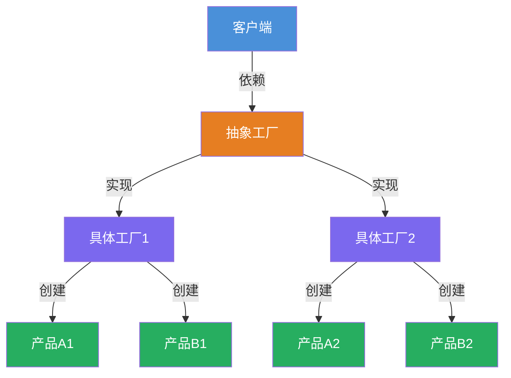
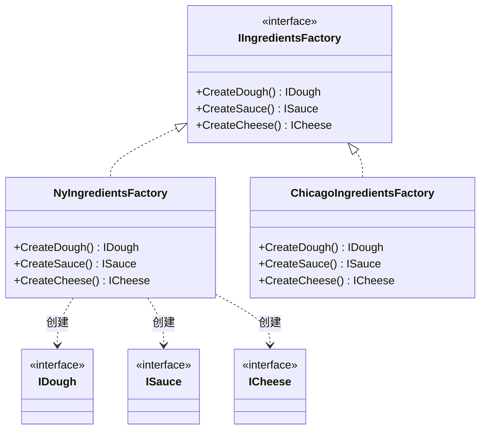

# 抽象工厂模式 (Abstract Factory) 教程

[TOC]


## 一、📖 概述

抽象工厂模式是**创建型设计模式**，提供一个接口用于创建**相关或依赖对象的家族**，而无需指定具体类。

核心思想：将对象的创建与使用分离，客户端仅依赖抽象接口，不关心具体实现。当需要创建一系列相关对象时，抽象工厂确保它们属于同一产品族。

### 核心特性

- **封装性**：客户端不直接创建对象，通过工厂获取

- **一致性**：确保同一工厂创建的对象属于同一产品族

- **可扩展**：新增产品族只需新增工厂类，无需修改现有代码

- **符合开闭原则**：对扩展开放，对修改关闭

<br/>

## 二、📐 结构图解

### 2.1 整体流程



### 2.2 类关系



### 2.3 关键角色

| 角色 | 说明 |
|------|------|
| 抽象工厂 (IIngredientsFactory) | 定义创建一族产品的接口 |
| 具体工厂 (Ny/ChicagoIngredientsFactory) | 实现抽象工厂，创建特定产品族 |
| 抽象产品 (IDough/ISauce/ICheese) | 定义产品接口 |
| 具体产品 (ThinCrust/CherryTomato 等) | 实现产品接口 |

<br/>

## 三、💻 代码实现

以披萨配料为例：纽约和芝加哥风味的面团、酱料、奶酪各不相同，通过抽象工厂确保配料一致性。

### 3.1 抽象产品与具体产品

```csharp
// 抽象产品：面团
public interface IDough
{
    string Name { get; }
}

// 具体产品
public class ThinCrust : IDough
{
    public string Name => "薄面团";
}

public class DeepDish : IDough
{
    public string Name => "深盘面团";
}

// 抽象产品：酱料
public interface ISauce
{
    string Name { get; }
}

public class CherryTomato : ISauce
{
    public string Name => "樱桃番茄酱";
}

public class PlumTomato : ISauce
{
    public string Name => "李子番茄酱";
}

// 抽象产品：奶酪
public interface ICheese
{
    string Name { get; }
}

public class Mozarella : ICheese
{
    public string Name => "马苏里拉";
}

public class Parmesan : ICheese
{
    public string Name => "帕尔马干酪";
}
```

### 3.2 抽象工厂与具体工厂

```csharp
// 抽象工厂：配料工厂
public interface IIngredientsFactory
{
    IDough CreateDough();
    ISauce CreateSauce();
    ICheese CreateCheese();
}

// 纽约配料工厂
public class NyIngredientsFactory : IIngredientsFactory
{
    public IDough CreateDough() => new ThinCrust();
    public ISauce CreateSauce() => new CherryTomato();
    public ICheese CreateCheese() => new Mozarella();
}

// 芝加哥配料工厂
public class ChicagoIngredientsFactory : IIngredientsFactory
{
    public IDough CreateDough() => new DeepDish();
    public ISauce CreateSauce() => new PlumTomato();
    public ICheese CreateCheese() => new Parmesan();
}
```

### 3.3 客户端使用

```csharp
// 客户端面向抽象工厂接口
IIngredientsFactory factory = new NyIngredientsFactory();

IDough dough = factory.CreateDough();
ISauce sauce = factory.CreateSauce();
ICheese cheese = factory.CreateCheese();

Console.WriteLine($"纽约风味: {dough.Name} + {sauce.Name} + {cheese.Name}");
```

**运行结果**：
```
纽约风味: 薄面团 + 樱桃番茄酱 + 马苏里拉
```

<br/>

## 四、🔍 核心解析

### 4.1 产品族一致性

同一工厂创建的所有产品属于同一产品族。纽约工厂创建的配料都是纽约风味，芝加哥工厂创建的配料都是芝加哥风味，不会混淆。

### 4.2 与工厂方法的区别

工厂方法创建单一产品，抽象工厂创建一族产品。本例中 `IIngredientsFactory` 同时创建面团、酱料、奶酪三种产品。

### 4.3 扩展产品族

新增加州风味只需新增 `CaliforniaIngredientsFactory` 类，实现 `IIngredientsFactory` 接口即可，无需修改现有代码。

<br/>

## 五、🎯 应用场景

### 5.1 适用场景

- 系统需要多个系列的相关对象

- 需要确保同一产品族的对象风格一致

- 需要在运行时动态切换产品族

### 5.2 实际案例

- **.NET 数据库访问**：`IDbProviderFactory` 创建 Connection、Command、DataAdapter 等数据库对象族

- **跨平台 UI**：Windows/Mac/Linux 不同风格的按钮、文本框、菜单组件族

- **游戏引擎**：不同主题的道具、角色外观、音效等资源族

<br/>

## 六、⚖️ 优缺点分析

### 6.1 优点

- **产品族一致性**：同一工厂创建的产品风格统一

- **符合开闭原则**：新增产品族无需修改现有代码

- **解耦客户端**：客户端面向抽象接口编程

### 6.2 缺点

- **扩展困难**：新增产品类型需修改所有工厂接口

- **类数量增多**：每新增一个产品族需要新增多个类

<br/>

## 七、📝 总结

- **核心思想**：提供创建一族相关产品的接口，无需指定具体类

- **关键角色**：抽象工厂、具体工厂、抽象产品、具体产品

- **适用场景**：需要一整套风格一致的产品族

- **与工厂方法区别**：工厂方法创建单一产品，抽象工厂创建产品族
