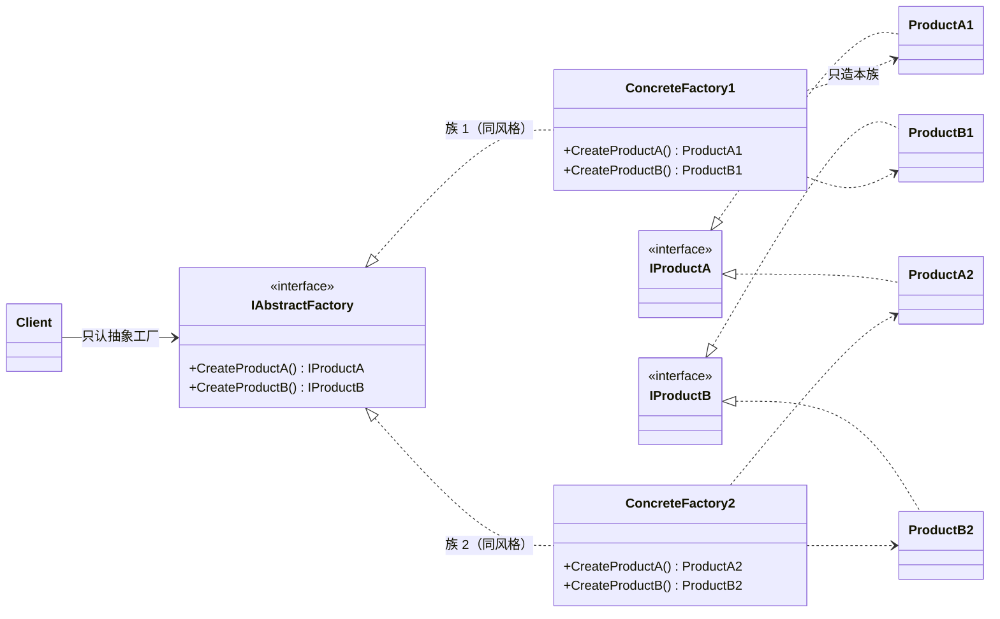
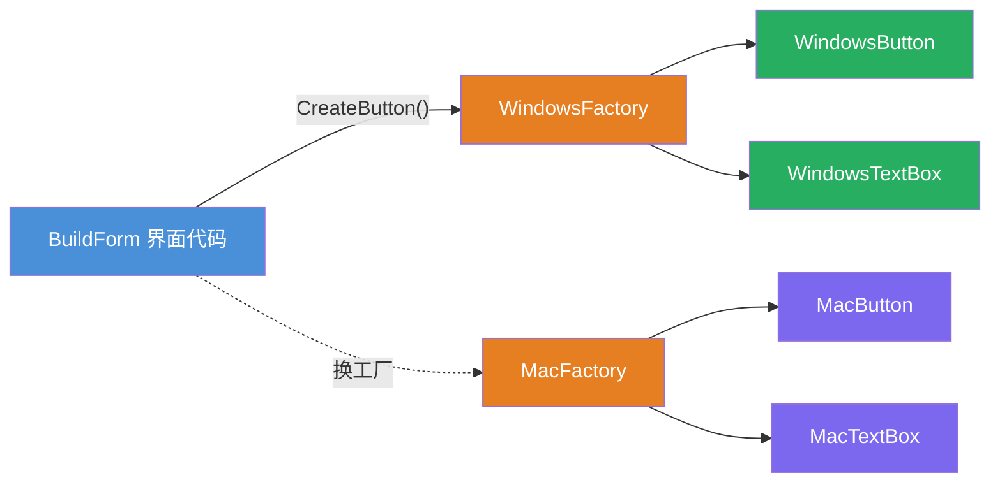
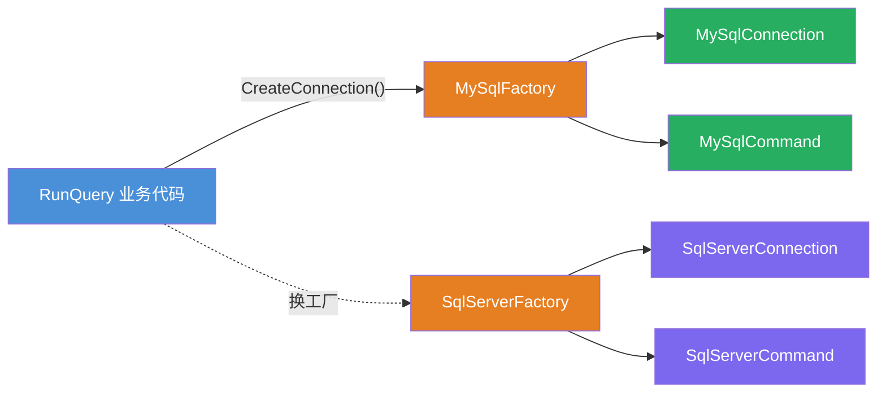

# 抽象工厂模式（Abstract Factory Pattern）

[TOC]

## 一、📖 概述

抽象工厂是**创建型设计模式**，提供一个创建**一系列相关或相互依赖对象**的接口，无需指定它们的具体类。

核心思想：工厂不再造"一个产品"，而是造"**一族产品**"——Windows 主题的按钮配 Windows 输入框、MySQL 的连接配 MySQL 命令。客户端换工厂 = 整族替换，且**绝不出现混搭**（Mac 按钮配 Windows 输入框）。

<br/>

## 二、🧩 模式解析

### 2.1 类关系图



| 关键角色 | 说明 | UI 示例 |
| --- | --- | --- |
| **抽象工厂（Abstract Factory）** | 声明一族产品的创建方法 | `IWidgetFactory` |
| **具体工厂（Concrete Factory）** | 只造本族产品，保证风格统一 | `WindowsFactory`/`MacFactory` |
| **抽象产品（Abstract Product）** | 族内每种产品的契约 | `IButton`/`ITextBox` |
| **具体产品（Concrete Product）** | 特定风格的实际控件 | `MacButton` 等 |

### 2.2 核心代码

```csharp
// 抽象产品 A、B：一族相关的产品契约
interface IProductA { void Act(); }
interface IProductB { void Act(); }

// 抽象工厂：一族创建方法
interface IAbstractFactory
{
    IProductA CreateProductA();
    IProductB CreateProductB();
}

// 具体工厂 1：A1 + B1 永远成套出现
class ConcreteFactory1 : IAbstractFactory
{
    public IProductA CreateProductA() => new ProductA1();
    public IProductB CreateProductB() => new ProductB1();
}

// 客户端：搭界面只写一次，风格由注入的工厂决定
void BuildUi(IAbstractFactory factory)
{
    factory.CreateProductA().Act();     // 族内任意产品
    factory.CreateProductB().Act();     // 必然同族
}
```

> 协作方式：客户端只依赖抽象工厂；具体工厂保证每个创建方法都返回本族产品——客户端永远拿不到"混搭"组合，换工厂即整体换族。

### 2.3 关键解析

**工厂三兄弟分工**：

| 对比维度 | 简单工厂 | 工厂方法 | 抽象工厂 |
| --- | --- | --- | --- |
| 造什么 | 单个产品 | 单个产品 | **一族产品** |
| 工厂形态 | 静态方法 + 分支 | 一个工厂类对应一种产品 | 一个工厂类对应一族产品 |
| 新增产品种类 | 改分支 | 加一对类 | **要改抽象工厂接口（违背开闭）** |
| 新增产品族 | — | — | **加一个工厂类即可（开闭）** |

- **开闭方向的取舍**：抽象工厂对"新增族"开放、对"新增产品种类"关闭——这是它与工厂方法最大的区别，也是选型依据
- **BCL/框架中的身影**：`DbProviderFactory`（CreateConnection + CreateCommand + CreateAdapter）、跨平台 UI（Avalonia/MAUI 的主题工厂）、`ILoggerProvider`
- **注意事项**：产品族种类固定后，每加一种产品要改所有工厂（接口 + N 个实现）；产品种数 > 族数时类数量增长快

另见：[简单工厂 ../FactoryPattern](../FactoryPattern/README.md)、[工厂方法 ../FactoryMethodPattern](../FactoryMethodPattern/README.md)

<br/>

## 三、💻 代码示例

### 3.1 经典场景：跨平台 UI 主题

> 场景：`BuildForm` 只写一次"搭界面"逻辑——注入 Windows 工厂得 Windows 控件，注入 Mac 工厂得 Mac 控件，按钮与输入框永远同风格。



| 角色 | 文件 |
| --- | --- |
| 抽象工厂 | [`UiTheme/IWidgetFactory.cs`](UiTheme/IWidgetFactory.cs) |
| 具体工厂 | [`UiTheme/WindowsFactory.cs`](UiTheme/WindowsFactory.cs)、[`MacFactory.cs`](UiTheme/MacFactory.cs) |
| 抽象产品 | [`UiTheme/IButton.cs`](UiTheme/IButton.cs)、[`ITextBox.cs`](UiTheme/ITextBox.cs) |
| 具体产品 | [`UiTheme/WindowsButton.cs`](UiTheme/WindowsButton.cs) 等 4 个 |
| 客户端 | [`Program.cs`](Program.cs) |

### 3.2 软件项目：数据库访问套件

> 场景：连接与命令必须来自同一数据库（MySQL 连接 + MySQL 命令）——`RunQuery` 只写一次，换 `SqlServerFactory` 整体切换，与 ADO.NET 的 `DbProviderFactory` 同构。



| 角色 | 文件 |
| --- | --- |
| 抽象工厂 | [`Database/IDatabaseFactory.cs`](Database/IDatabaseFactory.cs) |
| 具体工厂 | [`Database/MySqlFactory.cs`](Database/MySqlFactory.cs)、[`SqlServerFactory.cs`](Database/SqlServerFactory.cs) |
| 抽象产品 | [`Database/IConnection.cs`](Database/IConnection.cs)、[`ICommand.cs`](Database/ICommand.cs) |
| 具体产品 | [`Database/MySqlConnection.cs`](Database/MySqlConnection.cs) 等 4 个 |
| 客户端 | [`Program.cs`](Program.cs) |

### 3.3 运行结果

```bash
========== 抽象工厂模式 (Abstract Factory Pattern) ==========
创建一系列相关对象，换工厂 = 换整个产品族

--- 经典场景: 跨平台 UI 主题 ---
>> 界面代码只依赖抽象工厂，控件全部成套创建：

--- 切换到 Windows 主题 ---
[控件] 渲染 Windows 风格按钮：方正边框 + 系统蓝
[控件] 渲染 Windows 风格输入框：单线边框 + 系统字体

--- 切换到 Mac 主题 ---
[控件] 渲染 Mac 风格按钮：圆角胶囊 + 高斯模糊
[控件] 渲染 Mac 风格输入框：无边框 + 聚焦光环

--- 软件项目: 数据库访问套件 ---
>> 连接与命令必须同族，换数据库只换工厂：

--- 使用 MySQL 套件 ---
[MySQL] 连接已打开（3306 端口）
[MySQL] 执行：SELECT * FROM orders LIMIT 10
[MySQL] 连接已关闭

--- 使用 SQL Server 套件 ---
[SqlServer] 连接已打开（1433 端口）
[SqlServer] 执行：SELECT * FROM orders LIMIT 10
[SqlServer] 连接已关闭
```

<br/>

## 四、📝 小结

- **核心思想**：一个工厂造一族产品，同族产品成套出现，换工厂即整体换族

- **两个示例**：UI 主题展示"整体换肤"，数据库套件展示 ADO.NET 同构的多数据库切换

- **注意事项**：产品种类稳定时最划算；新增产品种类要动所有工厂接口——先确认"族会增、种类不增"再选它
