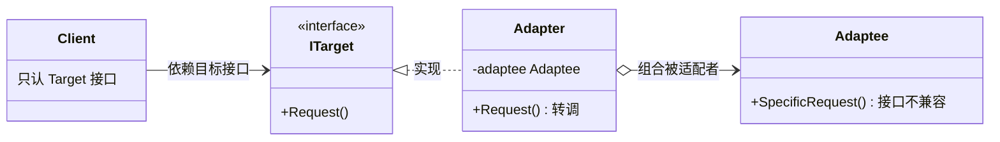
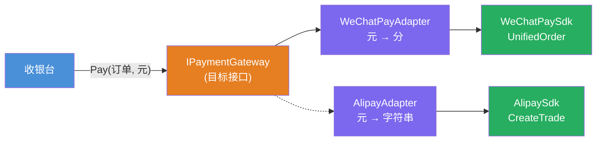

# 适配器模式（Adapter Pattern）

[TOC]

## 一、📖 概述

适配器是**结构型设计模式**，把一个类的接口**转换成客户端期望的另一个接口**，使原本接口不兼容的类可以协同工作。

核心思想：不改被适配者、不改客户端，中间加一层**转换器**——像旅行电源转换头一样，外接国标插孔、内接英标三脚。典型应用：集成第三方 SDK、复用遗留系统、统一多个不兼容库的调用方式。

<br/>

## 二、🧩 模式解析

### 2.1 类关系图



| 关键角色 | 说明 | 电源示例 |
| --- | --- | --- |
| **目标接口（Target）** | 客户端期望的接口 | 国标插座 `IStdSocket` |
| **被适配者（Adaptee）** | 接口不兼容的现存类，不能改 | 英标插头 `BritishPlug` |
| **适配器（Adapter）** | 实现目标接口，组合被适配者并转调 | 旅行转换头 `TravelAdapter` |

### 2.2 核心代码

```csharp
// 目标接口：客户端期望的样子
interface ITarget
{
    void Request();
}

// 被适配者：接口不兼容的现存类
class Adaptee
{
    public void SpecificRequest() { }
}

// 对象适配器：组合 + 转调（推荐）
class Adapter(Adaptee adaptee) : ITarget
{
    public void Request() => adaptee.SpecificRequest();     // 转调并做必要转换
}
```

> 协作方式：客户端只依赖 `ITarget`；适配器实现目标接口，内部持有被适配者，把调用转调过去（顺带做单位换算、格式转换等"接口翻译"）——客户端全程不知道被适配者的存在。

### 2.3 对象适配器 vs 类适配器

C# 不支持多重继承，类适配器通过"继承被适配者 + 实现目标接口"实现：

```csharp
// 类适配器：继承 Adaptee + 实现 ITarget（C# 只能继承类 + 实现接口）
class ClassAdapter : Adaptee, ITarget
{
    public void Request() => SpecificRequest();     // 直接调继承来的方法
}
```

| 对比维度 | 对象适配器（组合） | 类适配器（继承） |
| --- | --- | --- |
| 被适配者限制 | 类和子类都适用（面向接口） | 只能适配那个具体类 |
| 覆写被适配者行为 | 不行 | 可以（继承覆写） |
| C# 可行性 | 完全支持 | 受单继承限制，较少用 |
| 推荐 | ✅ 首选 | 了解即可 |

- **BCL 中的身影**：`Stream` 适配器（`StreamReader`/`StreamWriter` 把字节流适配成文本读写）、`IEnumerable<T>.Cast<TResult>()` 把旧集合适配成泛型序列
- **适配器 vs 装饰器**：适配器**改变接口**（形状转换），装饰器**保持接口**（功能叠加），见 [../DecoratorPattern](../DecoratorPattern/README.md)
- **适配器 vs 外观**：适配器做接口转换（一对一），外观做子系统简化（一对多），见 [../FacadePattern](../FacadePattern/README.md)

<br/>

## 三、💻 代码示例

### 3.1 经典场景：旅行电源转换头

> 场景：港版吹风机是英标三脚插头，国标插座只认两脚扁平——旅行转换头一头接国标插孔、一头接英标插头，形状转换后照常供电。


| 角色 | 文件 |
| --- | --- |
| 目标接口 | [`PowerAdapter/IStdSocket.cs`](PowerAdapter/IStdSocket.cs) |
| 被适配者 | [`PowerAdapter/BritishPlug.cs`](PowerAdapter/BritishPlug.cs) |
| 适配器 | [`PowerAdapter/TravelAdapter.cs`](PowerAdapter/TravelAdapter.cs) |
| 客户端 | [`Program.cs`](Program.cs) |

### 3.2 软件项目：统一支付网关

> 场景：电商收银台只认 `IPaymentGateway`（元 + Pay/Refund），微信 SDK 收"int 分"、支付宝 SDK 收"元字符串"——两个适配器各自做单位换算与接口翻译，SDK 变化不波及收银台。



| 角色 | 文件 |
| --- | --- |
| 目标接口 | [`Payment/IPaymentGateway.cs`](Payment/IPaymentGateway.cs) |
| 被适配者 | [`Payment/WeChatPaySdk.cs`](Payment/WeChatPaySdk.cs)、[`AlipaySdk.cs`](Payment/AlipaySdk.cs) |
| 适配器 | [`Payment/WeChatPayAdapter.cs`](Payment/WeChatPayAdapter.cs)、[`AlipayAdapter.cs`](Payment/AlipayAdapter.cs) |
| 客户端 | [`Program.cs`](Program.cs) |

### 3.3 运行结果

```bash
========== 适配器模式 (Adapter Pattern) ==========
转换接口，让原本不兼容的类协同工作

--- 经典场景: 旅行电源转换头（对象适配器） ---

>> 把港版吹风机（英标三脚插头）插进国标插座：
[失败] 插头形状不匹配，插不进去（接口不兼容，编译都过不了）

>> 插上旅行转换头再试：
[转换] 旅行转换头：外接国标插孔 → 内接英标三脚
[供电] 英标三脚插头已连接，220V 供电成功，港版吹风机开始工作

--- 软件项目: 统一支付网关（对象适配器） ---
>> 收银台只认 IPaymentGateway，两家 SDK 接口各不相同：

>> 用微信支付 199.50 元：
[适配] 微信适配器：¥199.50 → 19950 分
[微信] UnifiedOrder 下单成功：WX-2024-001，金额 19950 分

>> 用支付宝支付 88 元：
[适配] 支付宝适配器：¥88 → "88.00" 字符串
[支付宝] CreateTrade 创建交易：ALI-2024-002，金额 ¥88.00

>> 微信退款 199.50 元：
[适配] 微信适配器：¥199.50 → 19950 分
[微信] RefundOrder 退款成功：WX-2024-001，金额 19950 分
```

<br/>

## 四、📝 小结

- **核心思想**：不改动双方，中间加转换层；实现目标接口 + 组合被适配者 + 转调翻译

- **两个示例**：电源转换头展示"形状转换"的物理直觉，支付网关展示软件项目中最常见的"隔离第三方 SDK"

- **注意事项**：适配器是"亡羊补牢"的补救模式——接口能提前统一就统一（直接实现目标接口），别滥用适配器掩盖设计问题
