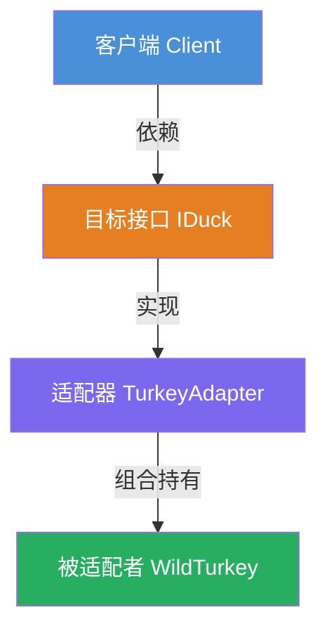
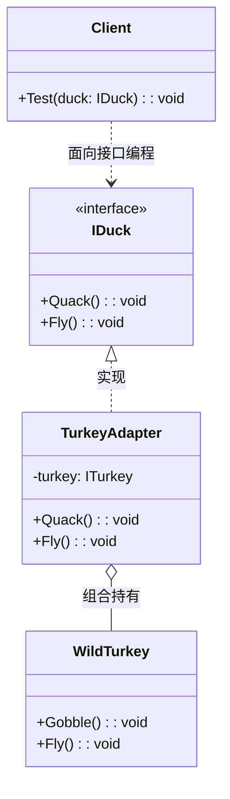

# 适配器模式（Adapter Pattern）教程

[TOC]

## 一、📖 概述

适配器模式是**结构型设计模式**，将一个类的接口转换成客户期望的另一个接口，使原本接口不兼容、无法一起工作的类可以协同工作。

核心思想：适配器像"转接头"，不改变原对象本身，只做接口翻译。当客户端依赖某个接口，而实际要复用的类接口不兼容时，适配器通过包装不兼容对象，将目标接口的调用翻译为被适配对象的操作，让新旧代码平滑整合。

### 核心特性

- **接口转换**：将被适配者的接口翻译为目标接口

- **不改变原有类**：被适配者无需修改，符合开闭原则

- **透明性**：客户端只面向目标接口编程，不感知适配器的存在

- **行为适配**：不仅翻译方法名，还能调整行为语义（如飞行距离适配）

<br/>

## 二、📐 结构图解

### 2.1 整体结构



### 2.2 类关系



### 2.3 关键角色

| 角色                | 说明                                         |
| ------------------- | -------------------------------------------- |
| 目标接口（Target）  | 客户端期望使用的接口                         |
| 被适配者（Adaptee） | 接口不兼容、需要被适配的已有类               |
| 适配器（Adapter）   | 实现目标接口，内部持有被适配者，完成接口翻译 |

<br/>

## 三、💻 代码实现

以火鸡适配鸭子为例：鸭子接口有 Quack() 和 Fly(500m)，火鸡只有 Gobble() 和 Fly(100m)，通过适配器让火鸡伪装成鸭子。

### 3.1 目标接口与被适配者

```csharp
// 目标接口：客户端期望的鸭子接口
public interface IDuck
{
    void Quack();
    void Fly();
}

// 被适配者：已有的火鸡类，接口不兼容
public class WildTurkey
{
    public void Gobble() => Console.WriteLine("Gobble gobble");
    public void Fly() => Console.WriteLine("飞100米");
}
```

### 3.2 适配器实现

```csharp
// 适配器：实现目标接口，内部持有被适配者
public class TurkeyAdapter : IDuck
{
    private readonly WildTurkey _turkey;

    public TurkeyAdapter(WildTurkey turkey) => _turkey = turkey;

    // Quack 翻译为 Gobble
    public void Quack() => _turkey.Gobble();

    // 行为适配：火鸡飞100米，鸭子飞500米，循环5次模拟
    public void Fly()
    {
        for (int i = 0; i < 5; i++)
            _turkey.Fly();
    }
}
```

### 3.3 客户端使用

```csharp
// 客户端只认识 IDuck
static void Tester(IDuck duck)
{
    duck.Fly();    // 实际是火鸡连续飞5次
    duck.Quack();  // 实际是火鸡 Gobble
}

// 创建适配器
var turkey = new WildTurkey();
var adapter = new TurkeyAdapter(turkey);
Tester(adapter);   // 火鸡以鸭子身份被使用
```

<br/>

## 四、🔍 核心解析

### 4.1 接口翻译

TurkeyAdapter 实现 IDuck 接口，将 Quack() 调用委托给 \_turkey.Gobble()，完成方法名和语义的翻译。

### 4.2 行为适配

火鸡单次飞行100米，鸭子飞行500米。适配器通过循环调用5次 Fly() 模拟鸭子的飞行距离，体现了适配器不仅做接口映射，还能调整行为差异。

### 4.3 客户端解耦

Tester 方法只依赖 IDuck 接口，不感知 TurkeyAdapter 的存在。运行时传入适配器，客户端无需任何修改。

<br/>

## 五、🎯 应用场景

### 5.1 适用场景

- 系统需要复用已有的类，但其接口与当前系统不兼容

- 需要在不修改原有类的前提下集成第三方库

- 多个不同接口的类需要统一调用方式

### 5.2 实际案例

- **数据库驱动适配**：不同数据库的API差异通过适配器统一为标准接口

- **第三方库集成**：将旧版SDK的API适配为新版接口规范

- **日志框架切换**：将不同日志库的接口适配为统一的日志抽象

<br/>

## 六、⚖️ 优缺点分析

### 6.1 优点

- **符合开闭原则**：无需修改原有类即可集成新接口

- **复用已有代码**：通过适配器复用不兼容的旧类

- **解耦客户端**：客户端只面向目标接口编程

### 6.2 缺点

- **增加复杂度**：每增加一个适配器就多一个类

- **间接层开销**：增加了一层调用转发，有轻微性能损耗

- **过度使用风险**：如果系统设计初期就考虑好接口统一，适配器可能是不必要的

<br/>

## 七、🔍 类适配器 vs 对象适配器

| 维度     | 类适配器                       | 对象适配器                         |
| -------- | ------------------------------ | ---------------------------------- |
| 实现方式 | 继承被适配者（多继承/接口+类） | 组合持有被适配者实例               |
| 灵活性   | 编译期确定，无法切换被适配者   | 运行时可替换不同的被适配者         |
| 耦合度   | 与被适配者有继承耦合           | 仅依赖目标接口，更松耦合           |
| 适用语言 | 适合支持多继承的语言（C++）    | 适合单继承语言（C#、Java），更通用 |
| 覆盖能力 | 可重写被适配者的方法           | 仅能调用被适配者的公开方法         |

> **本教程示例**：`TurkeyAdapter` 采用对象适配器方式——通过构造函数组合持有 `WildTurkey`，这是 C# / Java 中更推荐的做法。

<br/>

## 八、📝 总结

- **核心思想**：将不兼容的接口转换为客户期望的接口，使类可以协同工作

- **关键角色**：目标接口、被适配者、适配器

- **适用场景**：需要复用不兼容的已有类，且不修改原有代码

- **注意事项**：适度使用，避免因频繁适配导致系统复杂度上升
