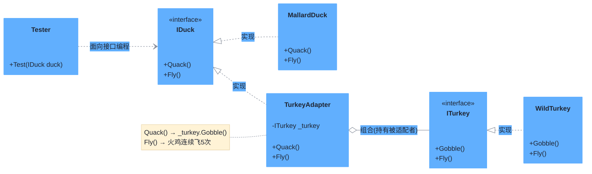

# 适配器模式（Adapter Pattern）

> **核心思想**：将一个类的接口转换成客户期望的另一个接口，使原本接口不兼容、无法一起工作的类可以协同工作。适配器像"转接头"，不改变原对象本身，只做接口翻译。

## 解决什么问题

当客户端依赖某个接口（如 `IDuck`），而实际要复用的是一个不兼容的类（如 `WildTurkey`，只有 `Gobble()` 而没有 `Quack()`）时，直接替换会失败。适配器模式通过包装不兼容对象，将目标接口的调用翻译为被适配对象的操作，从而让新旧代码平滑整合，符合**开闭原则**（无需修改已有类）。

## 主要参与者

| 角色 | 本示例类 | 职责 |
| --- | --- | --- |
| 目标接口 Target | `IDuck` | 客户端期望的接口：`Quack()` / `Fly()` |
| 被适配者 Adaptee | `WildTurkey`（实现 `ITurkey`） | 已有的、接口不兼容的类，只有 `Gobble()` / `Fly()` |
| 适配器 Adapter | `TurkeyAdapter` | 实现目标接口，内部持有一个 `ITurkey`，将 `Quack` 翻译为 `Gobble` |
| 客户端 Client | `Program` / `Tester` | 只面向 `IDuck` 编程，不感知适配器的存在 |

## 类图



## 源码结构

目录下源码文件与职责对应：

- **IDuck.cs / ITurkey.cs**：定义目标接口与已有接口。
- **WildTurkey.cs / MallardDuck.cs**：分别为被适配者与正常实现目标接口的类。
- **TurkeyAdapter.cs**：核心适配器。`Quack()` 委托给 `_turkey.Gobble()`；由于火鸡单次只飞 100 米、鸭子飞 500 米，适配器让火鸡循环飞 5 次并休息，模拟鸭子飞行——这正是"接口翻译 + 行为适配"的体现。
- **Program.cs**：创建 `WildTurkey`，包成 `TurkeyAdapter` 后以 `IDuck` 身份传给 `Tester` 使用。

```csharp
// Program.cs 核心代码
var turkey = new WildTurkey();
var adapter = new TurkeyAdapter(turkey);
Tester(adapter);   // 客户端只认识 IDuck

static void Tester(IDuck duck) {
    duck.Fly();    // 实际是火鸡连续飞 5 次
    duck.Quack();  // 实际是火鸡 Gobble
}
```
