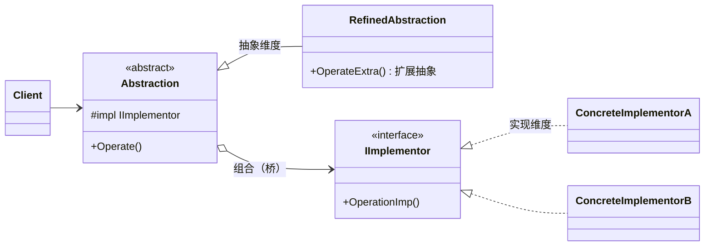
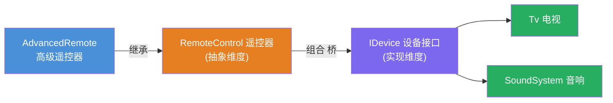
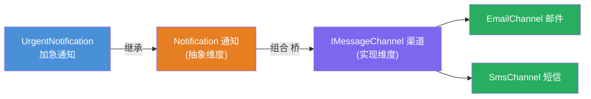

# 桥接模式（Bridge Pattern）

[TOC]

## 一、📖 概述

桥接是**结构型设计模式**，把**抽象部分与实现部分分离**，使它们可以**独立变化**。

核心思想：当类在**两个维度**上变化时（遥控器种类 × 设备种类、通知类型 × 发送渠道），继承会导致子类数量**乘法爆炸**（3×3=9 个子类）；改用**组合**把一个维度"桥接"进另一个维度，子类数量变为**加法**（3+3=6 个），任一维度新增都不影响另一个。

<br/>

## 二、🧩 模式解析

### 2.1 类关系图



| 关键角色 | 说明 | 遥控器示例 |
| --- | --- | --- |
| **抽象（Abstraction）** | 持有实现维度引用，控制高层逻辑 | `RemoteControl` |
| **扩展抽象（Refined Abstraction）** | 抽象维度的扩展 | `AdvancedRemote` |
| **实现接口（Implementor）** | 另一维度的契约 | `IDevice` |
| **具体实现（Concrete Implementor）** | 实现维度的具体类 | `Tv`、`SoundSystem` |

### 2.2 核心代码

```csharp
// 实现维度：独立变化的一侧
interface IImplementor
{
    void OperationImp();
}

// 抽象维度：组合（而非继承）实现维度 —— 这就是"桥"
abstract class Abstraction(IImplementor impl)
{
    protected IImplementor Impl { get; } = impl;

    public virtual void Operate() => Impl.OperationImp();     // 委托给实现侧
}

// 扩展抽象：抽象维度新增成员，无需知道具体实现是谁
class RefinedAbstraction(IImplementor impl) : Abstraction(impl)
{
    public void OperateExtra() { /* Impl.OperationImp() 的另一种编排 */ }
}
```

> 协作方式：客户端把"实现维度"的对象注入"抽象维度"；抽象侧编排高层逻辑并转调实现侧——两个维度只通过 `IImplementor` 接口这座桥通信，互不感知对方的具体类。

### 2.3 关键解析

**为什么不用继承？** 双维度继承的乘法爆炸：

| 维度组合 | 继承方案 | 桥接方案 |
| --- | --- | --- |
| 2 遥控器 × 2 设备 | 4 个子类（TvRemote、SoundRemote、AdvancedTvRemote…） | 2 + 2 = 4 个类 |
| 3 遥控器 × 5 设备 | **15 个子类** | 3 + 5 = 8 个类 |
| 新增 1 种设备 | 每种遥控器都要加子类 | 只加 1 个设备类 ✅ |

- **本质是"组合优于继承"**的应用：把"是什么"（继承）改为"有一个"（组合）
- **适配器 vs 桥接**：适配器是事后补救（接口不兼容才转换），桥接是事前设计（预见到两个维度都要扩展）
- **BCL 中的身影**：`DbConnection`（SqlConnection/SQLiteConnection）× `DbCommand`、`Stream` 与其 Reader/Writer 组合

<br/>

## 三、💻 代码示例

### 3.1 经典场景：遥控器 × 家电设备

> 场景：遥控器（基础/高级）与家电（电视/音响）两个维度独立演化——高级遥控器加静音键不用改设备代码，新增扫地机器人不用改遥控器代码。



| 角色 | 文件 |
| --- | --- |
| 实现接口 | [`RemoteControl/IDevice.cs`](RemoteControl/IDevice.cs) |
| 具体实现 | [`RemoteControl/Tv.cs`](RemoteControl/Tv.cs)、[`SoundSystem.cs`](RemoteControl/SoundSystem.cs) |
| 抽象 | [`RemoteControl/RemoteControl.cs`](RemoteControl/RemoteControl.cs) |
| 扩展抽象 | [`RemoteControl/AdvancedRemote.cs`](RemoteControl/AdvancedRemote.cs) |
| 客户端 | [`Program.cs`](Program.cs) |

### 3.2 软件项目：通知类型 × 发送渠道

> 场景：通知（普通/加急）与渠道（邮件/短信）自由组合——加急走短信、加急走邮件、普通走邮件互不影响，新增"钉钉渠道"零改动通知类型。



| 角色 | 文件 |
| --- | --- |
| 实现接口 | [`Notification/IMessageChannel.cs`](Notification/IMessageChannel.cs) |
| 具体实现 | [`Notification/EmailChannel.cs`](Notification/EmailChannel.cs)、[`SmsChannel.cs`](Notification/SmsChannel.cs) |
| 抽象 | [`Notification/Notification.cs`](Notification/Notification.cs) |
| 扩展抽象 | [`Notification/UrgentNotification.cs`](Notification/UrgentNotification.cs) |
| 客户端 | [`Program.cs`](Program.cs) |

### 3.3 运行结果

```bash
========== 桥接模式 (Bridge Pattern) ==========
抽象与实现分离，两个维度独立变化

--- 经典场景: 遥控器 × 家电设备 ---
>> 基础遥控器控制电视：

>> 按下【电源】键
[电视] 屏幕点亮，欢迎回来
>> 按下【音量+】键
[遥控] 客厅电视 音量 → 40
>> 按下【音量+】键
[遥控] 客厅电视 音量 → 50

>> 高级遥控器控制音响（新增静音键，设备无改动）：

>> 按下【电源】键
[音响] 功放启动，蓝牙已连接
>> 按下【音量-】键
[遥控] 书房音响 音量 → 40
>> 按下【静音】键
[遥控] 书房音响 已静音

--- 软件项目: 通知类型 × 发送渠道 ---
>> 普通通知走邮件渠道：

[通知] 通过邮件发送普通通知
[邮件] 已发送至 alice@example.com：今晚 22:00 例行系统维护

>> 加急通知走短信渠道（通知与渠道自由组合）：

[通知] 加急！通过短信连续发送 2 遍并电话提醒
[短信] 已发送至 138****5678：【加急】线上订单服务不可用，请立即处理
[短信] 已发送至 138****5678：【加急】线上订单服务不可用，请立即处理
[电话] 已拨打 138****5678，请立即查看短信

>> 加急通知也可以走邮件渠道：

[通知] 加急！通过邮件连续发送 2 遍并电话提醒
[邮件] 已发送至 ops@example.com：【加急】线上订单服务不可用，请立即处理
[邮件] 已发送至 ops@example.com：【加急】线上订单服务不可用，请立即处理
[电话] 已拨打 ops@example.com，请立即查看邮件
```

<br/>

## 四、📝 小结

- **核心思想**：双维度变化时用组合搭桥，继承树两侧各自扩展，乘法变加法

- **两个示例**：遥控器×设备展示经典双维度，通知类型×渠道展示软件项目中的自由组合

- **注意事项**：只有**一个**维度变化时别用桥接（过度设计）；识别信号是"类名出现 and/with 连接词"——`AdvancedRemoteWithTv` 这种命名就是在提醒你该桥接了
