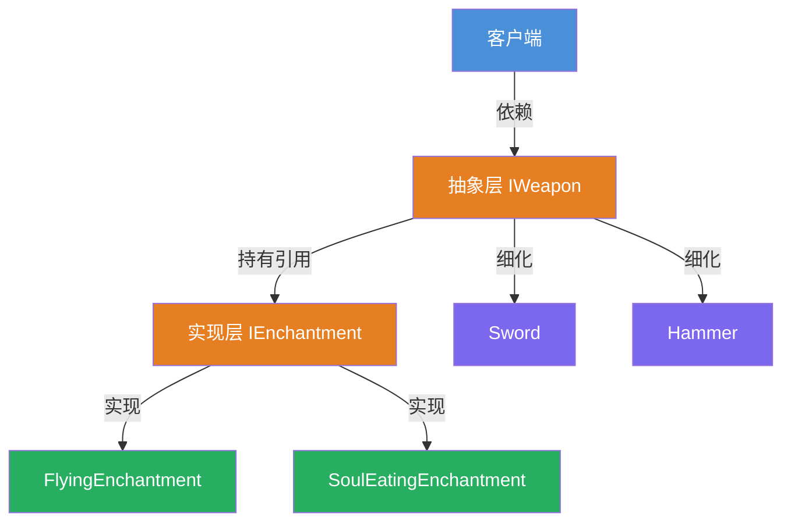
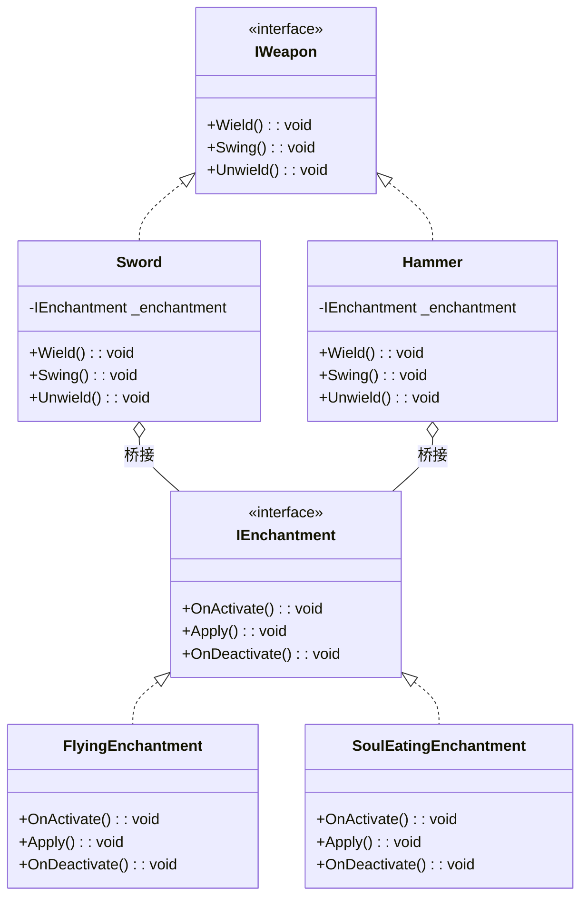

# 桥接模式教程

[TOC]


## 一、📖 概述

桥接模式是**结构型设计模式**，将抽象部分与实现部分分离，使两者可以**独立变化**。

核心思想：用**组合**代替继承，在抽象层持有实现层的接口引用，把"抽象"和"实现"两个维度解耦，各自扩展互不影响。

### 核心特性

- **解耦抽象与实现**：两个维度各自独立演化，互不牵连

- **组合代替继承**：避免多层继承导致的类爆炸问题

- **运行时动态组合**：通过组合关系在运行时自由切换实现

- **符合开闭原则**：新增抽象或实现都不需要修改已有代码

<br/>

## 二、📐 结构图解

### 2.1 整体结构

以"武器 × 附魔"为例：武器是抽象维度，附魔是实现维度，两者通过桥接组合。



### 2.2 类关系



<br/>

## 三、💻 代码实现

以"武器与附魔"为例：武器种类（剑、锤）和附魔效果（飞行、噬魂）两个维度独立变化。

### 3.1 抽象层：武器接口

```csharp
// 抽象维度：武器
public interface IWeapon
{
    void Wield();   // 装备
    void Swing();   // 挥击
    void Unwield(); // 卸下
}
```

### 3.2 实现层：附魔接口

```csharp
// 实现维度：附魔
public interface IEnchantment
{
    void OnActivate();   // 激活
    void Apply();        // 施加效果
    void OnDeactivate(); // 停用
}
```

### 3.3 具体实现

```csharp
// 具体武器：通过构造函数注入附魔（桥接）
public class Sword : IWeapon
{
    private readonly IEnchantment _enchantment;

    public Sword(IEnchantment enchantment) => _enchantment = enchantment;

    public void Wield()
    {
        Console.WriteLine("The sword is wielded.");
        _enchantment.OnActivate();
    }

    public void Swing()
    {
        Console.WriteLine("The sword swings.");
        _enchantment.Apply();
    }

    public void Unwield()
    {
        Console.WriteLine("The sword is unwielded.");
        _enchantment.OnDeactivate();
    }
}

// 具体附魔：独立实现
public class FlyingEnchantment : IEnchantment
{
    public void OnActivate() => Console.WriteLine("The item begins to glow faintly.");
    public void Apply() => Console.WriteLine("The target flies into the air.");
    public void OnDeactivate() => Console.WriteLine("The glow fades.");
}
```

### 3.4 客户端使用

```csharp
public class Program
{
    public static void Main()
    {
        // 自由组合：剑 × 飞行
        IWeapon sword = new Sword(new FlyingEnchantment());
        sword.Wield();   // The sword is wielded. → The item begins to glow faintly.
        sword.Swing();   // The sword swings. → The target flies into the air.
        sword.Unwield(); // The sword is unwielded. → The glow fades.

        // 自由组合：锤 × 噬魂
        IWeapon hammer = new Hammer(new SoulEatingEnchantment());
        hammer.Wield();
    }
}
```

**关键点**：新增一种武器（如 `Bow`）或一种附魔（如 `FireEnchantment`），都不需要修改对方的代码。

<br/>

## 四、🔍 核心解析

### 4.1 桥接关系

`Sword` 和 `Hammer` 通过构造函数持有 `IEnchantment` 引用——这就是"桥"。武器调用附魔的方法，但不关心具体是哪种附魔。

### 4.2 两个独立维度

- **抽象维度**（武器）：`IWeapon → Sword / Hammer`，关注武器的基本操作

- **实现维度**（附魔）：`IEnchantment → FlyingEnchantment / SoulEatingEnchantment`，关注附魔的具体效果

### 4.3 组合优于继承

如果用继承处理 N 种武器 × M 种附魔，需要 N×M 个类。桥接模式只需 N+M 个类，运行时自由组合。

<br/>

## 五、🎯 应用场景

### 5.1 适用场景

- 系统存在两个或多个独立变化的维度

- 需要避免多层继承导致的类数量爆炸

- 抽象和实现需要在运行时动态绑定

### 5.2 实际案例

- **图形渲染**：形状（抽象）× 颜色（实现），如 `Circle + Red`、`Square + Blue`

- **数据库驱动**：抽象 API（抽象）× 具体数据库驱动（实现）

- **跨平台应用**：业务逻辑（抽象）× 平台适配（实现）

<br/>

## 六、⚖️ 优缺点分析

### 6.1 优点

- **避免类爆炸**：N×M 的继承关系缩减为 N+M 的组合关系

- **独立扩展**：抽象和实现可以独立演化，互不影响

- **运行时切换**：通过组合关系在运行时动态切换实现

- **符合开闭原则**：新增维度只需新增类，无需修改已有代码

### 6.2 缺点

- **增加理解成本**：引入间接层，设计初期需要正确识别两个维度

- **不适用于单一维度**：如果系统只有一个变化维度，桥接模式是过度设计

<br/>

## 七、📝 总结

- **核心思想**：将抽象部分与实现部分分离，用组合代替继承

- **关键角色**：抽象接口、细化抽象、实现接口、具体实现

- **适用场景**：系统存在两个独立变化的维度，需要避免类爆炸

- **识别信号**：如果发现 N×M 种组合正在产生大量子类，就该考虑桥接模式
