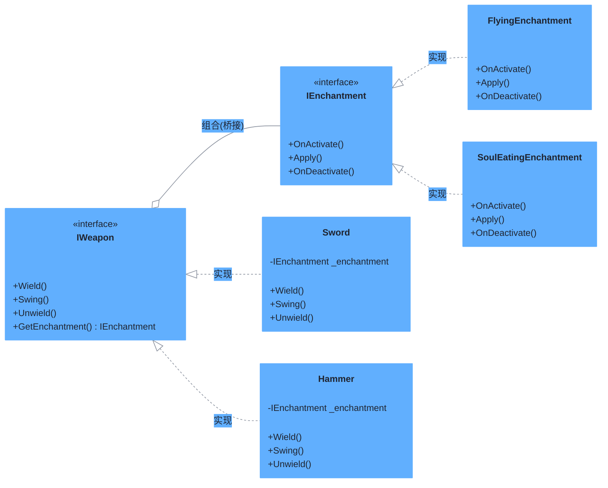

# 桥接模式（Bridge Pattern）

> **核心思想**：将"抽象部分"与"实现部分"分离，使两者可以独立变化。桥接模式用**组合**代替继承，在抽象层持有实现层的接口引用，从而把"抽象"和"实现"两个维度解耦，各自扩展互不影响。

## 解决什么问题

若直接用继承处理"武器种类 × 附魔效果"两个维度，会产生类爆炸（剑-飞行、剑-噬魂、锤-飞行、锤-噬魂……N×M 个类）。桥接模式将两个维度拆成两棵独立的继承树——武器树（抽象）与附魔树（实现），运行时自由组合，新增一种武器或附魔都不必修改对方。

## 主要参与者

| 角色 | 本示例类 | 职责 |
| --- | --- | --- |
| 抽象 Abstraction | `IWeapon`（及 `Sword` / `Hammer`） | 定义武器操作接口，并持有实现部分的引用 |
| 细化抽象 RefinedAbstraction | `Sword` / `Hammer` | 具体武器，组合一个 `IEnchantment` 并调用其生命周期方法 |
| 实现 Implementor | `IEnchantment` | 定义实现部分接口：`OnActivate` / `Apply` / `OnDeactivate` |
| 具体实现 ConcreteImplementor | `FlyingEnchantment` / `SoulEatingEnchantment` | 附魔的具体行为 |

## 类图



## 源码结构

目录下源码文件与职责对应：

- **IWeapon.cs / IEnchantment.cs**：抽象与实现两个维度的接口定义。
- **Sword.cs / Hammer.cs**：均通过主构造函数注入 `IEnchantment`，`Wield/Swing/Unwield` 依次调用附魔的 `OnActivate/Apply/OnDeactivate`——武器"指挥"附魔，附魔细节完全封装在自己内部。
- **FlyingEnchantment.cs / SoulEatingEnchantment.cs**：两个互不影响的附魔实现。
- **Program.cs**：自由组合出"剑+飞行"与"锤+噬魂"两把武器，验证桥接的组合能力。

```csharp
// Program.cs 核心代码
IWeapon sword = new Sword(new FlyingEnchantment());     // 剑 × 飞行
IWeapon hammer = new Hammer(new SoulEatingEnchantment()); // 锤 × 噬魂
sword.Wield();  // The sword is wielded. → The item begins to glow faintly.
```
