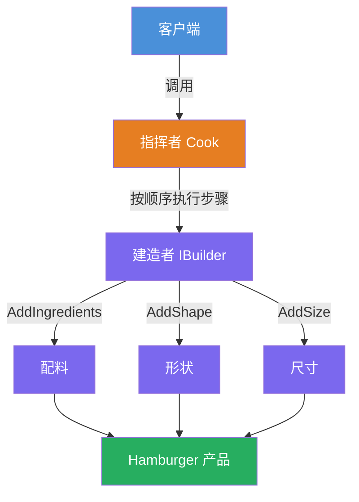
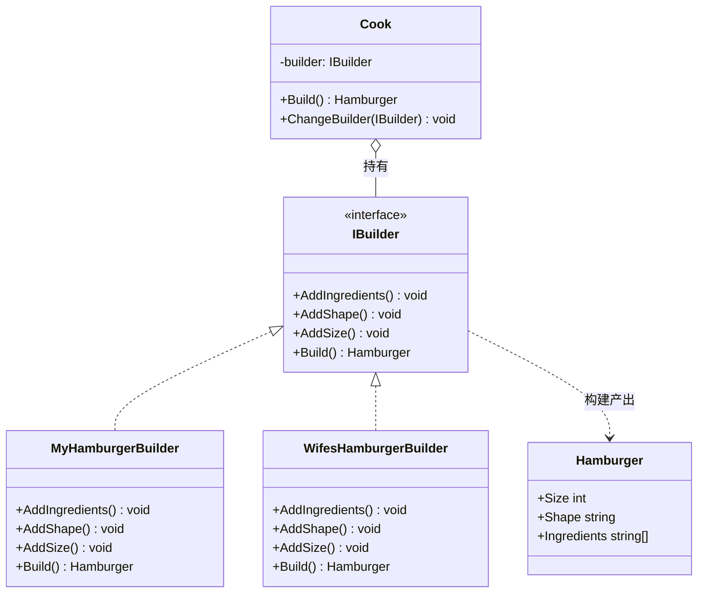

# 建造者模式（Builder Pattern）教程

[TOC]

## 一、📖 概述

建造者模式是**创建型设计模式**，将复杂对象的**构建过程**与**表示**分离，使同样的构建步骤可以组装出不同的产品。

核心思想：由"指挥者"控制构建步骤的顺序，"建造者"负责各步骤的具体实现。客户端无需了解内部组装细节，即可创建不同表示的对象。

### 核心特性

- **步骤固定**：构建流程由指挥者统一编排，算法骨架不变

- **实现分离**：每个建造者独立实现构建细节，互不干扰

- **灵活扩展**：新增产品表示只需新增建造者类，无需修改指挥者

- **符合开闭原则**：对扩展开放，对修改关闭

<br/>

## 二、📐 结构图解

### 2.1 整体流程



### 2.2 类关系



### 2.3 关键角色

| 角色                       | 说明                         |
| -------------------------- | ---------------------------- |
| 抽象建造者 Builder         | 定义构建步骤的接口           |
| 具体建造者 ConcreteBuilder | 实现各构建步骤，产出具体产品 |
| 指挥者 Director            | 编排构建步骤的顺序           |
| 产品 Product               | 被构建的复杂对象             |

<br/>

## 三、💻 代码实现

以汉堡制作为例：指挥者 Cook 按固定顺序调用建造者步骤，不同建造者产出不同风格的汉堡。

### 3.1 产品类

```csharp
public class Hamburger
{
    public int Size { get; set; }
    public string Shape { get; set; }
    public string[] Ingredients { get; set; }
}
```

### 3.2 建造者接口

```csharp
public interface IBuilder
{
    void AddIngredients();
    void AddShape();
    void AddSize();
    Hamburger Build();
}
```

### 3.3 具体建造者

```csharp
// 我的汉堡：5种配料、风筝形、大尺寸
public class MyHamburgerBuilder : IBuilder
{
    private Hamburger _hamburger = new Hamburger();

    public void AddIngredients()
        => _hamburger.Ingredients = new[] { "Bread", "Meat", "Tomato", "Salad", "Mayonnaise" };
    public void AddShape() => _hamburger.Shape = "Kite";
    public void AddSize() => _hamburger.Size = 10;
    public Hamburger Build() => _hamburger;
}

// 妻子的汉堡：2种配料、长方体、小尺寸
public class WifesHamburgerBuilder : IBuilder
{
    private Hamburger _hamburger = new Hamburger();

    public void AddIngredients()
        => _hamburger.Ingredients = new[] { "Bread", "Salad" };
    public void AddShape() => _hamburger.Shape = "Cuboid";
    public void AddSize() => _hamburger.Size = 6;
    public Hamburger Build() => _hamburger;
}
```

### 3.4 指挥者

```csharp
public class Cook
{
    private IBuilder _builder;

    public Cook(IBuilder builder) => _builder = builder;

    // 固定构建顺序
    public Hamburger Build()
    {
        _builder.AddIngredients();
        _builder.AddShape();
        _builder.AddSize();
        return _builder.Build();
    }

    public void ChangeBuilder(IBuilder builder) => _builder = builder;
}
```

### 3.5 客户端使用

```csharp
var cook = new Cook(new MyHamburgerBuilder());
var myHamburger = cook.Build();
// Ingredients: Bread Meat Tomato Salad Mayonnaise, Size: 10, Shape: Kite

cook.ChangeBuilder(new WifesHamburgerBuilder());
var wifesHamburger = cook.Build();
// Ingredients: Bread Salad, Size: 6, Shape: Cuboid
```

**运行结果**：

```
我的汉堡: 5种配料, 风筝形, 尺寸10
妻子的汉堡: 2种配料, 长方体, 尺寸6
```

<br/>

## 四、🔍 核心解析

### 4.1 建造者接口

`IBuilder` 定义了构建步骤的契约：`AddIngredients` → `AddShape` → `AddSize` → `Build`。所有具体建造者遵循同一套接口，保证步骤一致性。

### 4.2 Director 的作用

Director（指挥者）是建造者模式中容易被忽视的角色，但它是模式的核心价值所在：

- **封装构建算法**：将"先放配料、再定形状、最后定尺寸"的固定顺序封装在 `Cook` 中，客户端和建造者都不需要知道这个顺序

- **隔离变化**：算法骨架不变（开闭原则），变更只发生在具体建造者的产品细节中

- **有无 Director 的区别**：

  | 对比     | 有 Director（经典建造者）        | 无 Director（Builder 变体）                     |
  | -------- | -------------------------------- | ----------------------------------------------- |
  | 构建顺序 | 由 Director 统一编排             | 由客户端自行调用                                |
  | 适用场景 | 构建流程固定，多处复用           | 一次性构建，顺序灵活                            |
  | 典型代表 | 本例 `Cook` 类                   | .NET 的 `StringBuilder`、LINQ 的 `QueryBuilder` |
  | 代码耦合 | 客户端只调 `Build()`，不感知步骤 | 客户端需了解每个步骤及顺序                      |

- **何时省略 Director**：当构建步骤少、流程不需要复用时，可直接用流式调用（链式 Builder），省略 Director 以减少类数量。

### 4.3 产品

`Hamburger` 是纯数据对象，不包含构建逻辑。构建细节全部封装在建造者中，产品与构建过程完全解耦。

<br/>

## 五、🎯 应用场景

### 5.1 适用场景

- 对象有多种属性组合，构造函数参数过多

- 需要同一套构建流程产出不同表示的对象

- 构建过程包含多个步骤，且顺序固定

### 5.2 实际案例

- **StringBuilder**：逐步构建字符串，最终 `ToString()` 产出结果

- **Director模式在游戏开发中**：统一角色创建流程，不同建造者生成不同属性的角色

- **文档生成器**：同一模板流程，不同建造者产出 HTML/PDF/Markdown 文档

<br/>

## 六、⚖️ 优缺点分析

### 6.1 优点

- **构建与表示分离**：同一流程可产出不同产品

- **代码清晰**：构建步骤逐步执行，逻辑一目了然

- **符合开闭原则**：新增产品只需新增建造者类

- **精细控制**：可逐步检查构建过程的每个阶段

### 6.2 缺点

- **类数量增多**：每个产品变体需要一个具体建造者类

- **仅适用复杂对象**：简单对象使用建造者模式会增加不必要的复杂度

<br/>

## 七、📝 总结

- **核心思想**：将复杂对象的构建过程与表示分离，同一流程产出不同产品

- **关键角色**：建造者（定义步骤）、具体建造者（实现细节）、指挥者（编排流程）、产品（最终对象）

- **适用场景**：对象属性组合多、构建步骤固定、需要多种表示

- **注意事项**：仅在对象确实复杂时使用，避免对简单对象过度设计
