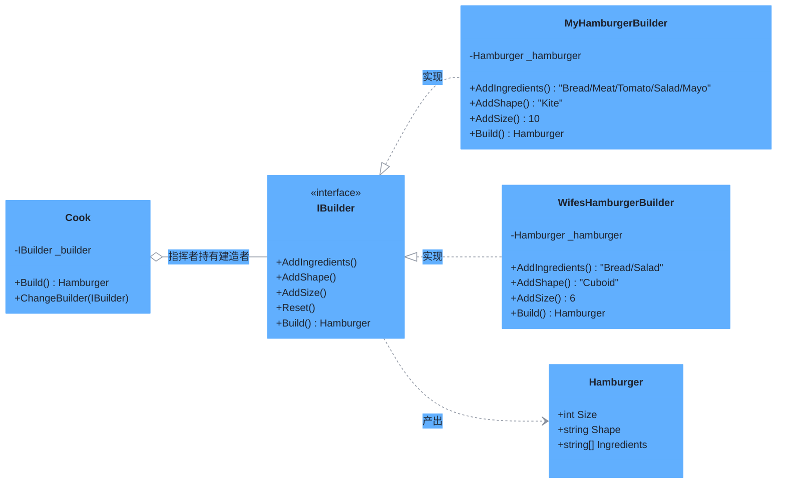

# 建造者模式（Builder Pattern）

> **核心思想**：将一个复杂对象的**构建过程**与它的**表示**分离，使同样的构建步骤可以组装出不同的产品。由"指挥者"控制构建步骤的顺序，"建造者"负责各步骤的具体实现。

## 解决什么问题

当产品有很多可选属性（配料、形状、尺寸等）且构造参数组合繁杂时，直接构造函数会产生大量重载或参数混乱。建造者模式把"组装步骤"固定为算法骨架，把"每一步怎么做"交给不同建造者，从而用同一套流程产出风格迥异的对象，代码更清晰、可读性更强。

## 主要参与者

| 角色 | 本示例类 | 职责 |
| --- | --- | --- |
| 产品 Product | `Hamburger` | 最终构建出的复杂对象（Size/Shape/Ingredients） |
| 抽象建造者 Builder | `IBuilder` | 定义构建步骤接口：`AddIngredients` / `AddShape` / `AddSize` / `Reset` / `Build` |
| 具体建造者 ConcreteBuilder | `MyHamburgerBuilder` / `WifesHamburgerBuilder` | 各自实现步骤细节，产出不同汉堡 |
| 指挥者 Director | `Cook` | 按固定顺序调用建造者步骤完成组装 |

## 类图



## 源码结构

目录下源码文件与职责对应：

- **IBuilder.cs**：建造者接口，定义"加配料→加形状→加尺寸→产出"的步骤契约。
- **Hamburger.cs**：产品类，纯数据对象。
- **MyHamburgerBuilder.cs / WifesHamburgerBuilder.cs**：两个具体建造者，`MyHamburgerBuilder` 组装 5 种配料的风筝形大汉堡，`WifesHamburgerBuilder` 组装 2 种配料的长方体小汉堡——同一套步骤、不同细节。
- **Cook.cs**：指挥者，`Build()` 固定按 `AddIngredients → AddShape → AddSize → Build` 顺序执行，并通过 `ChangeBuilder` 支持中途更换建造者。
- **Program.cs**：先让 `Cook` 使用 `MyHamburgerBuilder` 做汉堡，再换 `WifesHamburgerBuilder` 做另一个，展示"相同构建过程、不同表示"。

```csharp
// Program.cs 核心代码
var cook = new Cook(new MyHamburgerBuilder());
var myHamburger = cook.Build();                 // Ingredients: Bread Meat Tomato Salad Mayonnaise, Size: 10, Shape: Kite
cook.ChangeBuilder(new WifesHamburgerBuilder());
var wifesHamburger = cook.Build();              // Ingredients: Bread Salad, Size: 6, Shape: Cuboid
```
