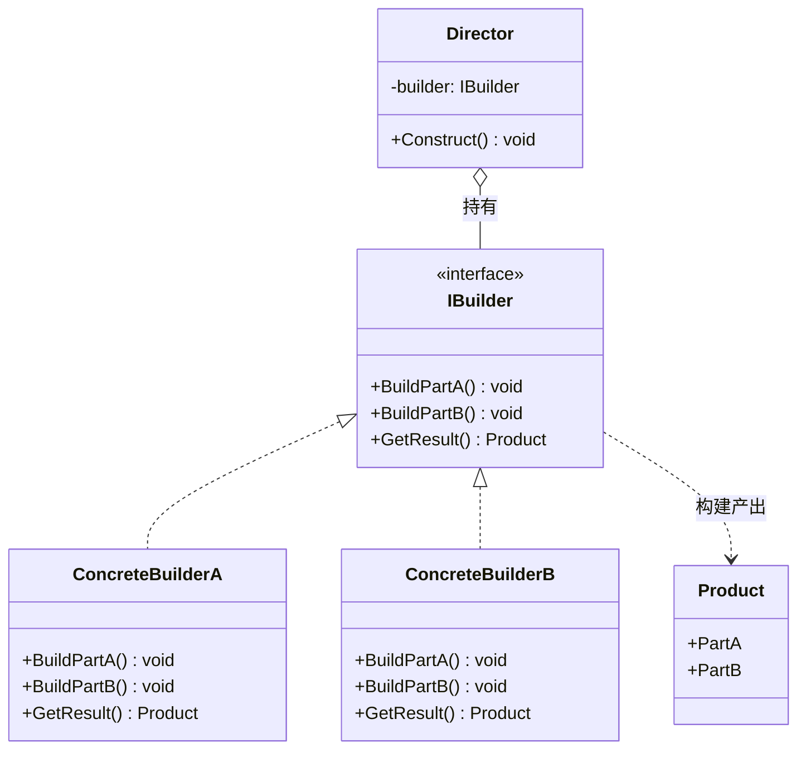
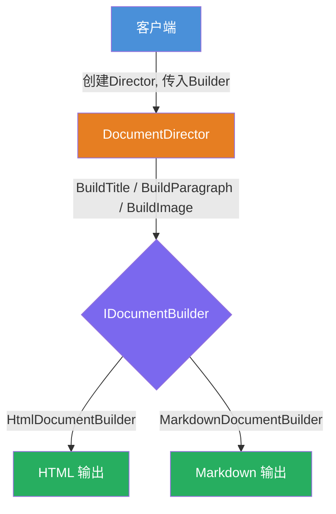

# 建造者模式（Builder Pattern）教程

[TOC]

## 一、📖 概述

建造者模式是**创建型设计模式**，将复杂对象的**构建过程**与**表示**分离，使同样的构建步骤可以组装出不同的产品。

核心思想：由 **指挥者** 控制构建步骤的顺序，**建造者** 负责各步骤的具体实现。客户端无需了解内部组装细节，即可创建不同表示的对象。

<br/>

## 二、🧩 模式解析

### 2.1 类关系图



### 2.2 四大角色

| 角色 | 职责 | 设计要点 |
| --- | --- | --- |
| **产品 Product** | 被构建的复杂对象，包含多个部件 | 纯数据对象，不包含构建逻辑 |
| **抽象建造者 Builder** | 定义构建步骤的接口契约 | 所有具体建造者遵循同一套接口，保证步骤一致性 |
| **具体建造者 ConcreteBuilder** | 实现各构建步骤，产出具体产品 | 每个建造者独立实现，互不干扰；内部维护产品引用 |
| **指挥者 Director** | 编排构建步骤的顺序，封装构建算法 | 算法骨架不变（开闭原则），变更只发生在具体建造者 |

### 2.3 关键解析

**有无 Director 的区别**：

| 对比 | 有 Director（经典建造者） | 无 Director（Fluent-Builder） |
| --- | --- | --- |
| 构建顺序 | 由 Director 统一编排 | 由客户端自行调用 |
| 适用场景 | 构建流程固定，多处复用 | 一次性构建，顺序灵活 |
| 代码耦合 | 客户端只调 `Build()`，不感知步骤 | 客户端需了解每个步骤及顺序 |

**接口的意义**：抽象建造者接口是 GoF Builder 的核心契约，保证 Director 的构建流程可以无缝切换 Builder。Fluent-Builder 省略接口，以灵活性换取简洁性。

**产品的纯度**：产品类是纯数据对象，不包含任何构建逻辑，构建细节全部封装在建造者中——这是 Builder 模式与工厂模式的关键区别。

> **何时省略 Director**：当构建步骤少、流程不需要复用时，可直接用链式调用，省略 Director 以减少类数量。

<br/>

## 三、💻 代码示例

### 3.1 经典代码示例

> 场景：指挥者 DocumentDirector 按固定顺序调用建造者步骤，不同建造者产出不同风格的文档。



| 角色         | 文件                    |
| ------------ | ----------------------- |
| 产品 Product | [`Document.cs`](Document.cs) |
| 抽象建造者   | [`IDocumentBuilder.cs`](IDocumentBuilder.cs) |
| 具体建造者A  | [`HtmlDocumentBuilder.cs`](HtmlDocumentBuilder.cs) |
| 具体建造者B  | [`MarkdownDocumentBuilder.cs`](MarkdownDocumentBuilder.cs) |
| 指挥者       | [`DocumentDirector.cs`](DocumentDirector.cs) |
| 客户端       | [`Program.cs`](Program.cs) |

**运行结果**：

```
==== HTML 输出 ====
<h1>设计模式笔记</h1>
<p>GoF建造者模式，构建流程与表示互相分离。</p>


==== Markdown 输出 ====
# 设计模式笔记

GoF建造者模式，构建流程与表示互相分离。


```

### 3.2 Fluent-Builder

> 说明：Fluent-Builder是Builder Pattern的变体，无接口、无Director，链式调用，`Build()` 统一校验返回不可变产品。

```csharp
// 产品：不可变应用配置
public sealed class WebAppConfig
{
    public string ConnectionString { get; init; }
    public string RedisEndpoint { get; init; }
    public bool EnableLog { get; init; }
}

// Fluent-Builder，无接口、无Director
public class WebAppConfigBuilder
{
    private readonly WebAppConfig _config = new WebAppConfig();

    public WebAppConfigBuilder UseSql(string connStr)
    {
        _config.ConnectionString = connStr;
        return this;
    }

    public WebAppConfigBuilder UseRedis(string endpoint)
    {
        _config.RedisEndpoint = endpoint;
        return this;
    }

    public WebAppConfigBuilder EnableLog(bool enable)
    {
        _config.EnableLog = enable;
        return this;
    }

    // 终止方法：参数校验，产出最终对象
    public WebAppConfig Build()
    {
        if (string.IsNullOrWhiteSpace(_config.ConnectionString))
            throw new ArgumentException("数据库连接字符串不能为空");
        return _config;
    }
}

// 使用：链式调用，一步到位
var config = new WebAppConfigBuilder()
    .UseSql("Server=127.0.0.1;Database=DemoDb")
    .UseRedis("127.0.0.1:6379")
    .EnableLog(true)
    .Build();
```

### 3.3 StringBuilder

> 说明：链式调用 ≠ Builder 模式，建造者与产品没有分离。
>
> Fluent-Builder：Builder 和 Product 是两个对象，Build() 返回最终产品
>
> StringBuilder：Builder 就是 Product，ToString() 只是导出内部缓冲区

```csharp
var sb = new StringBuilder();
sb.Append("a").Append("b").AppendLine("c");
string output = sb.ToString();
```

- ❌ `StringBuilder` 本身就是产品，建造者与产品没有分离
- ❌ 没有独立 `Build()` 终止方法
- ✅ 仅是 Fluent Interface（流畅接口），一种编码语法风格

<br/>

## 四、📝 小结

- **核心思想**：将复杂对象的构建过程与表示分离，同一流程产出不同产品

- **适用场景**：构造函数参数过多、需要同一套构建流程产出多种表示、构建步骤固定

- **选型建议**：需要多套输出变体 → GoF 完整 Builder；仅解决参数过多 → Fluent-Builder

- **注意事项**：仅在对象确实复杂时使用，避免对简单对象过度设计
