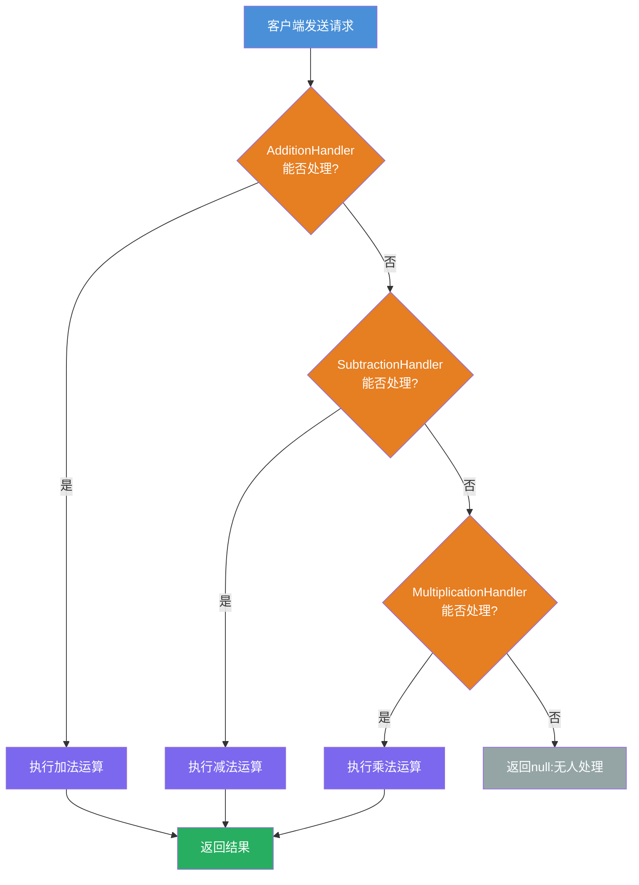
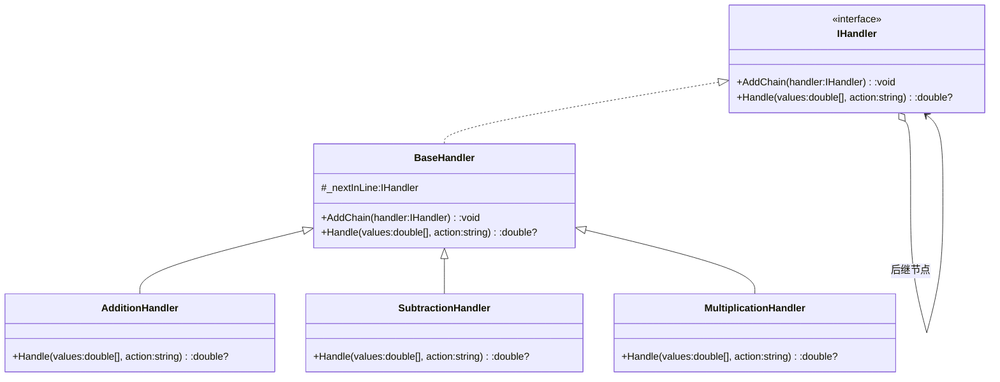

# 职责链模式教程

[TOC]


## 一、📖 概述

职责链模式是**行为型设计模式**，将请求的发送者与接收者解耦，使**多个对象都有机会处理同一个请求**。这些处理对象被连成一条链，请求沿链传递，直到某个处理器能处理它为止。发送者无需知道具体由谁处理。

核心思想：将每个处理逻辑封装为独立节点，通过链表组织起来。新增处理只需追加节点并挂到链尾，符合**开闭原则**；链尾无人响应时返回 null，天然支持"兜底不处理"。

### 核心特性

- **解耦发送者与接收者**：客户端不关心请求由谁处理

- **链式传递**：请求沿处理链逐个传递，直到被处理

- **动态组合**：运行时可灵活增删链中的处理器

- **符合开闭原则**：新增处理器无需修改现有代码

<br/>

## 二、📐 结构图解

### 2.1 处理流程

以计算器为例：加法、减法、乘法三个处理器组成链，客户端发送请求，链上各节点依次尝试处理。



### 2.2 类关系



<br/>

## 三、💻 代码实现

以计算器为例：三个处理器（加法、减法、乘法）组成职责链，客户端发送不同运算请求。

### 3.1 处理者接口与基类

```csharp
// 职责链接口
public interface IHandler
{
    void AddChain(IHandler handler);
    double? Handle(double[] values, string action);
}

// 抽象基类：维护后继节点
public abstract class BaseHandler : IHandler
{
    protected IHandler? _nextInLine;

    public void AddChain(IHandler handler)
    {
        _nextInLine = handler;
    }

    public abstract double? Handle(double[] values, string action);
}
```

### 3.2 具体处理器

```csharp
// 加法处理器
public class AdditionHandler : BaseHandler
{
    public override double? Handle(double[] values, string action)
    {
        if (string.Equals(action, "Add"))
            return values[0] + values[1];

        return _nextInLine?.Handle(values, action); // 传给下一个
    }
}

// 减法处理器
public class SubtractionHandler : BaseHandler
{
    public override double? Handle(double[] values, string action)
    {
        if (string.Equals(action, "Minus"))
            return values[0] - values[1];

        return _nextInLine?.Handle(values, action);
    }
}

// 乘法处理器
public class MultiplicationHandler : BaseHandler
{
    public override double? Handle(double[] values, string action)
    {
        if (string.Equals(action, "Multiply"))
            return values[0] * values[1];

        return _nextInLine?.Handle(values, action);
    }
}
```

### 3.3 客户端使用

```csharp
// 组装链：加法 → 减法 → 乘法
var multiplicationHandler = new MultiplicationHandler();
var subtractionHandler = new SubtractionHandler();
var additionHandler = new AdditionHandler();

subtractionHandler.AddChain(multiplicationHandler);
additionHandler.AddChain(subtractionHandler);

double[] numbers = [2, 3];

// 请求加法 → AdditionHandler 处理
var addResult = additionHandler.Handle(numbers, "Add");       // 5

// 请求除法 → 链中无人处理 → null
var divideResult = additionHandler.Handle(numbers, "divide"); // null
```

<br/>

## 四、🔍 核心解析

### 4.1 链式接口

`IHandler` 定义了两个方法：`AddChain` 用于挂载后继节点，`Handle` 用于处理请求。所有处理器遵循统一接口，客户端无感知。

### 4.2 抽象基类

`BaseHandler` 维护 `_nextInLine` 引用，实现 `AddChain` 方法。具体处理器继承基类，只需实现自己的 `Handle` 逻辑。

### 4.3 请求传递

每个具体处理器判断能否处理当前请求：能处理则直接返回结果；不能处理则调用 `_nextInLine?.Handle()` 向后传递。链尾无人处理时，`?.` 空合并运算符返回 null。

### 4.4 链的组装

客户端通过 `AddChain` 将处理器串成单向链表。链的顺序决定了优先级：先注册的处理器优先尝试处理。

<br/>

## 五、🎯 应用场景

### 5.1 适用场景

- 多个对象可能处理同一请求，具体处理者在运行时确定

- 需要在不指定接收者的情况下发送请求

- 处理者集合应动态指定

- 请求需要经过多级处理、过滤或校验

### 5.2 实际案例

- **Web中间件管道**：ASP.NET Core 的请求管道，中间件按顺序处理请求

- **审批流程**：员工请假逐级上报，主管→经理→总监依次审批

- **异常处理**：try-catch 链中多个 catch 块依次尝试匹配

- **事件冒泡**：DOM 事件从子元素向父元素逐层传递

<br/>

## 六、⚖️ 优缺点分析

### 6.1 优点

- **解耦请求发送者与处理者**：发送者不关心谁处理

- **灵活调整链结构**：运行时动态增删处理器

- **符合开闭原则**：新增处理器不影响现有代码

- **职责单一**：每个处理器只关注自己的逻辑

### 6.2 缺点

- **请求可能无人处理**：链尾无兜底时请求丢失

- **链过长影响性能**：请求需逐个传递，链太长时效率降低

- **调试困难**：请求在链中流转，排查问题时不易追踪

<br/>

## 七、📝 总结

- **核心思想**：将请求的发送者与接收者解耦，多个对象沿链依次尝试处理请求

- **关键角色**：处理者接口、抽象基类、具体处理器、客户端

- **适用场景**：多个对象可能处理同一请求，需动态指定处理者

- **注意事项**：设计时考虑链的长度和兜底处理器，避免请求无人处理
