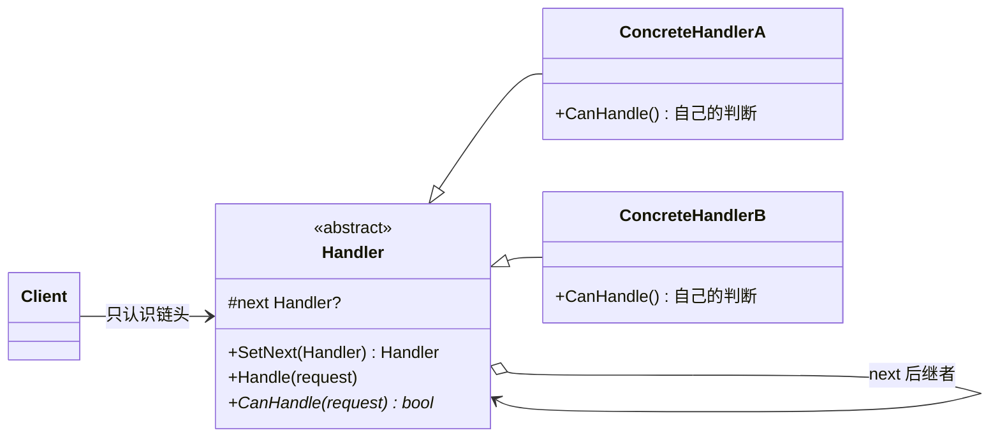
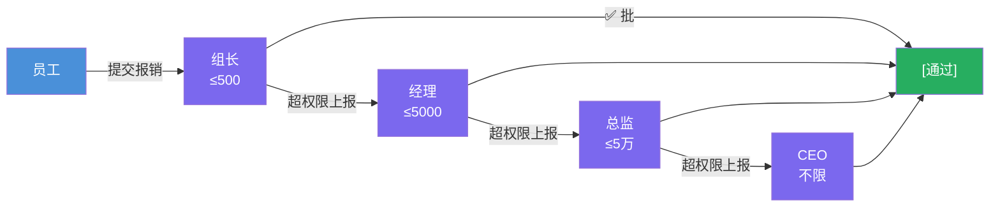
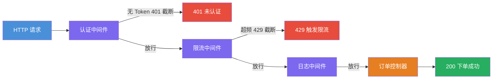

# 责任链模式（Chain of Responsibility Pattern）

[TOC]

## 一、📖 概述

责任链是**行为型设计模式**，让多个对象都有机会处理请求，把这些对象**连成一条链**，请求沿链传递，直到有一个对象处理它为止。

核心思想：发送者只知道链头，不知道谁会处理；每个处理者**只判断自己的部分**，处理不了就交给下一环。发送者与接收者解耦，新增/移除处理者零改动客户端。典型应用：审批流、异常处理、HTTP 中间件、事件冒泡。

<br/>

## 二、🧩 模式解析

### 2.1 类关系图



| 关键角色 | 说明 | 审批示例 |
| --- | --- | --- |
| **抽象处理者（Handler）** | 持有 `next` 引用，实现"处理或转交"骨架 | `Approver` |
| **具体处理者（Concrete Handler）** | 只判断自己的权限，管不了就上报 | `TeamLead`/`Manager`/`Director`/`Ceo` |
| **客户端（Client）** | 把请求发给链头，不关心谁处理 | `Program.cs` |

### 2.2 核心代码

```csharp
// 抽象处理者：串链 + 处理或转交
abstract class Handler
{
    private Handler? _next;                      // 后继者

    public Handler SetNext(Handler next)         // 串链（返回 next 便于链式组装）
    {
        _next = next;
        return next;
    }

    public void Handle(Request request)
    {
        if (CanHandle(request)) { /* 处理 */ }
        else if (_next is not null) _next.Handle(request);   // 转交
        else { /* 链尾兜底：拒绝 */ }
    }

    protected abstract bool CanHandle(Request request);      // 只管自己的判断
}
```

> 协作方式：客户端把请求发给链头；每个处理者只回答一个问题——"我能不能管"，管得了就处理，管不了就转给 `next`——发送者与具体处理者互不相识。

### 2.3 关键解析

**两种链策略**：

| 策略 | 行为 | 示例 |
| --- | --- | --- |
| 处理即终止 | 有一个环节接手就结束 | 报销审批（组长批了就不再上报） |
| 全链穿透 | 每环都过一遍（观察/加工） | HTTP 中间件（认证→限流→日志依次检查） |

- **BCL 中的身影**：ASP.NET Core 中间件管道 `app.Use(async (ctx, next) => { ...; await next(ctx); })` 就是责任链的 lambda 版；WinForms/WPF 事件冒泡、`Exception.GetBaseException()` 异常链同理
- **纯版 vs 变体**：GoF 纯版"要么处理要么转交"，变体"处理后仍继续传递"（中间件模型）——本模式两个示例各演示一种
- **注意事项**：请求可能到链尾无人处理（需兜底）；调试时链路不直观，日志要打清楚在哪一环

<br/>

## 三、💻 代码示例

### 3.1 经典场景：公司报销审批

> 场景：组长（≤500）→ 经理（≤5000）→ 总监（≤5 万）→ CEO（不限）逐级审批——员工只管提交，系统自动找到有权限的审批人。



| 角色 | 文件 |
| --- | --- |
| 请求对象 | [`Approval/ExpenseRequest.cs`](Approval/ExpenseRequest.cs) |
| 抽象处理者 | [`Approval/Approver.cs`](Approval/Approver.cs) |
| 具体处理者 | [`Approval/TeamLead.cs`](Approval/TeamLead.cs)、[`Manager.cs`](Approval/Manager.cs)、[`Director.cs`](Approval/Director.cs)、[`Ceo.cs`](Approval/Ceo.cs) |
| 客户端 | [`Program.cs`](Program.cs) |

### 3.2 软件项目：HTTP 中间件管道

> 场景：请求流经 认证 → 限流 → 日志 → 控制器——无 Token 在认证环被 401 截断，超频在限流环被 429 截断，全部通过才到达业务控制器（ASP.NET Core 的核心机制）。



| 角色 | 文件 |
| --- | --- |
| 请求对象 | [`Middleware/HttpContext.cs`](Middleware/HttpContext.cs) |
| 抽象处理者 | [`Middleware/Middleware.cs`](Middleware/Middleware.cs) |
| 具体处理者 | [`Middleware/AuthMiddleware.cs`](Middleware/AuthMiddleware.cs)、[`RateLimitMiddleware.cs`](Middleware/RateLimitMiddleware.cs)、[`LoggingMiddleware.cs`](Middleware/LoggingMiddleware.cs)、[`OrderController.cs`](Middleware/OrderController.cs) |
| 客户端 | [`Program.cs`](Program.cs) |

### 3.3 运行结果

```bash
========== 责任链模式 (Chain of Responsibility) ==========
请求沿链传递，每个处理者决定处理或转交下一位

--- 经典场景: 公司报销审批 ---
>> 审批链：组长(≤500) → 经理(≤5000) → 总监(≤5万) → CEO(不限)

>> 小陈 提交「团建零食」¥320
[通过] 组长老王 审批通过：小陈 的「团建零食」¥320

>> 小周 提交「差旅费」¥3800
[上报] 组长老王：¥3800 超出我的权限，转交 经理老李
[通过] 经理老李 审批通过：小周 的「差旅费」¥3800

>> 小吴 提交「展会物料」¥28000
[上报] 组长老王：¥28000 超出我的权限，转交 经理老李
[上报] 经理老李：¥28000 超出我的权限，转交 张总监
[通过] 张总监 审批通过：小吴 的「展会物料」¥28000

>> 小郑 提交「服务器采购」¥500000
[上报] 组长老王：¥500000 超出我的权限，转交 经理老李
[上报] 经理老李：¥500000 超出我的权限，转交 张总监
[上报] 张总监：¥500000 超出我的权限，转交 赵总
[通过] 赵总 审批通过：小郑 的「服务器采购」¥500000

--- 软件项目: HTTP 中间件管道 ---
>> 管道：认证 → 限流 → 日志 → 控制器（ASP.NET Core 的核心机制）

>> 请求进入管道：GET /api/orders（Token：jwt-token-abc）
[执行] 认证中间件：GET /api/orders
[放行] 认证中间件 检查通过，进入下一环
[执行] 限流中间件：/api/orders 已访问 0/3 次
[放行] 限流中间件 检查通过，进入下一环
[执行] 日志中间件：记录 GET /api/orders
[放行] 日志中间件 检查通过，进入下一环
[执行] 订单控制器：处理业务 /api/orders
[截断] 订单控制器 终止管道：200 OK 订单创建成功

>> 请求进入管道：GET /api/orders（Token：无）
[执行] 认证中间件：GET /api/orders
[截断] 认证中间件 终止管道：401 Unauthorized 未认证

>> 请求进入管道：GET /api/orders（Token：jwt-token-abc）
[执行] 认证中间件：GET /api/orders
[放行] 认证中间件 检查通过，进入下一环
[执行] 限流中间件：/api/orders 已访问 1/3 次
[放行] 限流中间件 检查通过，进入下一环
[执行] 日志中间件：记录 GET /api/orders
[放行] 日志中间件 检查通过，进入下一环
[执行] 订单控制器：处理业务 /api/orders
[截断] 订单控制器 终止管道：200 OK 订单创建成功

>> 请求进入管道：GET /api/orders（Token：jwt-token-abc）
[执行] 认证中间件：GET /api/orders
[放行] 认证中间件 检查通过，进入下一环
[执行] 限流中间件：/api/orders 已访问 2/3 次
[放行] 限流中间件 检查通过，进入下一环
[执行] 日志中间件：记录 GET /api/orders
[放行] 日志中间件 检查通过，进入下一环
[执行] 订单控制器：处理业务 /api/orders
[截断] 订单控制器 终止管道：200 OK 订单创建成功

>> 请求进入管道：GET /api/orders（Token：jwt-token-abc）
[执行] 认证中间件：GET /api/orders
[放行] 认证中间件 检查通过，进入下一环
[执行] 限流中间件：/api/orders 已访问 3/3 次
[截断] 限流中间件 终止管道：429 Too Many Requests 触发限流
```

<br/>

## 四、📝 小结

- **核心思想**：处理者串成链，各自只判断自己的部分，处理或转交；客户端只认识链头

- **两个示例**：报销审批展示"处理即终止"的逐级上报，HTTP 中间件展示"全链穿透 + 拦截截断"的软件工程用法

- **注意事项**：链要设计兜底（链尾无人处理时的默认行为）；性能敏感场景注意长链的逐环开销
