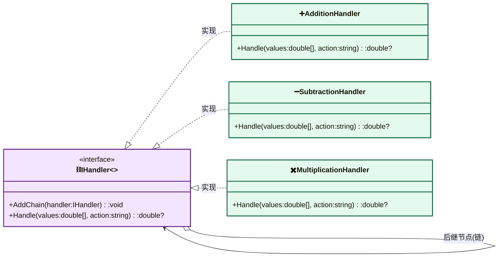

---
AIGC:
    Label: "1"
    ContentProducer: 001191440300708461136T1XGW3
    ProduceID: 6731a671e9c59b3546535911c94fc1c6_622eddc29bf011f19467525400287e28
    ReservedCode1: 7no85TtRJoWqDG6vGowZInbr3jTVRqnyxFMbQygpjhCa1vUm9jei6JfqsUFfhiw2dUI5PCD0hMQbwd9LINUnEi0s2frtA6KrfFoy1z73BjRTEQ5dmQ6jDMI6b+xvWUM1X+JiDZl7SkQ+4BAPl26YWCVfB0+XS7XpL4EnXdZBQ8t8t6uquAZdKrvxvp8=
    ContentPropagator: 001191440300708461136T1XGW3
    PropagateID: 6731a671e9c59b3546535911c94fc1c6_622eddc29bf011f19467525400287e28
    ReservedCode2: 7no85TtRJoWqDG6vGowZInbr3jTVRqnyxFMbQygpjhCa1vUm9jei6JfqsUFfhiw2dUI5PCD0hMQbwd9LINUnEi0s2frtA6KrfFoy1z73BjRTEQ5dmQ6jDMI6b+xvWUM1X+JiDZl7SkQ+4BAPl26YWCVfB0+XS7XpL4EnXdZBQ8t8t6uquAZdKrvxvp8=
---

# 职责链模式（Chain of Responsibility Pattern）

> **核心思想**：将请求的发送者与接收者解耦，使**多个对象都有机会处理同一个请求**。这些处理对象被连成一条链，请求沿链传递，直到某个处理器能处理它为止。发送者无需知道具体由谁处理。

## 解决什么问题

当有多个候选处理器、且处理条件动态变化时，若用 if-else 硬编码会导致逻辑膨胀、难以扩展。职责链把每个处理逻辑封装成独立节点，通过链表组织起来，新增一种处理只需追加一个节点并挂到链尾，符合**开闭原则**；同时天然支持"兜底不处理"（链尾无人响应返回 null）。

## 主要参与者

| 角色 | 本示例类 | 职责 |
| --- | --- | --- |
| 处理者 Handler | `IHandler` | 定义链式接口：`AddChain` / `Handle` |
| 基础处理者 BaseHandler | `BaseHandler` | 维护后继节点 `_nextInLine`，抽象 `Handle` |
| 具体处理者 | `AdditionHandler` / `SubtractionHandler` / `MultiplicationHandler` | 各处理一种 action，处理不了则传给下一个 |
| 客户端 Client | `Program` | 组装链并发送请求 |

## 类图



## 源码结构

目录下源码文件与职责对应：

- **IHandler.cs**：职责链接口，`Handle(double[] values, string action)` 返回 `double?`，链尾无人处理时为 null。
- **BaseHandler.cs**：抽象基类，`AddChain` 把下一个处理器挂到 `_nextInLine`，形成单向链。
- **AdditionHandler.cs / SubtractionHandler.cs / MultiplicationHandler.cs**：三个具体处理器，用 `string.Equals(action, ...)` 判断是否能处理，不能则 `_nextInLine?.Handle(values, action)` 向后传递。
- **Program.cs**：构建链"加法→减法→乘法"，分别请求 `Add / Minus / Multiply / divide`。其中 `divide` 链中无人处理，返回 null，直观展示职责链的"无人认领"兜底行为。

```csharp
// Program.cs 核心代码
subtractionHandler.AddChain(multiplicationHandler);
additionHandler.AddChain(subtractionHandler);   // 链：加法 → 减法 → 乘法

var divisionResult = additionHandler.Handle(numbers, "divide"); // 无人处理 → null
```
*（内容由AI生成，仅供参考）*
