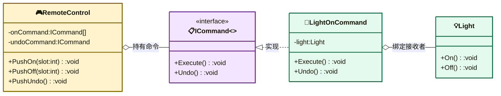

# 命令模式（Command Pattern）

> **核心思想**：将"请求"封装为对象，从而可以用不同的请求对调用方进行参数化，并支持请求的**排队、日志记录与撤销**。命令把"动作的发起者"与"动作的执行者"彻底解耦。

## 解决什么问题

若按钮（调用者）直接调用设备（接收者）的方法，会导致两者强耦合，且难以实现撤销、宏命令（一键多设备）等高级功能。命令模式把"按按钮→执行动作"抽象为独立的命令对象：调用者只持有命令并调用 `Execute()`，命令内部才去操作具体的接收者，因此可以轻松组合、排队、撤销。

## 主要参与者

| 角色 | 本示例类 | 职责 |
| --- | --- | --- |
| 命令 Command | `ICommand` | 定义 `Execute()` / `Undo()` 契约 |
| 具体命令 | `LightOnCommand` / `LightOffCommand` / `GarageDoorOpenCommand` / `GarageDoorCloseCommand` | 绑定接收者与动作 |
| 宏命令 | `MacroCommand` | 组合多个命令批量执行/撤销 |
| 空命令 | `NoCommand` | 空实现，避免空引用判断 |
| 接收者 Receiver | `Light` / `Garage` | 真正执行操作的对象 |
| 调用者 Invoker | `RemoteControl` | 持有并触发命令，支持开/关/撤销 |
| 客户端 Client | `Program` | 组装命令并绑定到遥控器槽位 |

## 类图



## 源码结构

目录下源码文件与职责对应：

- **ICommand.cs**：命令接口，含 `Execute` 与 `Undo`。
- **Light.cs / Garage.cs**：接收者，提供 `On/Off` 与 `Open/Close` 真实操作。
- **LightOnCommand.cs / LightOffCommand.cs / GarageDoorOpenCommand.cs / GarageDoorCloseCommand.cs**：每个命令绑定一个接收者，`Execute` 执行对应动作、`Undo` 反着执行。
- **MacroCommand.cs**：宏命令，遍历执行/撤销一组命令——对应 `Program` 中的"派对模式"一键开关多设备。
- **NoCommand.cs**：空命令对象，填充遥控器默认槽位，避免每个槽位判空。
- **OnOffStruct.cs**：`On`/`Off` 一对命令结构，方便绑定到同一槽位。
- **RemoteControl.cs**：调用者，内部维护 `_onCommand` / `_offCommand` 数组与 `_undoCommand`，`PushUndo()` 支持撤销上一步。
- **Program.cs**：把车库门开关绑到槽位 0，把宏命令绑到槽位 2，演示单命令撤销与宏命令批量控制。

```csharp
// Program.cs 核心代码
remote[0] = new OnOffStruct { On = bikeDoorOpen, Off = bikeDoorClose };
remote.PushOn(0);     // 执行开
remote.PushUndo();    // 撤销 → 关闭
remote.PushUndo();    // 再撤销 → 打开

remote[2] = new OnOffStruct { On = new MacroCommand(partyOn), Off = new MacroCommand(partyOff) };
remote.PushOn(2);     // 一键开灯+开两个车库门
```
