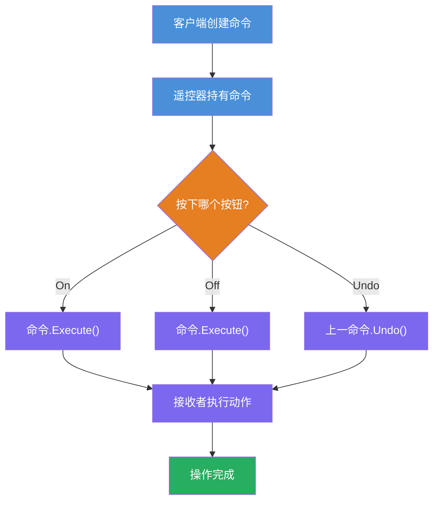
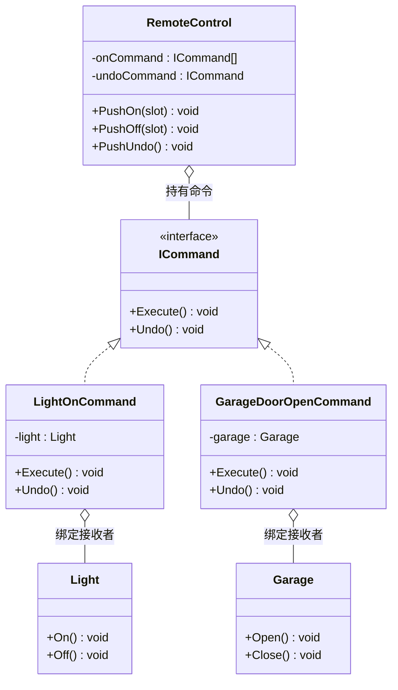

# 命令模式（Command Pattern）教程

[TOC]

## 一、📖 概述

命令模式是**行为型设计模式**，将请求封装为对象，从而可以用不同的请求对调用方进行参数化，并支持请求的**排队、日志记录与撤销**。

核心思想：把"动作的发起者"与"动作的执行者"彻底解耦，调用者只持有命令对象并调用 `Execute()`，命令内部才去操作具体的接收者，因此可以轻松组合、排队、撤销。

### 核心特性

- **解耦调用者与接收者**：调用者不直接引用接收者，仅通过命令接口交互

- **命令可排队与日志化**：命令对象可存入队列、持久化、重放

- **支持撤销/重做**：命令对象记录操作前状态，可反向执行 `Undo()`

- **支持宏命令**：将多个命令组合为一个复合命令批量执行

<br/>

## 二、📐 结构图解

### 2.1 整体流程



### 2.2 类关系



### 2.3 关键角色

| 角色                             | 说明                                              |
| -------------------------------- | ------------------------------------------------- |
| **命令接口（Command）**          | 定义 `Execute()` 和 `Undo()` 的统一契约           |
| **具体命令（Concrete Command）** | 绑定接收者，将 `Execute()` 映射到接收者的具体方法 |
| **接收者（Receiver）**           | 实际执行操作的对象                                |
| **调用者（Invoker）**            | 持有命令引用并触发执行，不知道具体接收者是谁      |

<br/>

## 三、💻 代码实现

以遥控器控制家电为例：遥控器（调用者）通过命令对象控制灯和车库门，支持开关与撤销。

### 3.1 命令接口

```csharp
// 命令接口：统一的执行与撤销契约
public interface ICommand
{
    void Execute();
    void Undo();
}
```

### 3.2 接收者与具体命令

```csharp
// 接收者：灯
public class Light
{
    public void On() => Console.WriteLine("灯已打开");
    public void Off() => Console.WriteLine("灯已关闭");
}

// 具体命令：开灯
public class LightOnCommand : ICommand
{
    private readonly Light _light;

    public LightOnCommand(Light light) => _light = light;

    public void Execute() => _light.On();
    public void Undo() => _light.Off();   // 撤销 = 反操作
}

// 接收者：车库门
public class Garage
{
    public void Open() => Console.WriteLine("车库门已打开");
    public void Close() => Console.WriteLine("车库门已关闭");
}

// 具体命令：开车库门
public class GarageDoorOpenCommand : ICommand
{
    private readonly Garage _garage;

    public GarageDoorOpenCommand(Garage garage) => _garage = garage;

    public void Execute() => _garage.Open();
    public void Undo() => _garage.Close();
}
```

### 3.3 调用者：遥控器

```csharp
// 调用者：遥控器，维护命令数组与撤销栈
public class RemoteControl
{
    private readonly ICommand[] _onCommands = new ICommand[4];
    private readonly ICommand[] _offCommands = new ICommand[4];
    private ICommand _undoCommand;

    // 设置槽位的开/关命令
    public void SetCommand(int slot, ICommand onCmd, ICommand offCmd)
    {
        _onCommands[slot] = onCmd;
        _offCommands[slot] = offCmd;
    }

    // 按下 On 按钮
    public void PushOn(int slot)
    {
        _onCommands[slot]?.Execute();
        _undoCommand = _onCommands[slot];
    }

    // 按下 Off 按钮
    public void PushOff(int slot)
    {
        _offCommands[slot]?.Execute();
        _undoCommand = _offCommands[slot];
    }

    // 撤销上一步操作
    public void PushUndo()
    {
        _undoCommand?.Undo();
    }
}
```

### 3.4 客户端组装

```csharp
// 客户端：组装命令并绑定到遥控器
var remote = new RemoteControl();

var light = new Light();
var garage = new Garage();

// 绑定到槽位 0
remote.SetCommand(0,
    new LightOnCommand(light),      // On: 开灯
    new LightOffCommand(light));    // Off: 关灯

// 使用
remote.PushOn(0);       // 灯已打开
remote.PushUndo();      // 灯已关闭（撤销）

// 绑定到槽位 1
remote.SetCommand(1,
    new GarageDoorOpenCommand(garage),
    new GarageDoorCloseCommand(garage));

remote.PushOn(1);       // 车库门已打开
```

<br/>

## 四、🔍 核心解析

### 4.1 命令接口

`ICommand` 定义了 `Execute()` 和 `Undo()` 两个方法，所有具体命令必须实现。这使得调用者无需知道具体执行什么操作。

### 4.2 调用者与接收者解耦

`RemoteControl`（调用者）只持有 `ICommand` 引用，不知道具体是灯还是车库门。命令对象内部绑定接收者，负责将 `Execute()` 映射到接收者的具体方法。

### 4.3 撤销机制

每次执行命令时，遥控器记录 `_undoCommand`。撤销时调用该命令的 `Undo()`，由具体命令决定反向操作是什么（开灯的撤销是关灯）。

### 4.4 宏命令扩展

`MacroCommand` 将多个命令组合为一个，`Execute()` 遍历执行所有子命令，`Undo()` 遍历反向撤销。典型应用：一键同时开关多个设备。

<br/>

## 五、🎯 应用场景

### 5.1 适用场景

- 需要支持撤销/重做的操作（如文本编辑器、绘图工具）

- 需要将操作排队或延迟执行（如任务队列、事务日志）

- 需要将操作序列化保存或远程传输（如命令宏、RPC）

- 需要解耦触发者与执行者（如GUI按钮、菜单项）

### 5.2 实际案例

- **GUI框架**：菜单项、按钮的点击事件本质上是命令对象

- **事务系统**：数据库操作封装为命令，支持回滚

- **任务队列**：后台任务封装为命令，支持重试与日志

- **游戏存档**：玩家操作封装为命令，支持录像回放

<br/>

## 六、⚖️ 优缺点分析

### 6.1 优点

- **调用者与接收者解耦**：调用者不知道谁来处理请求

- **易于扩展新命令**：新增命令无需修改现有类

- **支持撤销/重做**：命令对象天然适合记录与回退

- **支持宏命令与队列**：可组合、排队、日志化

### 6.2 缺点

- **类数量增多**：每个具体命令都是一个类，项目规模膨胀

- **间接层增加**：简单场景下引入命令模式会过度设计

<br/>

## 七、📝 总结

- **核心思想**：将请求封装为对象，解耦调用者与接收者

- **关键角色**：命令接口、具体命令、接收者、调用者、客户端

- **适用场景**：需要撤销、排队、日志化或解耦触发与执行的场景

- **注意事项**：简单场景下命令模式会增加不必要的类，需权衡复杂度

---

## 八、🔬 宏命令与撤销

### 8.1 宏命令

宏命令是命令模式的组合扩展，将**多个命令封装为一个复合命令**。调用者无需逐个触发，一次 `Execute()` 即可批量执行。

```csharp
// 宏命令：组合多个命令
public class MacroCommand : ICommand
{
    private readonly ICommand[] _commands;

    public MacroCommand(ICommand[] commands) => _commands = commands;

    public void Execute()
    {
        foreach (var cmd in _commands)
            cmd.Execute();         // 依次执行所有子命令
    }

    public void Undo()
    {
        for (int i = _commands.Length - 1; i >= 0; i--)
            _commands[i].Undo();   // 反序撤销所有子命令
    }
}
```

**典型场景**："一键离家"宏命令 → 关灯 + 关空调 + 锁门，三个操作合为一个命令对象。

### 8.2 撤销机制

撤销的核心在于每个命令对象**自行封装反向操作**：

| 命令              | Execute（正向）    | Undo（反向）               |
| ----------------- | ------------------ | -------------------------- |
| `LightOnCommand`  | `light.On()`       | `light.Off()`              |
| `LightOffCommand` | `light.Off()`      | `light.On()`               |
| `MacroCommand`    | 遍历执行所有子命令 | **反序**遍历撤销所有子命令 |

调用者只需维护一个 `_undoCommand` 引用，每次执行新命令时覆盖，撤销时调用该命令的 `Undo()`。如需支持多步撤销（Undo/Redo），可将执行历史改为**命令栈**（两个栈分别记录可撤销和可重做的命令）。
