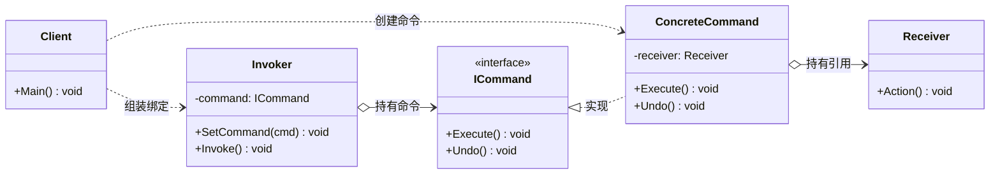
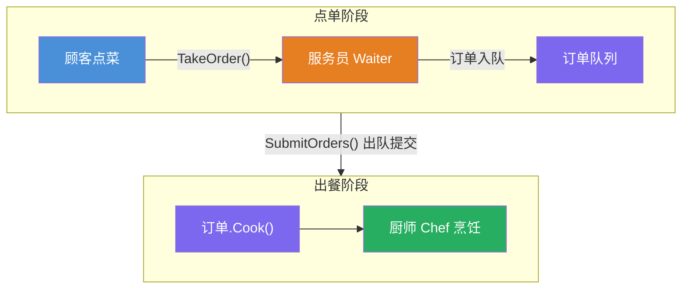
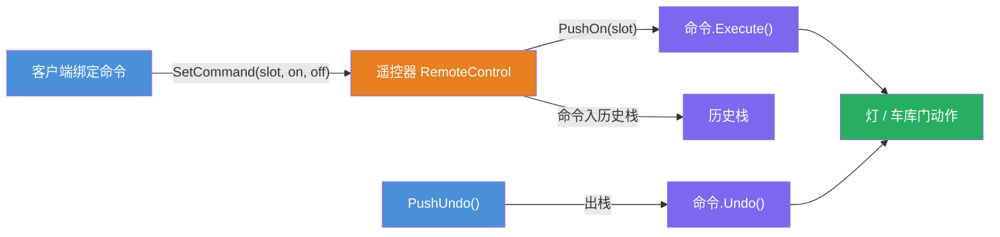
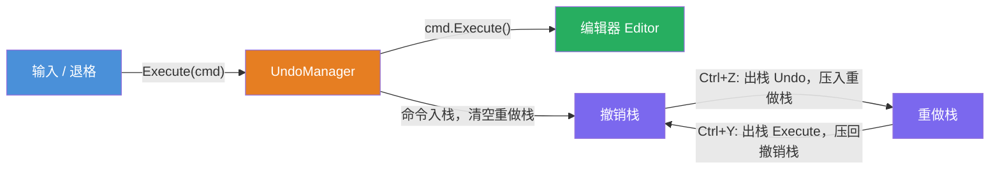

# 命令模式（Command Pattern）

[TOC]

## 一、📖 概述

命令模式是**行为型设计模式**，将请求封装为独立的命令对象，从而使调用者与接收者彻底解耦。

核心思想：把"做什么"打包成对象。调用者只持有命令并调用 `Execute()`，不关心谁执行、如何执行，因此命令天然支持**排队、撤销/重做、日志记录与组合**。

<br/>

## 二、🧩 模式解析

### 2.1 类关系图



| 角色 | 说明 |
| --- | --- |
| **命令接口（Command）** | 定义 `Execute()` / `Undo()` 的统一契约 |
| **具体命令（Concrete Command）** | 绑定接收者，将 `Execute()` 映射到接收者的具体方法 |
| **接收者（Receiver）** | 实际执行操作的对象 |
| **调用者（Invoker）** | 持有命令并触发执行，不知道具体接收者是谁 |

### 2.2 三类应用对比

| 应用 | 目的 | 实现要点 |
| --- | --- | --- |
| **命令排队 Queue** | 请求与执行在时间上解耦 | 调用者将命令存入队列，稍后统一取出执行 |
| **撤销/重做 Undo/Redo** | 支持操作回退与恢复 | 命令封装反向操作，调用者用栈管理历史 |
| **宏命令 Macro** | 多个命令一键批量执行 | 组合多个子命令，撤销时反序回退 |

> 三种应用的具体示例见第三节。

### 2.3 核心代码

```csharp
// 命令接口：统一的执行与撤销契约
interface Command
{
    void Execute();
    void Undo();
}

// 具体命令：绑定接收者，Execute 正向、Undo 反向
class ConcreteCommand : Command
{
    readonly Receiver _receiver;                  // 构造时绑定的接收者

    void Execute() => _receiver.Action();         // 正向：转调接收者
    void Undo()    => _receiver.UndoAction();     // 反向：接收者的逆操作
}

// 调用者 Invoker：只持有命令并触发，不认识任何接收者
class Invoker
{
    Command _command;
    Stack<Command> _history;                      // 历史栈，支撑撤销/重做

    void SetCommand(Command cmd) => _command = cmd;

    void Invoke()
    {
        _command.Execute();                       // 触发执行
        _history.Push(_command);                  // 执行过即入历史
    }

    void Undo() => _history.Pop().Undo();         // 撤销 = 出栈执行反向
}
```

> 协作方式：客户端创建命令并绑定接收者，再装配给调用者；调用者只管 `Invoke()` 触发与 `Undo()` 回退，请求的真正执行细节全部封装在命令对象内部。

### 2.4 关键解析

**调用者与接收者解耦**：调用者只面向命令接口编程，新增设备只需新增命令类，无需修改调用者（开闭原则）。

**与策略模式的区别**：

| 对比维度 | 命令模式 Command | 策略模式 Strategy |
| --- | --- | --- |
| 核心目的 | 封装**请求**，支持排队、撤销、日志 | 封装**算法**，支持运行时替换 |
| 对象生命周期 | 短生命周期，执行后仍可留存（入队、入栈） | 长生命周期，贯穿上下文 |
| 调用方角色 | 只负责触发，不消费执行结果 | 主动选择算法并消费其结果 |

<br/>

## 三、💻 代码示例

### 3.1 命令排队：餐厅点餐

> 场景：服务员（调用者）只负责把订单（命令）入队，不认识厨师（接收者）；点单与烹饪在时间上解耦，后厨按队列顺序出餐。



| 角色 | 文件 |
| --- | --- |
| 命令接口 | [`Restaurant/IOrder.cs`](Restaurant/IOrder.cs) |
| 具体命令 | [`Restaurant/SteakOrder.cs`](Restaurant/SteakOrder.cs)、[`Restaurant/NoodleOrder.cs`](Restaurant/NoodleOrder.cs) |
| 接收者 | [`Restaurant/Chef.cs`](Restaurant/Chef.cs) |
| 调用者 | [`Restaurant/Waiter.cs`](Restaurant/Waiter.cs) |

### 3.2 撤销与宏命令：智能家居遥控器

> 场景：遥控器（调用者）通过命令控制灯与车库门；历史栈支持多步撤销，宏命令实现"一键回家"批量执行、反序撤销。



| 角色 | 文件 |
| --- | --- |
| 命令接口 | [`SmartHome/ICommand.cs`](SmartHome/ICommand.cs) |
| 具体命令 | [`SmartHome/LightOnCommand.cs`](SmartHome/LightOnCommand.cs) 等 4 个 |
| 接收者 | [`SmartHome/Light.cs`](SmartHome/Light.cs)、[`SmartHome/Garage.cs`](SmartHome/Garage.cs) |
| 调用者 | [`SmartHome/RemoteControl.cs`](SmartHome/RemoteControl.cs) |
| 宏命令 | [`SmartHome/MacroCommand.cs`](SmartHome/MacroCommand.cs) |

### 3.3 撤销/重做：文本编辑器

> 场景：每次输入/退格封装为命令进入历史；双栈实现 Ctrl+Z 撤销与 Ctrl+Y 重做，新操作会清空重做栈——与 VS Code、Word 的编辑历史机制一致。



| 角色 | 文件 |
| --- | --- |
| 命令接口 | [`TextEditor/IEditCommand.cs`](TextEditor/IEditCommand.cs) |
| 具体命令 | [`TextEditor/TypeTextCommand.cs`](TextEditor/TypeTextCommand.cs)、[`TextEditor/BackspaceCommand.cs`](TextEditor/BackspaceCommand.cs) |
| 接收者 | [`TextEditor/Editor.cs`](TextEditor/Editor.cs) |
| 调用者 | [`TextEditor/UndoManager.cs`](TextEditor/UndoManager.cs) |
| 客户端 | [`Program.cs`](Program.cs) |

### 3.4 运行结果

```bash
========== 命令模式 (Command Pattern) ==========
将请求封装为对象，支持排队、撤销/重做与宏命令

--- 命令排队: 餐厅点餐 ---
服务员：新订单入队（当前待处理 1 单）
服务员：新订单入队（当前待处理 2 单）
服务员：新订单入队（当前待处理 3 单）
服务员：订单统一提交后厨
厨师：一份牛排煎好
厨师：一碗牛肉面出锅
厨师：一份牛排煎好

--- 撤销与宏命令: 智能家居遥控器 ---
客厅灯已打开
客厅灯已关闭
没有可撤销的操作

车库门已打开
客厅灯已打开
客厅灯已关闭
车库门已关闭

--- 撤销/重做: 文本编辑器 ---
>> 输入 Hello
  [编辑器] "Hello"
>> 输入 " World"
  [编辑器] "Hello World"
>> 退格 6 个字符
  [编辑器] "Hello"
>> Ctrl+Z 撤销退格
  [编辑器] "Hello World"
>> Ctrl+Z 撤销输入
  [编辑器] "Hello"
>> Ctrl+Y 重做
  [编辑器] "Hello World"
```

<br/>

## 四、📝 小结

- **核心思想**：将请求封装为对象，解耦调用者与接收者

- **三类应用**：命令排队延迟执行、撤销/重做管理历史、宏命令组合批量操作

- **注意事项**：每个操作对应一个命令类，简单场景易过度设计；撤销要求命令自行封装反向操作（如退格命令需记录被删内容才能恢复）
