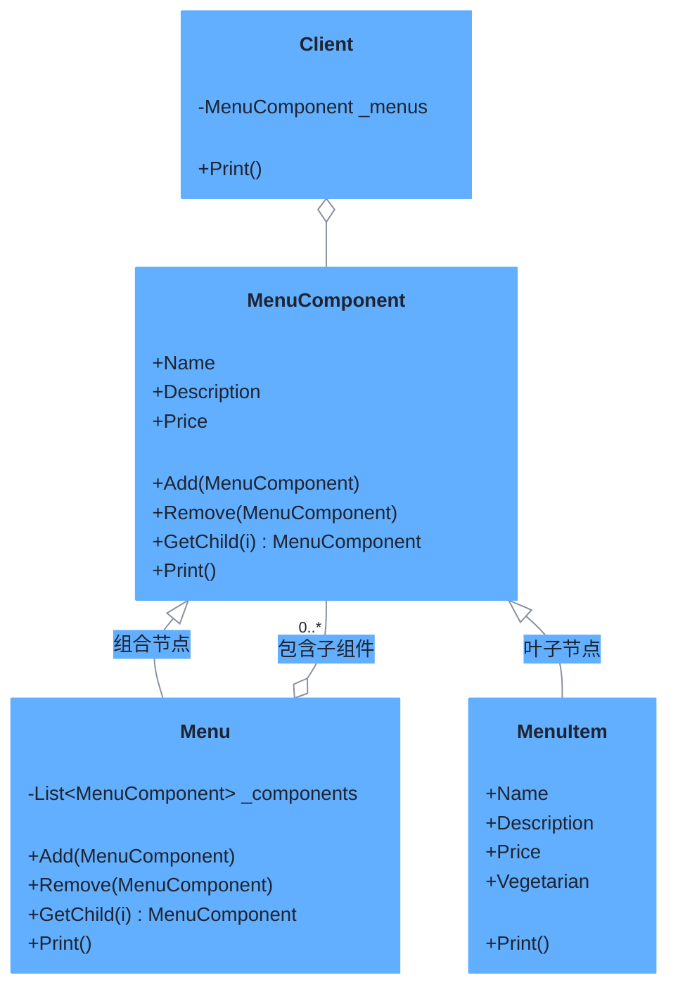

# 组合模式（Composite Pattern）

> **核心思想**：将对象组合成**树形结构**以表示"部分-整体"的层次关系，使得**单个对象（叶子）和组合对象（容器）的使用具有一致性**——客户端可以用同一套接口操作它们。

## 解决什么问题

菜单系统天然是树状结构：顶层菜单包含子菜单，子菜单又包含菜单项。若把"菜单"和"菜单项"分开建模，客户端需要分别处理并判断类型，代码重复且脆弱。组合模式让容器节点和叶子节点实现同一抽象接口，客户端只需递归调用，无需区分类型即可完成整棵树的遍历。

## 主要参与者

| 角色 | 本示例类 | 职责 |
| --- | --- | --- |
| 组件 Component | `MenuComponent` | 定义统一接口（Add/Remove/GetChild/Print 等），默认抛 NotImplementedException |
| 叶子 Leaf | `MenuItem` | 不可再包含子节点，只实现自身打印 |
| 组合 Composite | `Menu` | 可包含子组件，递归打印 |
| 客户端 Client | `Client` / `Program` | 只面向 `MenuComponent` 编程 |

## 类图



## 源码结构

目录下源码文件与职责对应：

- **MenuComponent.cs**：组件抽象基类。容器用的 `Add/Remove/GetChild` 默认抛 `NotImplementedException`，叶子节点无需重写；叶子的属性在 `Menu` 中也用默认值。
- **MenuItem.cs**：叶子节点，实现 `Print()` 输出菜品名、价格与素食标记。
- **Menu.cs**：组合节点，持有 `List<MenuComponent>`，`Print()` 先打印自身再递归打印所有子组件——这是树形递归的核心。
- **Client.cs**：只持有根 `MenuComponent`，调用一次 `Print()` 即可输出整棵菜单树。
- **Program.cs**：构建"All → Breakfast/Lunch/Dinner(→Dessert)"的树，验证叶子与容器的透明一致性。

```csharp
// Program.cs 核心代码
dinner.Add(dessert);          // 容器内再嵌容器
menu.Add(breakfast); menu.Add(lunch); menu.Add(dinner);
menu.Print();                 // 一次调用，递归输出整棵树
```
