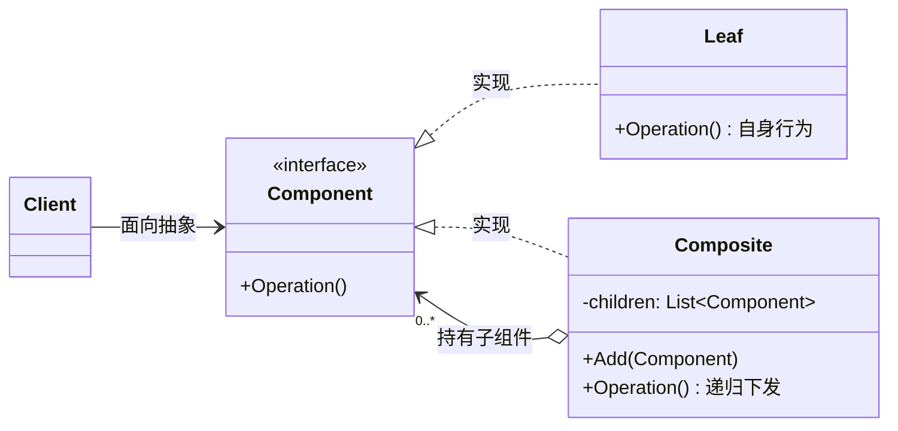
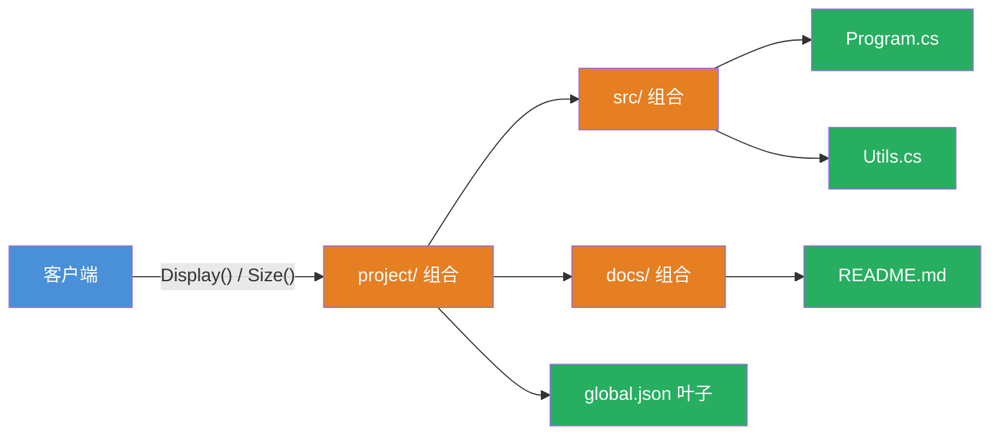
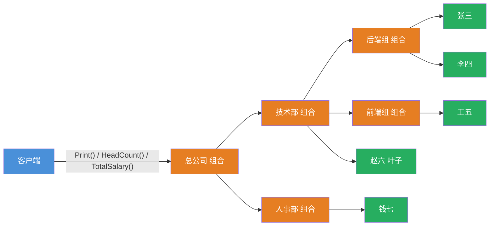

# 组合模式（Composite Pattern）

[TOC]

## 一、📖 概述

组合模式是**结构型设计模式**，将对象组合成**树形结构**以表示"部分-整体"的层次关系，使客户端对**单个对象（叶子）和组合对象（容器）的使用具有一致性**。

核心思想：叶子和容器实现同一抽象，容器持有子节点列表并把操作**递归下发**——客户端一次调用，整棵树自动展开，无需关心节点是叶子还是容器。

<br/>

## 二、🧩 模式解析

### 2.1 类关系图



| 关键角色 | 说明 |
| --- | --- |
| **抽象组件（Component）** | 定义叶子与容器的统一契约 |
| **叶子节点（Leaf）** | 树的末端，实现自身业务行为 |
| **组合节点（Composite）** | 持有子节点列表，操作递归下发给子节点 |

### 2.2 核心代码

```csharp
// 抽象组件：叶子和容器的统一契约
abstract class Component
{
    abstract void Operation();                   // 共有操作

    virtual void Add(Component c) => throw ...;  // 透明式：容器方法也声明在此
}

// 叶子：没有子节点，实现自身行为
class Leaf : Component
{
    void Operation() => /* 自身行为 */;
}

// 组合：持有子节点，操作递归下发
class Composite : Component
{
    List<Component> _children;

    void Add(Component c) => _children.Add(c);

    void Operation()
    {
        // ... 自身处理
        foreach (var child in _children)
            child.Operation();                   // 叶子执行自身，容器继续展开
    }
}
```

> 协作方式：客户端只面向 `Component` 抽象调用 `Operation()`；叶子执行自身行为，容器把操作递归下发给每个子节点——整棵树在一次调用中自动展开，递归终止于叶子。

### 2.3 透明式 vs 安全式

`Add`/`Remove` 声明在哪，是组合模式的核心取舍，两个示例各体现一种风格：

| 维度 | 透明式（3.1 文件系统） | 安全式（3.2 组织架构） |
| --- | --- | --- |
| 接口划分 | `Add`/`Remove` 也声明在抽象组件 | `Add` 仅声明在组合节点 |
| 叶子节点 | 被迫暴露无意义方法，调用抛异常 | 接口干净，不含容器方法 |
| 误用暴露 | 运行期抛 `NotSupportedException` | 编译期即拦截 |
| 客户端 | 完全透明，无需区分类型 | 组装树时需感知容器类型 |
| 适用场景 | 以统一遍历为主 | 需要类型安全或方法差异大 |

<br/>

## 三、💻 代码示例

### 3.1 透明式：文件系统

> 场景：文件夹（容器）嵌套子文件夹与文件（叶子）；`Display()` 递归打印整棵目录树，`Size()` 递归聚合总大小——等价于 `tree` 与 `du` 命令。叶子继承的 `Add` 抛出异常，是透明式的代价。



| 角色 | 文件 |
| --- | --- |
| 抽象组件 | [`FileSystem/FileSystemNode.cs`](FileSystem/FileSystemNode.cs) |
| 叶子节点 | [`FileSystem/FileNode.cs`](FileSystem/FileNode.cs) |
| 组合节点 | [`FileSystem/FolderNode.cs`](FileSystem/FolderNode.cs) |
| 客户端 | [`Program.cs`](Program.cs) |

### 3.2 安全式：组织架构

> 场景：部门（容器）混合包含子部门与员工（叶子）；`HeadCount()` 与 `TotalSalary()` 递归聚合，对总公司调用一次即可算出全公司人数与人力成本。`Add` 只在 `Department` 上，员工误调 `Add` 编译不通过。



| 角色 | 文件 |
| --- | --- |
| 抽象组件 | [`Organization/IOrgUnit.cs`](Organization/IOrgUnit.cs) |
| 叶子节点 | [`Organization/Employee.cs`](Organization/Employee.cs) |
| 组合节点 | [`Organization/Department.cs`](Organization/Department.cs) |
| 客户端 | [`Program.cs`](Program.cs) |

### 3.3 运行结果

```bash
========== 组合模式 (Composite Pattern) ==========
将对象组合成树形结构，使叶子与容器的使用具有一致性

--- 透明式: 文件系统 ---
project/  (共 2700 B)
  src/  (共 2000 B)
    Program.cs  (1200 B)
    Utils.cs  (800 B)
  docs/  (共 600 B)
    README.md  (600 B)
  global.json  (100 B)
>> du: project 总大小 2700 B
>> 文件调用 Add: NotSupportedException（透明式运行期才暴露误用）

--- 安全式: 组织架构 ---
部门 总公司
  部门 技术部
    部门 后端组
      员工 张三  月薪 25000
      员工 李四  月薪 22000
    部门 前端组
      员工 王五  月薪 20000
    员工 赵六  月薪 30000
  部门 人事部
    员工 钱七  月薪 15000
>> HeadCount: 总人数 5
>> TotalSalary: 月薪总额 112000
```

<br/>

## 四、📝 小结

- **核心思想**：部分-整体树形结构，叶子与容器统一接口，操作递归下发

- **两种风格**：透明式统一到底（客户端零分支，误用运行期暴露）；安全式职责分离（接口干净，误用编译期拦截）

- **注意事项**：叶子和容器行为差异大时避免强行统一接口；抽象接口不宜过大，别让叶子承担无意义的方法
