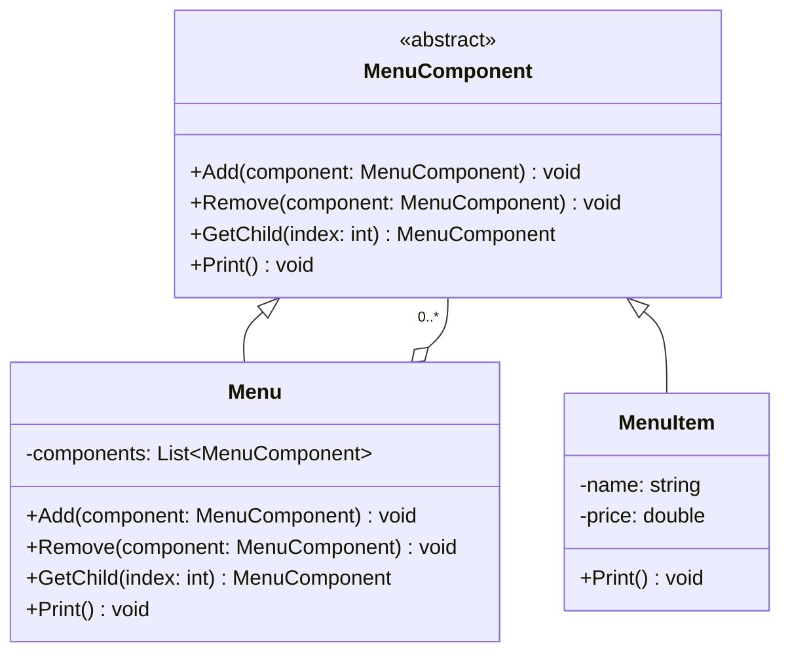

# 组合模式教程

[TOC]


## 一、📖 概述

组合模式是**结构型设计模式**，将对象组合成**树形结构**以表示"部分-整体"的层次关系，使**单个对象和组合对象的使用具有一致性**。

核心思想：客户端可以用同一套接口操作叶子节点和容器节点，无需区分类型。以菜单系统为例，顶层菜单包含子菜单，子菜单又包含菜单项，递归遍历即可输出整棵树。

### 核心特性

- **透明性**：叶子和容器实现同一接口，客户端无需判断类型

- **递归结构**：容器节点递归调用子组件，天然支持树形遍历

- **可扩展**：新增叶子或容器只需实现统一接口，不改现有代码

- **符合开闭原则**：对扩展开放，对修改关闭

<br/>

## 二、📐 结构图解

### 2.1 整体结构

```mermaid
flowchart TD
    A["客户端"] -->|"调用统一接口"| B["MenuComponent 抽象组件"]
    B -->|"继承"| C["Menu 组合节点"]
    B -->|"继承"| D["MenuItem 叶子节点"]
    C -->|"包含 0..*" E["子 MenuComponent"]
    E -->|"递归指向"| B

    style A fill:#4A90D9,color:#fff
    style B fill:#E67E22,color:#fff
    style C fill:#7B68EE,color:#fff
    style D fill:#27AE60,color:#fff
    style E fill:#7B68EE,color:#fff
```

### 2.2 类关系



<br/>

## 三、💻 代码实现

以菜单系统为例：顶层菜单包含早餐、午餐、晚餐子菜单，午餐子菜单下再嵌套甜点菜单项，演示递归遍历。

### 3.1 抽象组件

```csharp
// MenuComponent.cs — 统一接口（简化）
public abstract class MenuComponent
{
    public virtual void Add(MenuComponent component) =>
        throw new NotImplementedException();

    public virtual void Remove(MenuComponent component) =>
        throw new NotImplementedException();

    public virtual MenuComponent GetChild(int index) =>
        throw new NotImplementedException();

    public abstract void Print();
}
```

### 3.2 叶子节点

```csharp
// MenuItem.cs — 菜单项（不可包含子节点）
public class MenuItem : MenuComponent
{
    private string _name;
    private double _price;

    public MenuItem(string name, double price)
    {
        _name = name;
        _price = price;
    }

    public override void Print() =>
        Console.WriteLine($"  {_name} : {_price}");
}
```

### 3.3 组合节点

```csharp
// Menu.cs — 菜单（可包含子组件，递归打印）
public class Menu : MenuComponent
{
    private string _name;
    private List<MenuComponent> _components = new();

    public Menu(string name) => _name = name;

    public override void Add(MenuComponent component) =>
        _components.Add(component);

    public override void Remove(MenuComponent component) =>
        _components.Remove(component);

    public override void Print()
    {
        Console.WriteLine(_name);
        foreach (var component in _components)
            component.Print();  // 递归：叶子打印自身，容器继续展开
    }
}
```

### 3.4 客户端使用

```csharp
// Program.cs — 构建树并统一调用
var allMenus = new Menu("全部菜单");

var breakfast = new Menu("早餐");
breakfast.Add(new MenuItem("煎蛋", 5.0));
breakfast.Add(new MenuItem("吐司", 3.0));

var lunch = new Menu("午餐");
lunch.Add(new MenuItem("牛排", 25.0));
var dessert = new Menu("甜点");
dessert.Add(new MenuItem("蛋糕", 8.0));
lunch.Add(dessert);

allMenus.Add(breakfast);
allMenus.Add(lunch);

allMenus.Print();  // 一次调用，递归输出整棵树
```

**运行结果**：
```
全部菜单
早餐
  煎蛋 : 5
  吐司 : 3
午餐
  牛排 : 25
甜点
  蛋糕 : 8
```

<br/>

## 四、🔍 核心解析

### 4.1 统一接口

`MenuComponent` 定义了 `Add/Remove/GetChild/Print` 等方法。叶子节点不支持的操作（如 Add）由基类抛出异常，客户端调用 `Print()` 时无需关心具体类型。

### 4.2 递归遍历

`Menu.Print()` 遍历 `_components` 列表，对每个子组件调用 `Print()`。叶子节点打印自身，容器节点继续展开——递归自然终止于叶子。

### 4.3 客户端透明

`Program` 只持有 `MenuComponent` 类型引用，调用 `allMenus.Print()` 即可遍历整棵树。新增菜单层级或菜单项无需修改客户端代码。

<br/>

## 五、🎯 应用场景

### 5.1 适用场景

- 文件系统：文件夹包含文件和子文件夹

- UI 组件树：容器组件包含叶子组件和其他容器

- 组织架构：部门包含员工和子部门

### 5.2 实际案例

- **.NET WinForms**：`Control` 基类统一处理 `Control` 和 `ControlCollection`

- **XML/DOM**：`XmlNode` 统一操作元素和文本节点

- **菜单系统**：本示例的菜单树遍历

<br/>

## 六、⚖️ 优缺点分析

### 6.1 优点

- **调用透明**：客户端无需判断叶子或容器，统一调用同一接口

- **易于扩展**：新增叶子或容器只需实现抽象类，不改现有结构

- **自然递归**：树形结构天然适合递归遍历，代码简洁

### 6.2 缺点

- **接口臃肿**：抽象类需包含所有操作的默认实现，叶子可能被迫看到不相关的方法

- **设计困难**：何时使用组合模式、何时拆分为独立接口，需要审慎判断

<br/>

## 七、📝 总结

- **核心思想**：将对象组合成树形结构，使叶子和容器的使用具有一致性

- **关键角色**：MenuComponent（抽象组件）、Menu（组合节点）、MenuItem（叶子节点）

- **适用场景**：树形层次结构，客户端需要统一操作叶子和容器

- **注意事项**：抽象类接口不宜过大，避免叶子节点承担过多无意义的默认实现
