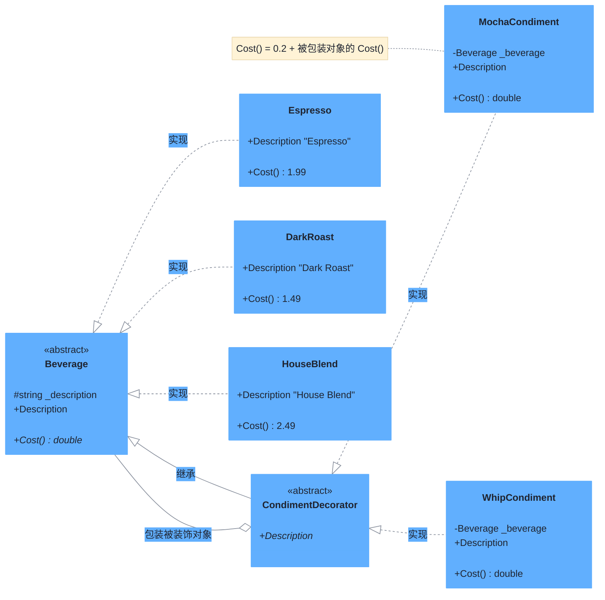

# 装饰器模式（Decorator Pattern）

> **核心思想**：**动态地**为对象添加额外职责，比继承更灵活。装饰器包装被装饰对象，并与其保持**相同的抽象类型**，因此可以像剥洋葱一样层层叠加，且对客户端透明。

## 解决什么问题

星巴克咖啡的"饮品"与"调料"是多维组合：浓缩/深焙/混合咖啡 × 摩卡/奶泡……若用继承穷举所有组合，会产生类爆炸。装饰器模式把每种调料做成装饰器，包装在饮品外层，通过递归叠加计算价格与描述，新增调料只需新增一个装饰器类，无需改动饮品类，符合**开闭原则**。

## 主要参与者

| 角色 | 本示例类 | 职责 |
| --- | --- | --- |
| 抽象组件 Component | `Beverage` | 定义 `Description` 与 `Cost()` |
| 具体组件 ConcreteComponent | `Espresso` / `DarkRoast` / `HouseBlend` | 基础饮品，被装饰的对象 |
| 抽象装饰器 Decorator | `CondimentDecorator` | 继承 `Beverage`，是"调料"的抽象父类 |
| 具体装饰器 | `MochaCondiment` / `WhipCondiment` | 包装一个 `Beverage`，增强描述与价格 |

## 类图



## 源码结构

目录下源码文件与职责对应：

- **Beverage.cs**：抽象组件，定义 `Description` 与 `Cost()`。
- **Espresso.cs / DarkRoast.cs / HouseBlend.cs**：三种基础饮品，固定价格。
- **CondimentDecorator.cs**：抽象装饰器，确保装饰器与被装饰者是同一抽象类型（都继承 `Beverage`），这样外层还能再套装饰器。
- **MochaCondiment.cs / WhipCondiment.cs**：具体装饰器，主构造函数注入 `Beverage`；`Cost()` 在基础价格上累加调料费，`Description` 自动追加调料名（相同调料第二次时显示 "Double"）。
- **Program.cs**：演示"深焙 + 双层摩卡 + 奶泡"与"混合 + 摩卡 + 奶泡"的叠加组合，价格与描述逐层递归计算。

```csharp
// Program.cs 核心代码
Beverage beverage2 = new DarkRoast();
beverage2 = new MochaCondiment(beverage2);   // +摩卡
beverage2 = new MochaCondiment(beverage2);   // 再+摩卡 → "Double Mocha Dark Roast"
beverage2 = new WhipCondiment(beverage2);    // +奶泡
Console.WriteLine(beverage2.Description + " $" + beverage2.Cost()); // Mocha Mocha Whip Dark Roast $1.99
```
