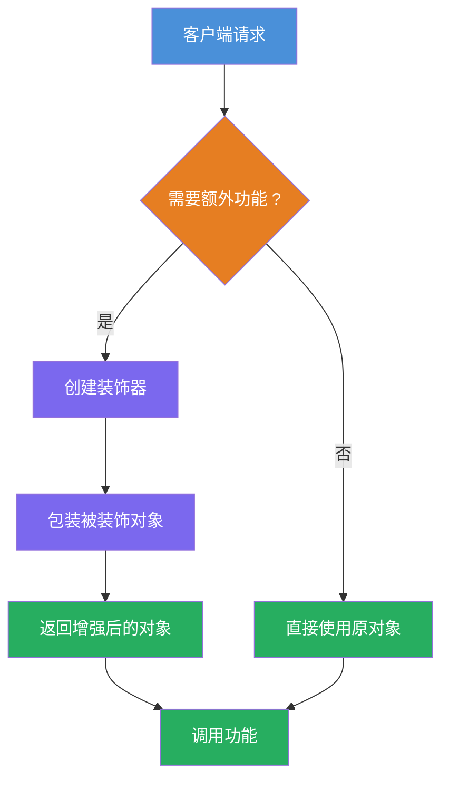
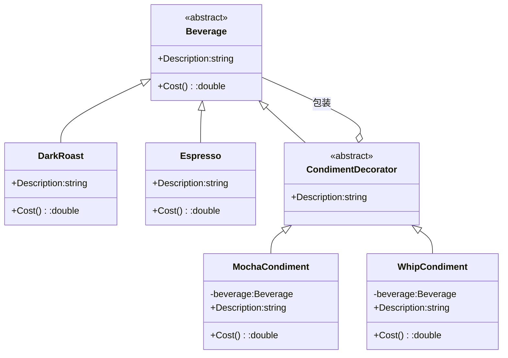

# 装饰器模式（Decorator Pattern）教程

[TOC]

## 一、📖 概述

装饰器模式是**结构型设计模式**，**动态地**为对象添加额外职责，比继承更灵活。装饰器包装被装饰对象，并与其保持**相同的抽象类型**，因此可以像剥洋葱一样层层叠加，且对客户端透明。

核心思想：将附加职责封装到独立的装饰器类中，通过组合而非继承实现功能扩展，运行时自由组合行为。

### 核心特性

- **动态扩展**：运行时为对象添加职责，无需修改原始类

- **透明叠加**：装饰器与被装饰者共享相同接口，客户端无感知

- **符合开闭原则**：新增功能只需新增装饰器类，无需改动已有代码

- **避免类爆炸**：多维组合不再需要为每种组合创建子类

<br/>

## 二、📐 结构图解

### 2.1 装饰流程



### 2.2 类关系



### 2.3 关键角色

| 角色                             | 说明                             |
| -------------------------------- | -------------------------------- |
| 抽象组件（Component）            | 定义被装饰对象和装饰器的公共接口 |
| 具体组件（Concrete Component）   | 原始对象，实现基础功能           |
| 抽象装饰器（Decorator）          | 继承抽象组件，持有被装饰者引用   |
| 具体装饰器（Concrete Decorator） | 添加额外职责，委托调用内部对象   |

<br/>

## 三、💻 代码实现

以星巴克咖啡为例：基础饮品（浓缩、深焙、混合）通过装饰器叠加调料（摩卡、奶泡），动态计算价格与描述。

### 3.1 抽象组件

```csharp
// 抽象饮品
public abstract class Beverage
{
    public virtual string Description { get; set; } = "未知饮品";
    public abstract double Cost();
}
```

### 3.2 具体组件

```csharp
// 基础饮品
public class DarkRoast : Beverage
{
    public override string Description => "深焙咖啡";
    public override double Cost() => 0.99;
}

public class Espresso : Beverage
{
    public override string Description => "浓缩咖啡";
    public override double Cost() => 1.99;
}
```

### 3.3 装饰器

```csharp
// 抽象装饰器：继承Beverage，持有Beverage引用
public abstract class CondimentDecorator : Beverage
{
    protected Beverage _beverage;
}

// 摩卡装饰器
public class MochaCondiment : CondimentDecorator
{
    public MochaCondiment(Beverage beverage) => _beverage = beverage;

    public override string Description => _beverage.Description + " + 摩卡";
    public override double Cost() => _beverage.Cost() + 0.20;
}

// 奶泡装饰器
public class WhipCondiment : CondimentDecorator
{
    public WhipCondiment(Beverage beverage) => _beverage = beverage;

    public override string Description => _beverage.Description + " + 奶泡";
    public override double Cost() => _beverage.Cost() + 0.15;
}
```

### 3.4 客户端使用

```csharp
// 深焙 + 双层摩卡 + 奶泡
Beverage order = new DarkRoast();
order = new MochaCondiment(order);    // +摩卡
order = new MochaCondiment(order);    // +摩卡（双份）
order = new WhipCondiment(order);     // +奶泡

Console.WriteLine($"{order.Description} ¥{order.Cost():F2}");
// 输出: 深焙咖啡 + 摩卡 + 摩卡 + 奶泡 ¥1.54
```

<br/>

## 四、🔍 核心解析

### 4.1 统一类型

`CondimentDecorator` 继承 `Beverage`，使装饰器与被装饰者保持相同抽象类型。这样外层还可以继续套装饰器，实现无限叠加。

### 4.2 委托转发

具体装饰器持有 `_beverage` 引用，`Cost()` 先递归调用内部对象的价格，再加上自身费用。描述同理逐层拼接。

### 4.3 动态组合

客户端在运行时决定叠加哪些装饰器，顺序可变，数量不限。相比继承的编译期固定组合，装饰器提供了极大的灵活性。

<br/>

## 五、🎯 应用场景

### 5.1 适用场景

- 需要动态、透明地为对象添加职责

- 通过继承扩展会导致类数量爆炸性增长

- 功能可以自由组合，且组合方式在运行时确定

### 5.2 实际案例

- **Java I/O流**：`BufferedInputStream` 装饰 `FileInputStream`，层层包装增加缓冲、加密等功能

- **中间件管道**：ASP.NET Core 的中间件链本质是装饰器模式的变体

- **UI组件增强**：为控件动态添加滚动条、边框、阴影等视觉装饰

<br/>

## 六、⚖️ 优缺点分析

### 6.1 优点

- **灵活扩展**：运行时动态添加职责，无需修改已有类

- **符合开闭原则**：新增装饰器不影响现有代码

- **细粒度组合**：可按需叠加功能，避免创建大量子类

### 6.2 缺点

- **小对象增多**：大量装饰器会产生许多小对象，增加理解成本

- **排序敏感**：装饰器的叠加顺序可能影响最终结果

- **移除困难**：从嵌套的装饰器链中移除特定装饰器不够直观

<br/>

## 七、🔍 装饰器 vs 继承

| 维度     | 装饰器                                | 继承                             |
| -------- | ------------------------------------- | -------------------------------- |
| 扩展时机 | 运行时动态叠加                        | 编译期静态确定                   |
| 组合方式 | 按需自由组合，数量不限                | 类继承树固定，组合受限于继承层级 |
| 类数量   | N 个装饰器支持任意组合                | 多维组合导致类爆炸（2^n）        |
| 灵活性   | 可运行时添加、移除、重排装饰器        | 功能固化在子类中，无法动态调整   |
| 代码复用 | 每个装饰器只关注自身增强逻辑          | 子类可能重复父类逻辑             |
| 适用场景 | 功能需要动态组合（如 I/O 流、中间件） | 类型层次稳定，组合方式固定       |

> **本教程示例**：`MochaCondiment` 和 `WhipCondiment` 在运行时任意叠加——`DarkRoast → +摩卡 → +摩卡 → +奶泡`，继承无法实现这种动态组合。

<br/>

## 八、📝 总结

- **核心思想**：动态地为对象添加额外职责，比继承更灵活

- **关键角色**：抽象组件、具体组件、抽象装饰器、具体装饰器

- **适用场景**：功能需要自由组合，且组合方式在运行时确定

- **注意事项**：装饰器数量过多会增加复杂度，应适度使用
