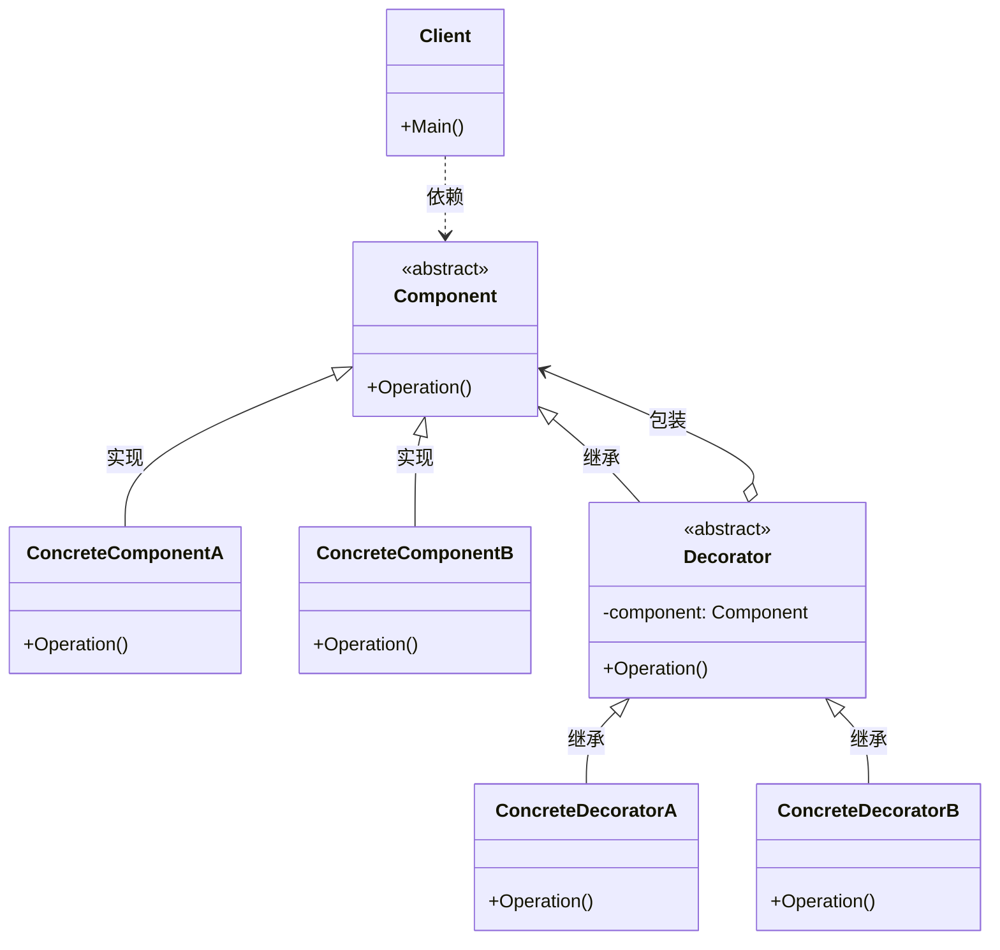
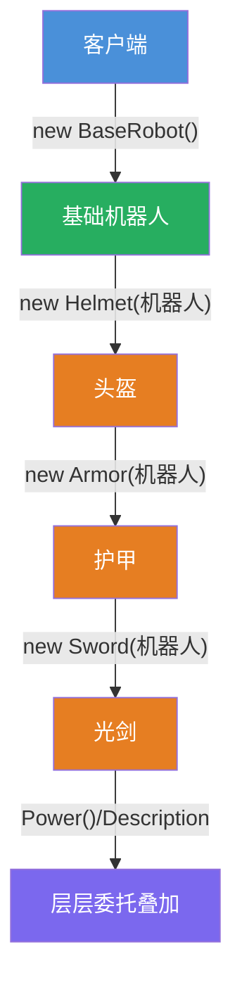
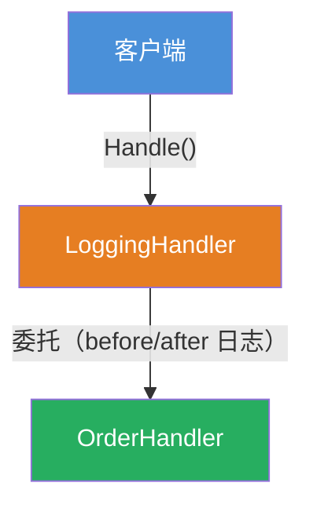

# 装饰器模式（Decorator Pattern）

[TOC]

## 一、📖 概述

装饰器模式是**结构型设计模式**，**动态地**为对象添加额外职责，比继承更灵活：将附加职责封装到独立的装饰器类中，通过**组合**而非继承扩展功能。

核心思想：装饰器与被装饰对象保持**相同的抽象类型**，层层包装后对客户端透明；运行时自由叠加、任意顺序组合行为。

<br/>

## 二、🧩 模式解析

### 2.1 类关系图



### 2.2 四大角色

| 角色 | 职责 | 设计要点 |
| --- | --- | --- |
| **抽象组件 Component** | 定义被装饰对象与装饰器共用的公共契约 | 抽象基类或接口，类型一致是叠加的前提 |
| **具体组件 ConcreteComponent** | 被装饰的基础对象，实现核心功能 | 只关注自身职责，不感知装饰器存在 |
| **抽象装饰器 Decorator** | 继承抽象组件，持有被装饰者引用 | 与组件同类型——这是可以无限嵌套的根基 |
| **具体装饰器 ConcreteDecorator** | 在委托调用的基础上附加自身职责 | 先委托后增强，可重复叠加、任意组合 |

### 2.3 关键解析

**叠加机制**：装饰器持有被装饰者的引用，每次调用都先委托给内部对象、再叠加自身逻辑，逐层递归——形成洋葱式嵌套结构。

**装饰器 vs 继承**：

| 维度 | 装饰器 | 继承 |
| --- | --- | --- |
| 扩展时机 | 运行时动态叠加 | 编译期静态确定 |
| 组合方式 | 任意顺序、数量不限 | 类继承树固定，组合受限 |
| 类数量 | N 个装饰器自由组合 | 多维组合导致类爆炸（2ⁿ） |
| 代码复用 | 类层级深，难以单独复用中间层 | 每一层都是可独立复用的类型 |

**开闭原则**：新增调料只需新增装饰器类，无需改动任何已有代码；继承则每加一种组合都要新增子类。

> **与代理模式的区别**：代理控制**访问**（何时/是否调用真实对象），装饰器增强**功能**（动态叠加行为）。详见 [代理模式](../ProxyPattern/README.md)。

<br/>

## 三、💻 代码示例

### 3.1 机器人穿戴

> 场景：基础机器人按需穿戴装备（头盔/护甲/光剑），层层装饰动态叠加战斗力。



| 角色 | 文件 |
| --- | --- |
| 抽象组件 | [`RobotDemo/Robot.cs`](RobotDemo/Robot.cs) |
| 具体组件 | [`RobotDemo/BaseRobot.cs`](RobotDemo/BaseRobot.cs) |
| 抽象装饰器 | [`RobotDemo/RobotDecorator.cs`](RobotDemo/RobotDecorator.cs) |
| 具体装饰器 | [`RobotDemo/Helmet.cs`](RobotDemo/Helmet.cs) · [`RobotDemo/Armor.cs`](RobotDemo/Armor.cs) · [`RobotDemo/Sword.cs`](RobotDemo/Sword.cs) |

### 3.2 API 埋点日志

> 场景：请求处理器（OrderHandler）外层套上 `LoggingHandler`，在真实处理前后透明插入埋点日志并统计耗时，处理器自身无需感知。



| 角色 | 文件 |
| --- | --- |
| 抽象组件 | [`LoggingDemo/IHandler.cs`](LoggingDemo/IHandler.cs) |
| 具体组件 | [`LoggingDemo/OrderHandler.cs`](LoggingDemo/OrderHandler.cs) |
| 抽象装饰器 | [`LoggingDemo/HandlerDecorator.cs`](LoggingDemo/HandlerDecorator.cs) |
| 具体装饰器 | [`LoggingDemo/LoggingHandler.cs`](LoggingDemo/LoggingHandler.cs) |
| 客户端 | [`Program.cs`](Program.cs) |

### 3.3 运行结果

```bash
========== 装饰器模式 (Decorator Pattern) ==========
动态地给对象添加额外的职责，比生成子类更灵活

--- 机器人穿戴 (Robot Demo) ---
基础机器人 战斗力: 10

基础机器人，头盔，护甲，光剑 战斗力: 45

基础机器人，头盔，光剑 战斗力: 35


--- API 埋点日志 (Logging Demo) ---
校验订单: order-123
订单入库成功

[LOG] 收到请求: order-456
校验订单: order-456
订单入库成功
[LOG] 处理完成: order-456 耗时 61ms

[LOG] 收到请求: order-789
[LOG] 收到请求: order-789
校验订单: order-789
订单入库成功
[LOG] 处理完成: order-789 耗时 61ms
[LOG] 处理完成: order-789 耗时 61ms
```

机器人穿戴说明：
- ① 裸机无装备——基础战斗力 10
- ② 三件装备**层层叠加**——战斗力逐层累加（10+5+10+20=45）
- ③ 只选头盔和光剑——装饰器**按需自由组合**（10+5+20=35）

埋点日志说明：
- 无装饰：原始处理器直接执行，无日志
- 套一层 `LoggingHandler`：请求前后各插入一条日志并统计耗时，处理器无感知
- 套两层：日志**逐层嵌套**（双重埋点），体现装饰器可无限叠加

<br/>

## 四、🔍 知识延伸

> Python 的 `@` 语法与 GoF 装饰器**思想同源**——都是"包装 + 增强"，但粒度不同：GoF 装饰器是**对象级**包装（类包裹类），Python `@` 是**函数级**增强（函数包裹函数）。

```python
import time
from functools import wraps

def timer(func):
    @wraps(func)
    def wrapper(*args, **kwargs):
        start = time.time()
        result = func(*args, **kwargs)          # 调用原函数
        elapsed = time.time() - start
        print(f"[timer] {func.__name__} 耗时 {elapsed:.3f}s")
        return result
    return wrapper

@timer                        # 等价于 order = timer(order)
def order(item):
    time.sleep(0.1)
    print(f"下单成功: {item}")

order("iPhone 16")
# 输出: 下单成功: iPhone 16
#        [timer] order 耗时 0.101s
```

| 维度 | GoF 装饰器 | Python `@` 装饰器 |
| --- | --- | --- |
| 包装目标 | 对象（类级别） | 函数（函数级别） |
| 实现载体 | 抽象组件 + 装饰器类 | 高阶函数（闭包） |
| 组合方式 | 多层嵌套 `new A(new B(obj))` | 多个 `@` 叠加 `@a @b def f` |
| 核心契约 | 装饰器与被装饰者类型一致 | `@wraps` 保留原函数签名/元信息 |
| 本质 | 设计模式（架构层面） | 语法糖（语言特性层面） |

两者共同体现了**"不修改原始代码、通过包裹实现增强"**的开闭原则思想。

<br/>

## 五、📝 小结

- **核心思想**：动态为对象添加额外职责，组合优于继承

- **适用场景**：运行时按需叠加功能、继承会导致类爆炸、功能可自由组合

- **注意事项**：叠加顺序可能影响结果；装饰器多为小对象，层数过多增加理解成本