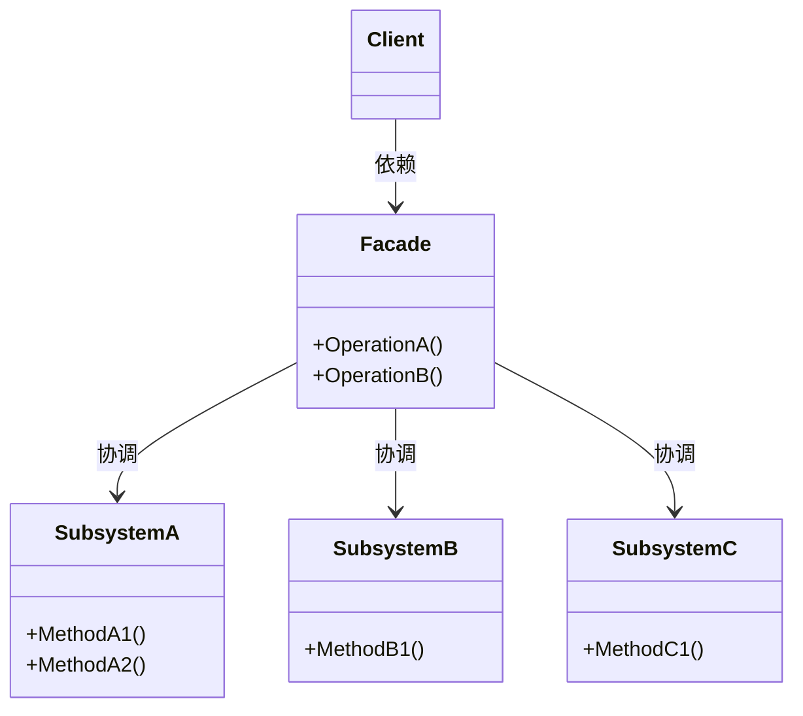
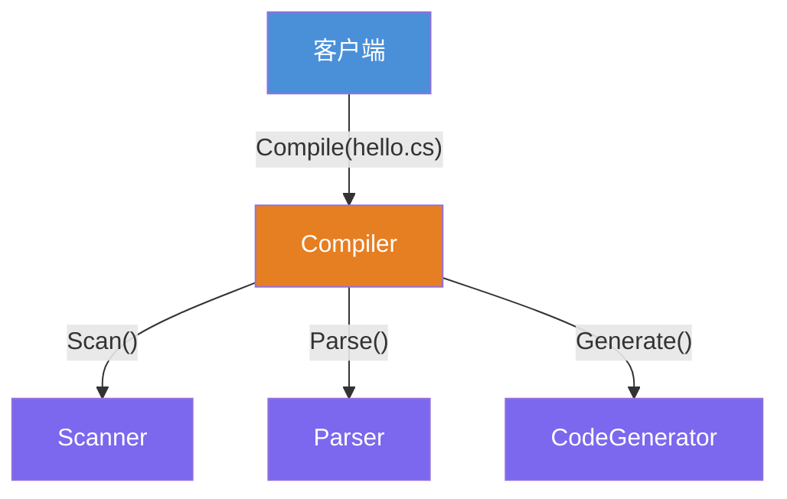
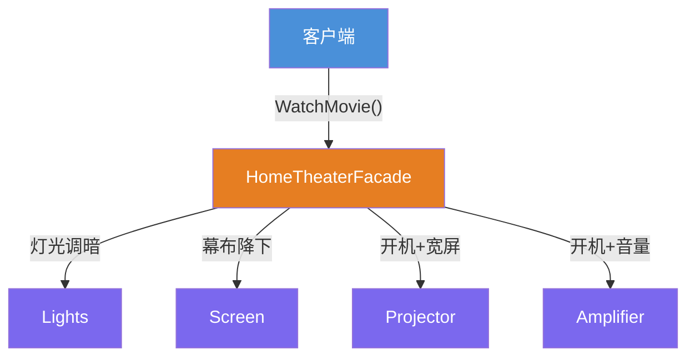

# 外观模式（Facade Pattern）

[TOC]

## 一、📖 概述

外观模式是**结构型设计模式**，为子系统中的一组接口提供**统一的高层接口**，降低客户端与子系统的耦合度。

核心思想：将复杂的子系统调用封装在一个高层接口之后，客户端只需调用外观提供的简单方法，无需了解子系统内部的调用顺序和协作细节——**一键搞定复杂系统**。

<br/>

## 二、🧩 模式解析

### 2.1 类关系图



### 2.2 三大角色

| 角色 | 职责 | 设计要点 |
| --- | --- | --- |
| **外观 Facade** | 封装子系统复杂度，提供统一高层接口 | 单向依赖，不感知客户端具体需求 |
| **子系统 Subsystem** | 实际执行业务逻辑的组件 | 各自独立，不感知外观存在 |
| **客户端 Client** | 只与外观交互，不直接依赖子系统 | 遵循**迪米特法则**（最少知识原则） |

### 2.3 关键解析

**迪米特法则（Law of Demeter）**：外观模式是迪米特法则的典型应用——客户端只需认识外观，无需了解子系统的存在、调用顺序和协作细节。这大幅降低了客户端的认知负担和耦合度。

**外观 vs 中介者**：

| 维度 | 外观模式 | 中介者模式 |
| --- | --- | --- |
| 方向 | 单向：客户端 → 外观 → 子系统 | 双向：子系统 ↔ 中介者 ↔ 子系统 |
| 职责 | 简化调用入口 | 协调多个平等对象之间的交互 |
| 子系统关系 | 子系统之间无感知 | 子系统通过中介者互相通信 |
| 典型场景 | 封装复杂库/框架的 API | GUI 组件间的消息分发 |

**灵活性保留**：外观不强制封装——客户端仍可绕过外观直接使用子系统，外观只是提供了一个"快捷方式"。

<br/>

## 三、💻 代码示例

### 3.1 编译器示例

> 场景：编译一个程序要经历词法分析 → 语法分析 → 代码生成，客户端不想逐个调用，`Compiler` 外观一行搞定。



| 角色 | 文件 |
| --- | --- |
| 子系统 | [`CompilerDemo/Scanner.cs`](CompilerDemo/Scanner.cs) · [`CompilerDemo/Parser.cs`](CompilerDemo/Parser.cs) · [`CompilerDemo/CodeGenerator.cs`](CompilerDemo/CodeGenerator.cs) |
| 外观 | [`CompilerDemo/Compiler.cs`](CompilerDemo/Compiler.cs) |
| 客户端 | [`Program.cs`](Program.cs) |

### 3.2 家庭影院示例

> 场景：看一部电影需要依次操作灯光、幕布、投影仪、功放，`HomeTheaterFacade` 一键观影、一键结束。



| 角色 | 文件 |
| --- | --- |
| 子系统 | [`HomeTheaterDemo/Lights.cs`](HomeTheaterDemo/Lights.cs) · [`HomeTheaterDemo/Screen.cs`](HomeTheaterDemo/Screen.cs) · [`HomeTheaterDemo/Projector.cs`](HomeTheaterDemo/Projector.cs) · [`HomeTheaterDemo/Amplifier.cs`](HomeTheaterDemo/Amplifier.cs) |
| 外观 | [`HomeTheaterDemo/HomeTheaterFacade.cs`](HomeTheaterDemo/HomeTheaterFacade.cs) |
| 客户端 | [`Program.cs`](Program.cs) |

### 3.3 运行结果

```
========== 外观模式 (Facade Pattern) ==========
为子系统中的一组接口提供一个统一的接口

--- 编译器 (Compiler Demo) ---
[Scanner] 词法分析: hello.cs
[Parser] 语法分析: 构建 AST
[CodeGen] 代码生成: 输出目标代码
编译完成

--- 家庭影院 (Home Theater Demo) ---
灯光调暗至 10%
幕布降下
投影仪开机
投影仪切换宽屏模式
功放开机
音量调至 5
正在播放: 流浪地球

功放关机
投影仪关机
幕布升起
灯光全亮
观影结束
```

编译器说明：
- 客户端只调 `Compile("hello.cs")` 一行，内部按序协调 Scanner → Parser → CodeGenerator

家庭影院说明：
- `WatchMovie`：灯光 → 幕布 → 投影仪 → 功放，按正确顺序一键开启
- `EndMovie`：按相反顺序一键关闭，客户端无需记住操作顺序

<br/>

## 四、📝 小结

- **核心思想**：为子系统提供统一的高层接口，简化客户端调用

- **迪米特法则**：客户端只与外观交互，减少不必要的依赖，是该模式的理论基石

- **适用场景**：复杂库/框架的简化入口、分层架构的层间入口、多子系统按序协作

- **注意事项**：子系统本身很简单时不要强行加外观；外观不替代子系统的全部功能，客户端仍可绕过外观直接使用子系统
