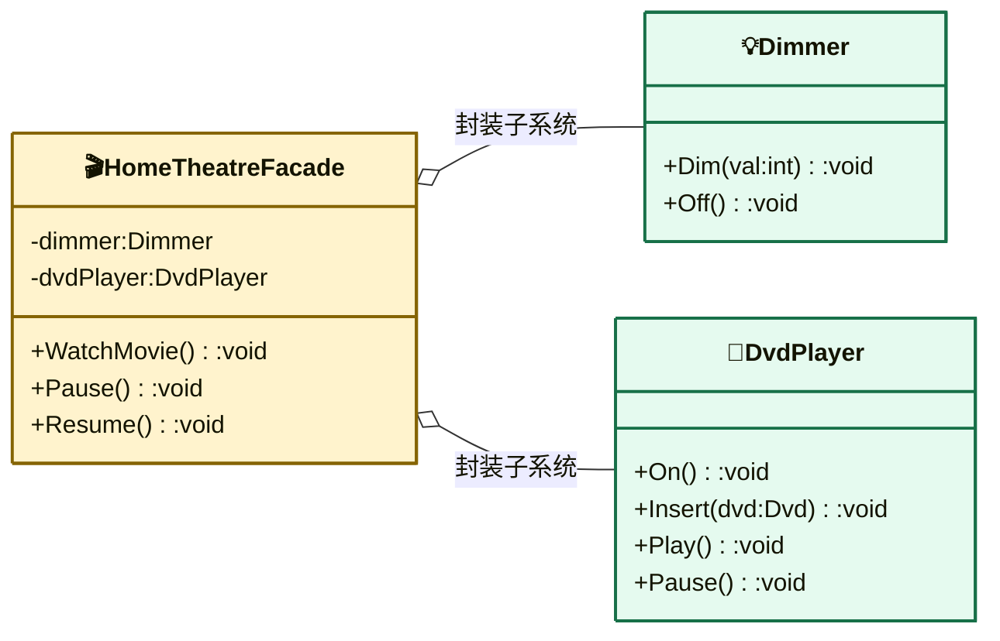

# 外观模式（Facade Pattern）

> **核心思想**：为子系统中的一组接口提供一个**统一的高层接口**，让客户端用一个简单入口完成复杂的子系统调用，降低客户端与子系统的耦合。

## 解决什么问题

看一部电影需要依次操作调光器、DVD 播放器（开机→插碟→播放）、灯光……如果客户端直接与每个子系统对象交互，步骤繁琐且与子系统细节强耦合。外观模式封装出一个"家庭影院遥控器"式的高层门面，客户端只需调用 `WatchMovie()` 即可，子系统内部的调用顺序和协作细节对外隐藏。

## 主要参与者

| 角色 | 本示例类 | 职责 |
| --- | --- | --- |
| 外观 Facade | `HomeTheatreFacade` | 封装子系统，提供 `WatchMovie` / `Pause` / `Resume` 高层接口 |
| 子系统类 | `Dimmer` / `Dvd` / `DvdPlayer` | 各自独立的复杂组件，不感知外观的存在 |
| 客户端 Client | `Program` | 只依赖外观，不直接接触子系统 |

## 类图



## 源码结构

目录下源码文件与职责对应：

- **Dimmer.cs**：调光器子系统，`Dim(10)` 表示开灯。
- **Dvd.cs / DvdPlayer.cs**：DVD 及播放器子系统，含开机、插碟、播放、暂停、续播等操作。
- **HometheaterFacade.cs**：外观类，构造时注入三个子系统，`WatchMovie()` 内按正确顺序编排"调光→开机→插碟→播放"；`Pause()/Resume()` 同步协调灯光与播放器。
- **Program.cs**：客户端只创建 `HomeTheatreFacade` 并调用三个高层方法，全程不直接触碰子系统类。

```csharp
// Program.cs 核心代码
var homeTheater = new HomeTheatreFacade(dimmer, dvd, dvdPlayer);
homeTheater.WatchMovie();  // 内部自动完成 调光→开机→插碟→播放
homeTheater.Pause();
homeTheater.Resume();
```
