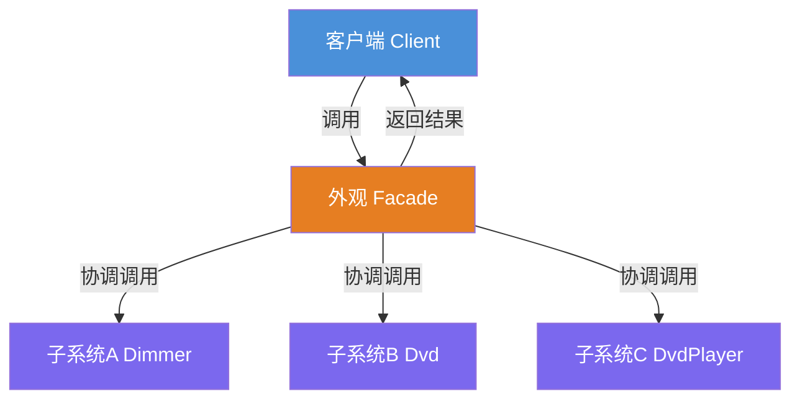
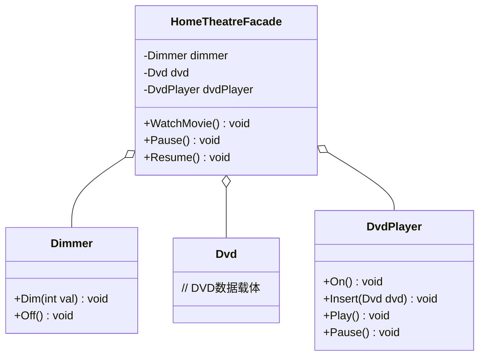

# 外观模式（Facade Pattern）教程

[TOC]


## 一、📖 概述

外观模式是**结构型设计模式**，为子系统中的一组接口提供**统一的高层接口**，降低客户端与子系统的耦合度。

核心思想：将复杂的子系统调用封装在一个高层接口之后，客户端只需调用外观提供的简单方法，无需了解子系统内部的调用顺序和协作细节。

### 核心特性

- **简化接口**：将多个子系统调用封装为一个高层方法

- **降低耦合**：客户端只依赖外观类，不直接接触子系统

- **遵循迪米特法则**：客户端只与外观交互，减少不必要的依赖

- **灵活性保留**：客户端仍可直接使用子系统，外观不强制封装

<br/>

## 二、📐 结构图解

### 2.1 整体结构



### 2.2 类关系



### 2.3 关键角色

| 角色 | 说明 |
|------|------|
| 外观（Facade） | 封装子系统复杂度，提供统一高层接口 |
| 子系统（Subsystem） | 实际执行业务逻辑的组件 |
| 客户端（Client） | 只与外观交互，不直接依赖子系统 |

<br/>

## 三、💻 代码实现

以家庭影院为例：看一部电影需要依次操作调光器、DVD播放器，外观模式封装出一个"遥控器"式的高层接口。

### 3.1 子系统类

```csharp
// 调光器子系统
public class Dimmer
{
    public void Dim(int val) => Console.WriteLine($"灯光调至 {val}%");
    public void Off() => Console.WriteLine("灯光关闭");
}

// DVD播放器子系统
public class DvdPlayer
{
    public void On() => Console.WriteLine("DVD播放器开机");
    public void Insert(Dvd dvd) => Console.WriteLine($"插入DVD: {dvd.Title}");
    public void Play() => Console.WriteLine("开始播放");
    public void Pause() => Console.WriteLine("暂停播放");
}
```

### 3.2 外观类

```csharp
// 家庭影院外观 - 封装所有子系统操作
public class HomeTheatreFacade
{
    private readonly Dimmer _dimmer;
    private readonly DvdPlayer _dvdPlayer;

    public HomeTheatreFacade(Dimmer dimmer, Dvd dvd, DvdPlayer dvdPlayer)
    {
        _dimmer = dimmer;
        _dvdPlayer = dvdPlayer;
    }

    // 一键观看电影：按正确顺序协调所有子系统
    public void WatchMovie(Dvd dvd)
    {
        _dimmer.Dim(30);           // 1. 调暗灯光
        _dvdPlayer.On();           // 2. 开启播放器
        _dvdPlayer.Insert(dvd);    // 3. 插入DVD
        _dvdPlayer.Play();         // 4. 开始播放
    }

    public void Pause()  => _dvdPlayer.Pause();
    public void Resume() => _dvdPlayer.Play();
}
```

### 3.3 客户端使用

```csharp
// 客户端只需调用外观，无需了解子系统细节
var facade = new HomeTheatreFacade(dimmer, dvd, dvdPlayer);
facade.WatchMovie(dvd);   // 一行搞定：调光→开机→插碟→播放
facade.Pause();
facade.Resume();
```

<br/>

## 四、🔍 核心解析

### 4.1 外观类的职责

`HomeTheatreFacade` 在构造时接收所有子系统引用，对外提供 `WatchMovie` / `Pause` / `Resume` 三个高层方法，内部按正确顺序编排子系统调用。

### 4.2 子系统的独立性

`Dimmer`、`DvdPlayer` 等子系统各自独立，不感知外观的存在。它们可以被单独使用，也可以被多个外观封装。

### 4.3 客户端解耦

`Program` 只依赖 `HomeTheatreFacade`，全程不直接触碰子系统类。子系统的增减、调用顺序的变化对外观透明。

<br/>

## 五、🎯 应用场景

### 5.1 适用场景

- 多个子系统需要按特定顺序协作完成一个复杂操作

- 希望为复杂库或框架提供一个简单的使用入口

- 需要分层架构中定义子系统的入口点

### 5.2 实际案例

- **.NET EF Core**：`DbContext` 作为外观封装数据库连接、变更追踪、查询等子系统

- **前端SDK**：支付SDK将鉴权、下单、回调等多个接口封装为一个 `Pay()` 方法

- **微服务网关**：API Gateway 作为外观，将多个微服务的调用聚合为一个接口

<br/>

## 六、⚖️ 优缺点分析

### 6.1 优点

- **使用简单**：客户端只需调用外观方法，无需了解子系统细节

- **降低耦合**：客户端与子系统解耦，子系统变化不影响客户端

- **分层清晰**：在分层系统中定义入口点，每层只与相邻层交互

### 6.2 缺点

- **过度封装**：如果子系统本身很简单，引入外观反而增加复杂度

- **违反开闭原则**：新增子系统可能需要修改外观类

- **性能开销**：多一层间接调用，极端场景下有微小性能损耗

<br/>

## 七、📝 总结

- **核心思想**：为子系统提供统一的高层接口，简化客户端调用

- **关键角色**：外观（Facade）、子系统（Subsystem）、客户端（Client）

- **适用场景**：多个子系统需要协作完成复杂操作，且希望简化调用入口

- **注意事项**：不要过度封装简单系统，外观不应替代子系统的全部功能
