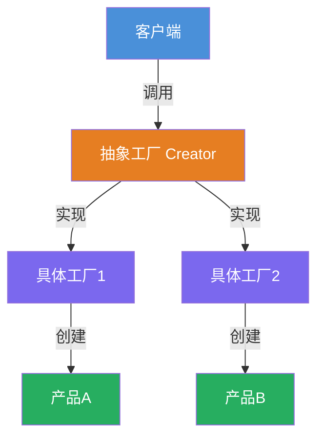
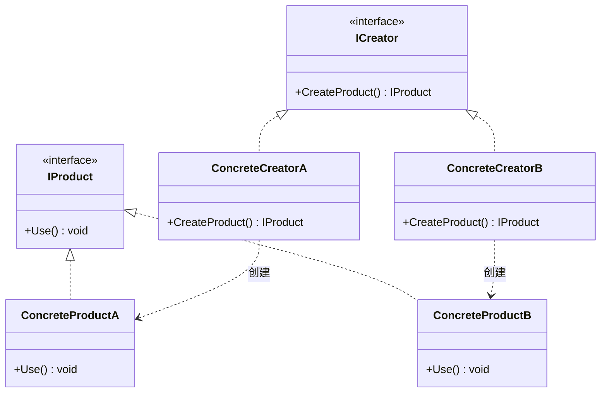

# 工厂方法模式 (Factory Method) 教程

[TOC]


## 一、📖 概述

工厂方法模式是**创建型设计模式**，定义一个创建对象的接口，但由**子类决定实例化哪一个类**，将对象的创建延迟到子类。

核心思想：客户端面向抽象工厂接口编程，具体对象由工厂子类创建。新增产品只需新增工厂子类，完全符合**开闭原则**。

### 核心特性

- **延迟创建**：将对象创建推迟到子类

- **符合开闭原则**：新增产品无需修改现有代码

- **单一职责**：每个工厂只负责创建一种产品

- **解耦客户端**：客户端不依赖具体产品类

<br/>

## 二、📐 结构图解

### 2.1 整体流程



### 2.2 类关系



### 2.3 关键角色

| 角色 | 说明 |
|------|------|
| 抽象产品 (IProduct) | 定义产品接口 |
| 具体产品 (ConcreteProduct) | 实现产品接口 |
| 抽象工厂 (ICreator) | 声明工厂方法 |
| 具体工厂 (ConcreteCreator) | 实现工厂方法，创建具体产品 |

<br/>

## 三、💻 代码实现

以披萨店为例：不同地区的披萨店创建不同风味的披萨。

### 3.1 抽象产品与具体产品

```csharp
// 抽象产品
public interface IPizza
{
    string Name { get; }
    void Prepare();
    void Bake();
    void Cut();
    void Box();
}

// 具体产品：纽约芝士披萨
public class NyCheesePizza : IPizza
{
    public string Name => "纽约芝士披萨";
    public void Prepare() => Console.WriteLine("准备纽约风味配料");
    public void Bake() => Console.WriteLine("烘烤 30 分钟");
    public void Cut() => Console.WriteLine("切成三角形");
    public void Box() => Console.WriteLine("装入蓝色盒子");
}

// 具体产品：芝加哥蛤蜊披萨
public class ChicagoClamPizza : IPizza
{
    public string Name => "芝加哥蛤蜊披萨";
    public void Prepare() => Console.WriteLine("准备芝加哥风味配料");
    public void Bake() => Console.WriteLine("烘烤 45 分钟");
    public void Cut() => Console.WriteLine("切成方形");
    public void Box() => Console.WriteLine("装入红色盒子");
}
```

### 3.2 抽象工厂与具体工厂

```csharp
// 抽象工厂
public interface IPizzaFactory
{
    IPizza CreatePizza(string type);
}

// 具体工厂：纽约披萨店
public class NyPizzaFactory : IPizzaFactory
{
    public IPizza CreatePizza(string type)
    {
        return type switch
        {
            "cheese" => new NyCheesePizza(),
            _ => throw new ArgumentException($"未知类型: {type}")
        };
    }
}

// 具体工厂：芝加哥披萨店
public class ChicagoPizzaFactory : IPizzaFactory
{
    public IPizza CreatePizza(string type)
    {
        return type switch
        {
            "clam" => new ChicagoClamPizza(),
            _ => throw new ArgumentException($"未知类型: {type}")
        };
    }
}
```

### 3.3 客户端使用

```csharp
// 客户端面向工厂接口
IPizzaFactory factory = new NyPizzaFactory();
IPizza pizza = factory.CreatePizza("cheese");
pizza.Prepare();
pizza.Bake();
pizza.Cut();
pizza.Box();
```

**运行结果**：
```
准备纽约风味配料
烘烤 30 分钟
切成三角形
装入蓝色盒子
```

<br/>

## 四、🔍 核心解析

### 4.1 工厂方法的作用

`CreatePizza()` 是工厂方法，客户端调用它来获取产品，但不知道具体创建的是哪个类。具体产品由工厂子类决定。

### 4.2 符合开闭原则

新增一种风味（如加州风味）只需新增 `CaliforniaPizzaFactory` 类，无需修改现有工厂或客户端代码。

### 4.3 与简单工厂的区别

简单工厂使用 `switch` 集中判断创建逻辑，新增产品需修改工厂类。工厂方法将创建逻辑分散到各个子类，更符合开闭原则。

<br/>

## 五、🎯 应用场景

### 5.1 适用场景

- 不确定将来需要创建哪些具体对象

- 希望将对象创建延迟到子类

- 想要复用已有对象而不是每次重新创建

### 5.2 实际案例

- **.NET 数据库访问**：`DbProviderFactory` 创建不同数据库的 Connection、Command

- **日志框架**：根据配置创建 FileLogger 或 DatabaseLogger

- **UI 框架**：不同平台创建对应的按钮、文本框控件

<br/>

## 六、⚖️ 优缺点分析

### 6.1 优点

- **符合开闭原则**：新增产品无需修改现有代码

- **单一职责**：每个工厂只负责创建一种产品

- **解耦客户端**：客户端面向接口编程

### 6.2 缺点

- **类数量增多**：每新增一种产品需要新增一个工厂类

- **增加了抽象层**：引入了额外的接口和类

<br/>

## 七、📝 总结

- **核心思想**：定义创建对象的接口，由子类决定实例化哪个类

- **关键角色**：抽象产品、具体产品、抽象工厂、具体工厂

- **适用场景**：需要灵活创建对象，且希望符合开闭原则

- **与抽象工厂区别**：工厂方法创建单一产品，抽象工厂创建产品族
