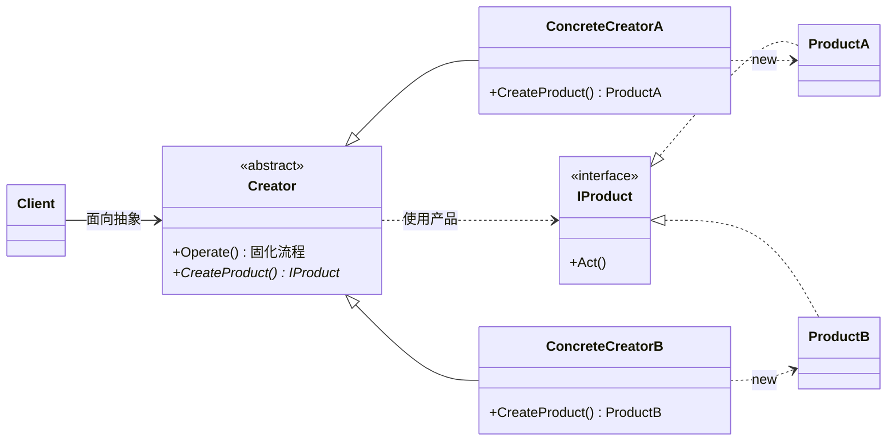
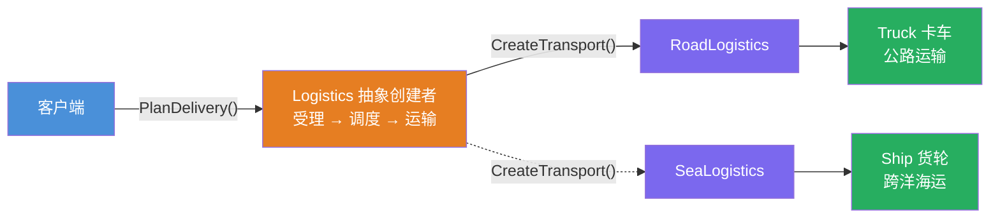
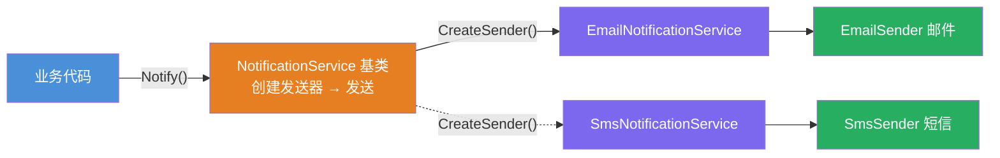

# 工厂方法模式（Factory Method Pattern）

[TOC]

## 一、📖 概述

工厂方法是**创建型设计模式**，定义一个创建对象的接口，但**由子类决定实例化哪一个产品**，将对象的创建延迟到子类。

核心思想：客户端面向抽象创建者编程，具体产品延迟到工厂子类里才创建。**新增产品 = 新增一对类（工厂子类 + 产品类）**，现有代码零改动，完全符合**开闭原则**。

<br/>

## 二、🧩 模式解析

### 2.1 类关系图



| 关键角色 | 说明 |
| --- | --- |
| **创建者（Creator）** | 声明工厂方法 `CreateProduct()`，通常还固化"拿到产品后怎么用"的模板流程 |
| **具体创建者（Concrete Creator）** | 实现工厂方法，返回特定产品——只回答"造什么" |
| **产品接口（Product）** | 所有产品的统一契约 |
| **具体产品（Concrete Product）** | 被工厂方法创建的实际对象 |

### 2.2 核心代码

```csharp
// 产品接口
interface IProduct
{
    void Act();
}

// 创建者：模板流程决定"怎么用"，工厂方法决定"造什么"
abstract class Creator
{
    public void Operate()
    {
        IProduct product = CreateProduct();   // 工厂方法：延迟到子类
        product.Act();
    }

    protected abstract IProduct CreateProduct();
}

// 具体创建者：只回答"造什么"
class ConcreteCreatorA : Creator
{
    protected override IProduct CreateProduct() => new ProductA();
}
```

> 协作方式：客户端只依赖抽象 `Creator`；基类固化流程并在恰当时机调用工厂方法，子类只负责返回具体产品——"框架决定何时造，子类决定造什么"。

### 2.3 三种工厂对比

| 对比维度 | 简单工厂 | 工厂方法 | 抽象工厂 |
| --- | --- | --- | --- |
| 工厂形态 | 一个静态方法 + 分支判断 | 每种产品一个工厂子类 | 一个工厂创建**一族**产品 |
| 新增产品 | 修改工厂分支（违背开闭） | 新增一对类，零修改 | 新增产品种类要改工厂接口 |
| 适用场景 | 产品少且稳定 | 单一产品体系、需要扩展 | 产品族/主题整体切换 |

另见同仓库：[简单工厂 ../FactoryPattern](../FactoryPattern/README.md)、[抽象工厂 ../AbstractFactoryPattern](../AbstractFactoryPattern/README.md)

关键点：

- **工厂方法常与模板方法合体**：基类固化流程，工厂方法是留给子类的"钩子"——本模式两个示例都体现了这一点
- **BCL 中的身影**：`ILoggerFactory.CreateLogger()`、`IDbConnectionFactory.CreateConnection()` 都是工厂方法

<br/>

## 三、💻 代码示例

### 3.1 经典场景：跨境物流

> 场景：公路/海运/空运物流公司受理货物——基类固化"受理 → 调度 → 运输"三步，运输工具由各子公司决定；新增空运只需新增 `AirLogistics` + `Plane` 两个类。



| 角色 | 文件 |
| --- | --- |
| 产品接口 | [`Logistics/ITransport.cs`](Logistics/ITransport.cs) |
| 具体产品 | [`Logistics/Truck.cs`](Logistics/Truck.cs)、[`Ship.cs`](Logistics/Ship.cs)、[`Plane.cs`](Logistics/Plane.cs) |
| 抽象创建者 | [`Logistics/Logistics.cs`](Logistics/Logistics.cs) |
| 具体创建者 | [`Logistics/RoadLogistics.cs`](Logistics/RoadLogistics.cs) 等 3 个 |
| 客户端 | [`Program.cs`](Program.cs) |

### 3.2 软件项目：消息通知中心

> 场景：通知服务基类固化「创建发送器 → 发送」两步流程，邮件/短信子类只回答"用哪种发送器"——工厂方法作为框架钩子的典型用法。



| 角色 | 文件 |
| --- | --- |
| 产品接口 | [`Notification/IMessageSender.cs`](Notification/IMessageSender.cs) |
| 具体产品 | [`Notification/EmailSender.cs`](Notification/EmailSender.cs)、[`SmsSender.cs`](Notification/SmsSender.cs) |
| 抽象创建者 | [`Notification/NotificationService.cs`](Notification/NotificationService.cs) |
| 具体创建者 | [`Notification/EmailNotificationService.cs`](Notification/EmailNotificationService.cs)、[`SmsNotificationService.cs`](Notification/SmsNotificationService.cs) |
| 客户端 | [`Program.cs`](Program.cs) |

### 3.3 运行结果

```bash
========== 工厂方法模式 (Factory Method Pattern) ==========
让子类决定创建哪个产品，新增产品零修改

--- 经典场景: 跨境物流 ---
>> 客户端只依赖抽象工厂 Logistics，安排三类运输：

[受理] 公路物流：货物「2 吨日用百货（上海 → 成都）」
[调度] 卡车已就位
[运输] 卡车沿公路配送，约 3 天，运费最低

[受理] 海运物流：货物「800 吨机电设备（青岛 → 洛杉矶）」
[调度] 货轮已就位
[运输] 货轮跨洋海运，约 15 天，适合大宗货物

[受理] 航空物流：货物「50kg 疫苗冷链（北京 → 法兰克福）」
[调度] 货机已就位
[运输] 货机航空直达，约 1 天，运费最高

--- 软件项目: 消息通知中心 ---
>> 基类固化「创建发送器 → 发送」流程，子类只决定发送器：

[通知] 邮件通知服务开始发送
[创建] 邮件发送器已就位
[发送] 向 alice@example.com 发送邮件：系统将于今晚 23:00-24:00 维护升级

[通知] 短信通知服务开始发送
[创建] 短信发送器已就位
[发送] 向 138****5678 发送短信：您的验证码是 8848，5 分钟内有效
```

<br/>

## 四、📝 小结

- **核心思想**：创建逻辑下放到工厂子类，基类只约定契约与流程；新增产品即插即用

- **两个示例**：物流展示"客户端面向抽象 + 开闭原则扩展"，通知中心展示"工厂方法作为框架钩子、与模板方法天然组合"

- **注意事项**：产品种类少且稳定时，简单工厂（一个静态方法）更划算；每种产品都要配一个工厂子类，类数量会翻倍
