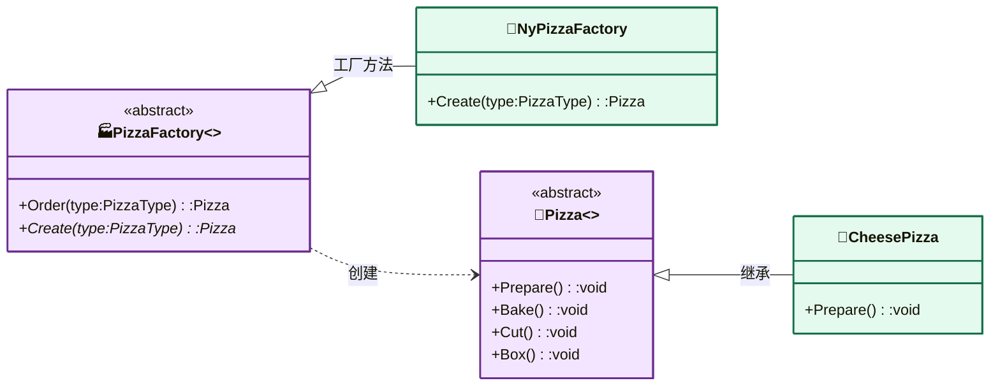

# 工厂模式（Factory Pattern）

> **核心思想**：把"创建对象"的职责从客户端抽离，交给专门的工厂。本示例同时演示了两种工厂模式：
> - **工厂方法模式（Factory Method）**：定义一个创建对象的接口，让**子类决定实例化哪一个类**，将创建延迟到子类。
> - **抽象工厂模式（Abstract Factory）**：提供一个创建**一族相关产品**的接口，而无需指定具体类。

## 解决什么问题

披萨店要支持"纽约风味"和"芝加哥风味"，且每种风味的面团、酱料、奶酪、海鲜配料各不相同。若在客户端用 if-else 逐层 new，代码臃肿且新增风味需要到处改。工厂方法把"创建哪种披萨"交给子类工厂；抽象工厂进一步把"一套配料族"封装成族工厂，客户端只面向抽象接口，更换风味只需更换工厂实现，完全符合**开闭原则**。

## 主要参与者

### 工厂方法（Factory Method）

| 角色 | 本示例类 | 职责 |
| --- | --- | --- |
| 抽象工厂 Creator | `PizzaFactory` | 定义 `Order()` 模板流程，抽象 `Create()` |
| 具体工厂 ConcreteCreator | `NyPizzaFactory` / `ChicagoPizzaFactory` | 各自决定创建哪种披萨 |
| 抽象产品 Product | `Pizza` | 定义 `Prepare/Bake/Cut/Box` 流程 |
| 具体产品 | `CheesePizza` / `ClamPizza` / `VeggiePizza` | 各类披萨 |

### 抽象工厂（Abstract Factory）

| 角色 | 本示例类 | 职责 |
| --- | --- | --- |
| 抽象工厂 | `IIngredientsFactory` | 定义创建一套配料的接口 |
| 具体工厂 | `NyIngredientsFactory` / `ChicagoIngredientsFactory` | 分别产出纽约/芝加哥配料族 |
| 抽象产品 | `ICheese` / `IDough` / `ISauce` / `IClam` / `IVeggies` | 各配料抽象接口 |
| 具体产品 | `Mozarella` / `Parmesan` / `ThinCrust` / `DeepDish` / `CherryTomato` / `PlumTomato` / `FrozenClam` / `FreshClam` 及蔬菜类 | 各配料实现 |

## 类图



## 源码结构

目录按子目录组织，职责清晰：

- **`Factory Method/`**：工厂方法模式。`PizzaFactory.cs` 的 `Order()` 固定流程（Create→Prepare→Bake→Cut→Box），`Create()` 为抽象；`NyPizzaFactory.cs` 用纽约配料族并给披萨标 `blue`，`ChicagoPizzaFactory.cs` 用芝加哥配料族并标 `red`。
- **`Abstract Factory/`**：抽象工厂模式。`IIngredientsFactory.cs` 定义配料族接口；`NyIngredientsFactory` / `ChicagoIngredientsFactory` 分别组合不同的面团、酱料、奶酪、海鲜、蔬菜。
- **`Pizza/`**：披萨产品层次。`CheesePizza` / `ClamPizza` / `VeggiePizza` 的 `Prepare()` 通过注入的 `IIngredientsFactory` 取回配料并打印。
- **`Helper.cs`**：定义 `PizzaType` 枚举（Cheese / Clam）。
- **Program.cs**：纽约店下 `Cheese` 单，芝加哥店下 `Clam` 单，展示两种风味工厂的差异。

```csharp
// Program.cs 核心代码
var yankees = new NyPizzaFactory();
yankees.Order(PizzaType.Cheese);   // 纽约风味芝士披萨，蓝色盒
var cubs = new ChicagoPizzaFactory();
cubs.Order(PizzaType.Clam);        // 芝加哥风味蛤蜊披萨，红色盒
```
