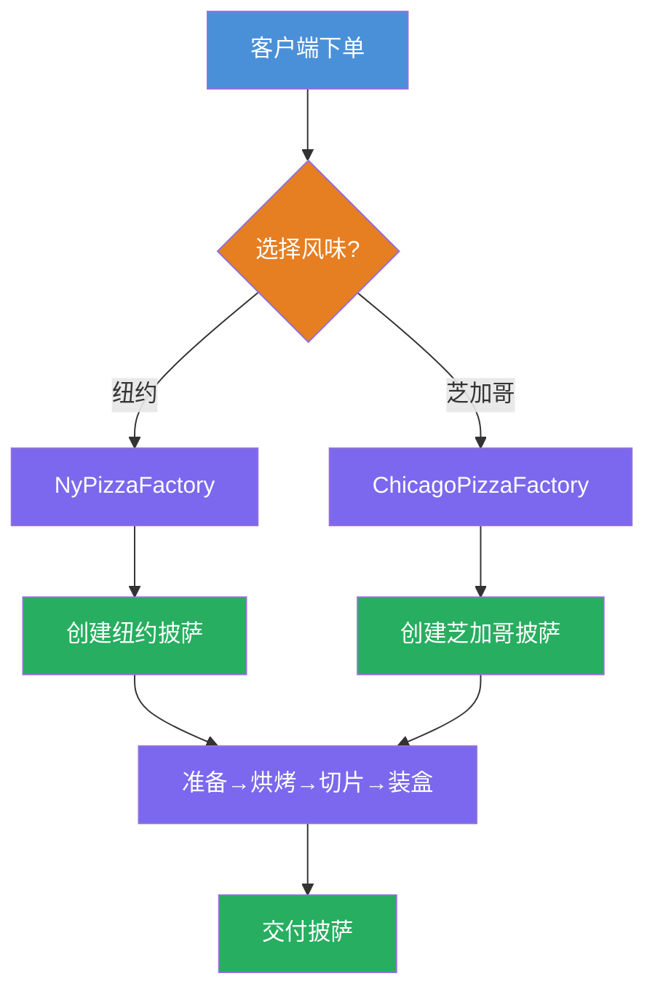
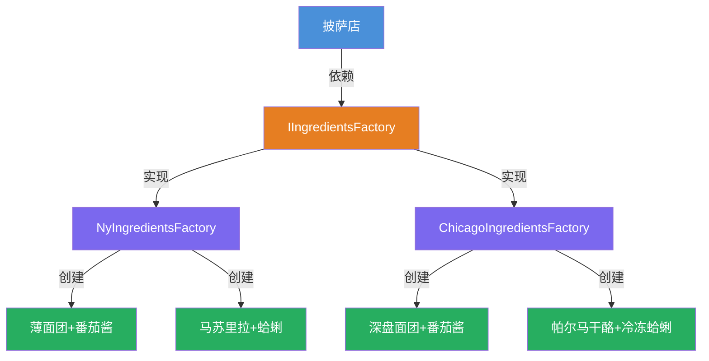
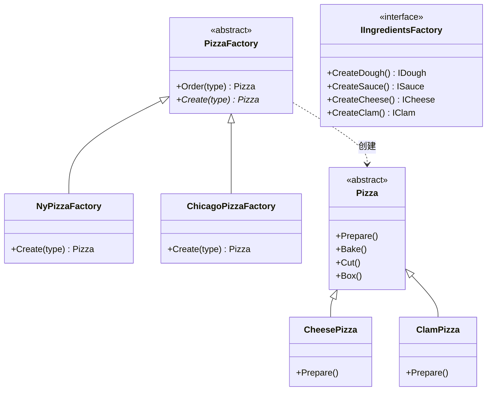

# 工厂模式教程

[TOC]

## 一、📖 概述

工厂模式是**创建型设计模式**，把"创建对象"的职责从客户端抽离，交给专门的工厂类。本示例涵盖两种工厂模式：

- **工厂方法模式**：定义创建对象的接口，让**子类决定实例化哪一个类**，将创建延迟到子类

- **抽象工厂模式**：提供创建**一族相关产品**的接口，无需指定具体类

核心思想：客户端面向抽象工厂接口编程，更换风味只需更换工厂实现，完全符合**开闭原则**。

### 核心特性

- **解耦创建与使用**：客户端不直接 new 对象，通过工厂获取

- **产品族一致性**：同一工厂产出的面团、酱料、奶酪等配料属于同一风味

- **可扩展**：新增风味只需新增工厂类，无需修改现有代码

- **符合开闭原则**：对扩展开放，对修改关闭

<br/>

## 二、📐 结构图解

### 2.1 工厂方法流程



### 2.2 抽象工厂结构



### 2.3 类关系



<br/>

## 三、💻 代码实现

以披萨店为例：纽约和芝加哥两种风味，每种风味的面团、酱料、奶酪、海鲜配料各不相同。

### 3.1 抽象工厂（工厂方法）

```csharp
// 工厂方法模式：抽象工厂定义模板流程
public abstract class PizzaFactory
{
    // 模板方法：固定流程
    public Pizza Order(PizzaType type)
    {
        var pizza = Create(type);  // 工厂方法，由子类决定
        pizza.Prepare();
        pizza.Bake();
        pizza.Cut();
        pizza.Box();
        return pizza;
    }

    // 抽象工厂方法
    protected abstract Pizza Create(PizzaType type);
}
```

### 3.2 具体工厂

```csharp
// 纽约风味工厂
public class NyPizzaFactory : PizzaFactory
{
    protected override Pizza Create(PizzaType type)
    {
        // 使用纽约配料族
        var ingredients = new NyIngredientsFactory();
        return new CheesePizza(ingredients) { BoxColor = "blue" };
    }
}

// 芝加哥风味工厂
public class ChicagoPizzaFactory : PizzaFactory
{
    protected override Pizza Create(PizzaType type)
    {
        // 使用芝加哥配料族
        var ingredients = new ChicagoIngredientsFactory();
        return new ClamPizza(ingredients) { BoxColor = "red" };
    }
}
```

### 3.3 抽象工厂（配料族）

```csharp
// 抽象工厂：定义配料族接口
public interface IIngredientsFactory
{
    IDough CreateDough();
    ISauce CreateSauce();
    ICheese CreateCheese();
    IClam CreateClam();
}

// 纽约配料工厂
public class NyIngredientsFactory : IIngredientsFactory
{
    public IDough CreateDough() => new ThinCrust();       // 薄面团
    public ISauce CreateSauce() => new CherryTomato();    // 樱桃番茄酱
    public ICheese CreateCheese() => new Mozarella();     // 马苏里拉
    public IClam CreateClam() => new FreshClam();         // 新鲜蛤蜊
}

// 芝加哥配料工厂
public class ChicagoIngredientsFactory : IIngredientsFactory
{
    public IDough CreateDough() => new DeepDish();        // 深盘面团
    public ISauce CreateSauce() => new PlumTomato();      // 李子番茄酱
    public ICheese CreateCheese() => new Parmesan();      // 帕尔马干酪
    public IClam CreateClam() => new FrozenClam();        // 冷冻蛤蜊
}
```

### 3.4 客户端使用

```csharp
// 客户端只面向工厂接口
var nyStore = new NyPizzaFactory();
nyStore.Order(PizzaType.Cheese);   // 纽约风味芝士披萨，蓝色盒

var chicagoStore = new ChicagoPizzaFactory();
chicagoStore.Order(PizzaType.Clam); // 芝加哥风味蛤蜊披萨，红色盒
```

<br/>

## 四、🔍 核心解析

### 4.1 工厂方法 vs 抽象工厂

- **工厂方法**：一个工厂创建一种产品，通过子类决定创建哪种披萨

- **抽象工厂**：一个工厂创建一族产品，封装了面团、酱料、奶酪、海鲜等一整套配料

### 4.2 模板方法与工厂方法协作

`PizzaFactory.Order()` 是模板方法，固定了"创建→准备→烘烤→切片→装盒"流程；`Create()` 是工厂方法，由子类决定实例化哪个具体产品。

### 4.3 客户端解耦

客户端通过 `PizzaFactory` 基类引用操作，不依赖具体工厂类。切换风味只需更换一行工厂实例化代码，无需修改客户端业务逻辑。

<br/>

## 五、🎯 应用场景

### 5.1 适用场景

- 系统需要多个系列的相关对象（如不同风味的食品、不同平台的UI组件）

- 创建对象的逻辑复杂且随产品族变化

- 需要在运行时动态切换产品族

### 5.2 实际案例

- **.NET数据库访问**：`IDbProviderFactory` 创建Connection、Command等数据库对象族

- **跨平台UI框架**：Windows/Mac/Linux不同风格组件族

- **游戏引擎**：不同主题的道具、角色外观、音效等资源族

<br/>

## 六、⚖️ 优缺点分析

### 6.1 优点

- **产品族一致性**：同一工厂创建的配料（面团、酱料、奶酪）风格统一

- **符合开闭原则**：新增风味只需新增工厂类，不修改现有代码

- **解耦客户端**：客户端面向抽象接口，更换风味只需更换工厂实例

### 6.2 缺点

- **扩展困难**：新增产品类型（如新增配料种类）需修改所有工厂接口

- **类数量增多**：每新增一个风味，需要增加对应的工厂类和配料类

<br/>

## 七、📝 总结

- **核心思想**：把创建对象的职责从客户端抽离，交给专门的工厂

- **两种模式**：工厂方法让子类决定创建哪种产品；抽象工厂创建一整套相关产品族

- **关键角色**：抽象工厂、具体工厂、抽象产品、具体产品

- **适用场景**：需要多套风格一致的产品族，且运行时动态切换

- **注意事项**：新增产品类型成本较高，设计时需预估扩展方向
