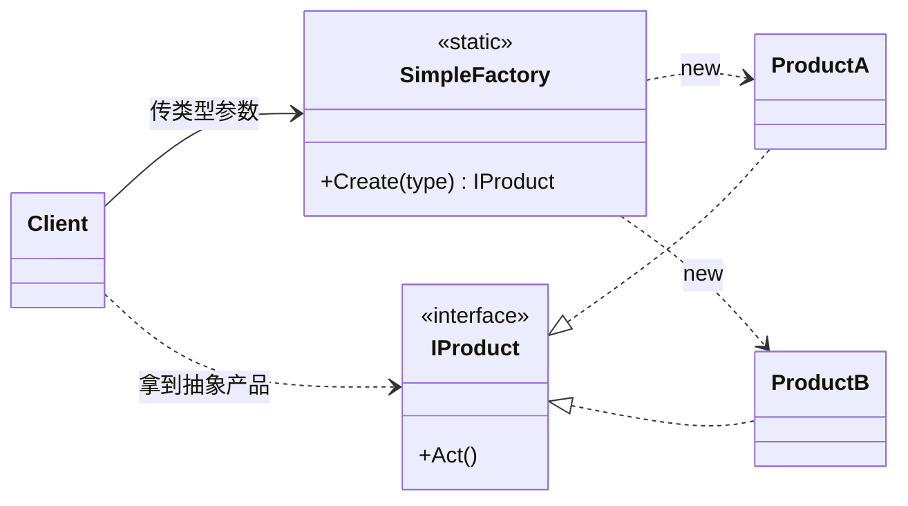
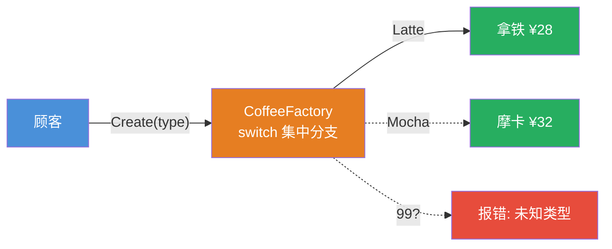
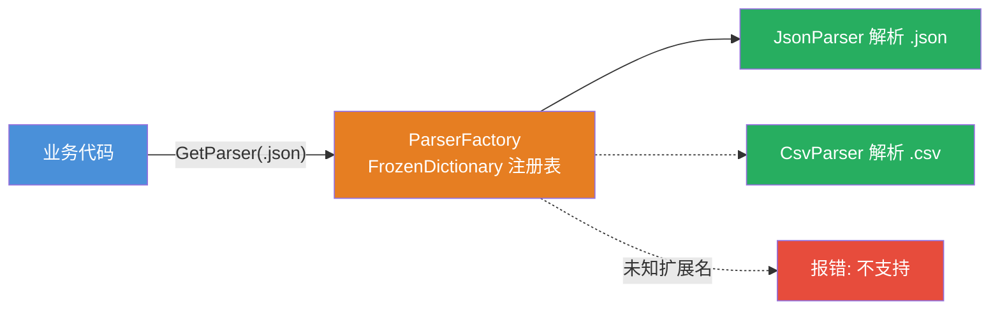

# 简单工厂模式（Simple Factory）

[TOC]

## 一、📖 概述

简单工厂是**创建型模式**的入门款：由**一个工厂类 + 一个创建方法**集中管理对象创建，客户端只传"要什么"，不关心"怎么 new"。它不在 GoF 23 种模式之列，却是工厂三兄弟（简单工厂 → [工厂方法](../FactoryMethodPattern/README.md) → [抽象工厂](../AbstractFactoryPattern/README.md)）中最常用的一环。

核心思想：把散落在各处的 `new` 收拢到一处，客户端与具体产品类**解耦**；代价是新增产品要修改工厂分支，违背开闭原则。

<br/>

## 二、🧩 模式解析

### 2.1 类关系图



| 关键角色 | 说明 |
| --- | --- |
| **工厂（Factory）** | 一个静态创建方法 + 集中的分支/注册表，是唯一出现 `new` 的地方 |
| **产品接口（Product）** | 所有产品的统一契约，客户端只面向它 |
| **具体产品（Concrete Product）** | 被创建的实际对象 |

### 2.2 核心代码

```csharp
// 简单工厂：一个静态方法 + 集中分支
static class SimpleFactory
{
    static IProduct Create(ProductType type) => type switch
    {
        ProductType.A => new ProductA(),      // 分支集中在这一处
        ProductType.B => new ProductB(),
        _ => throw new NotSupportedException($"未知类型：{type}"),
    };
}

// 客户端：不 new，只报类型
IProduct product = SimpleFactory.Create(ProductType.A);
product.Act();
```

> 协作方式：客户端只传"要什么"，工厂集中决定"怎么造"；新增产品必须改工厂分支——这正是它违背开闭原则、被[工厂方法](../FactoryMethodPattern/README.md)改进的地方。

### 2.3 关键解析

与工厂方法对比：

| 对比维度 | 简单工厂 | 工厂方法 |
| --- | --- | --- |
| 新增一个产品 | 修改 `Create()` 分支 | 新增一对类，零修改 |
| 开闭原则 | 违背 | 符合 |
| 类数量 | 最少 | 产品数 × 2 |
| 适用场景 | 产品少且稳定 | 产品体系需要持续扩展 |

两种实现风味（本模式两个示例各用一种）：

- **switch 表达式版**：类型少（<10 个）时最直观
- **字典注册版**：类型多时 O(1) 查找，注册即扩展，更贴近 DI 容器的注册表实现

BCL 中的身影：`Encoding.GetEncoding("utf-8")`、`Color.FromArgb(...)` 都是简单工厂。

<br/>

## 三、💻 代码示例

### 3.1 经典场景：咖啡店点单

> 场景：顾客报品类，咖啡工厂按 switch 分支制作——最直观的简单工厂；菜单外的品类在工厂统一拦截。



| 角色 | 文件 |
| --- | --- |
| 抽象产品 | [`Coffee/Coffee.cs`](Coffee/Coffee.cs) |
| 具体产品 | [`Coffee/Latte.cs`](Coffee/Latte.cs)、[`Americano.cs`](Coffee/Americano.cs)、[`Mocha.cs`](Coffee/Mocha.cs) |
| 工厂 | [`Coffee/CoffeeFactory.cs`](Coffee/CoffeeFactory.cs)（switch 表达式版） |
| 客户端 | [`Program.cs`](Program.cs) |

### 3.2 软件项目：文件解析器

> 场景：按文件扩展名分发到 JSON/XML/CSV 解析器——字典注册表式工厂，软件项目中最常见的用法（`FrozenDictionary` 查找 O(1)）。



| 角色 | 文件 |
| --- | --- |
| 产品接口 | [`Parser/IDataParser.cs`](Parser/IDataParser.cs) |
| 具体产品 | [`Parser/JsonParser.cs`](Parser/JsonParser.cs)、[`XmlParser.cs`](Parser/XmlParser.cs)、[`CsvParser.cs`](Parser/CsvParser.cs) |
| 工厂 | [`Parser/ParserFactory.cs`](Parser/ParserFactory.cs)（FrozenDictionary 注册版） |
| 客户端 | [`Program.cs`](Program.cs) |

### 3.3 运行结果

```bash
========== 简单工厂模式 (Simple Factory) ==========
一个工厂方法集中管理创建，客户端不直接 new 产品

--- 经典场景: 咖啡店点单（switch 表达式版） ---
>> 顾客依次点单：

[下单] 拿铁 Latte ¥28 — 浓缩咖啡 + 蒸奶 + 细奶泡
[下单] 美式 Americano ¥22 — 浓缩咖啡 + 热水
[下单] 摩卡 Mocha ¥32 — 浓缩咖啡 + 巧克力酱 + 蒸奶 + 奶泡

>> 顾客点了菜单外的品类：
[报错] 未知咖啡类型：99

--- 软件项目: 文件解析器（字典注册版） ---
>> 按扩展名分发到对应解析器：

[解析] users.json（JSON）：读取 25 字符，反序列化为对象树
[解析] config.xml（XML）：读取 33 字符，构建 DOM 文档
[解析] books.csv（CSV）：按分隔符切分为 3 行 × 2 列

>> 传入不支持的 .txt 文件：
[报错] 不支持的文件格式：.txt
```

<br/>

## 四、📝 小结

- **核心思想**：创建逻辑集中到一个静态工厂方法，客户端面向产品接口编程，不接触具体类

- **两个示例**：咖啡店展示 switch 分支版的生活直觉，文件解析器展示字典注册版的软件实战

- **注意事项**：产品种类持续增长时，升级为工厂方法（每种产品一对类）；简单工厂的"修改分支"在小规模下反而是优势——类最少、结构最简单
