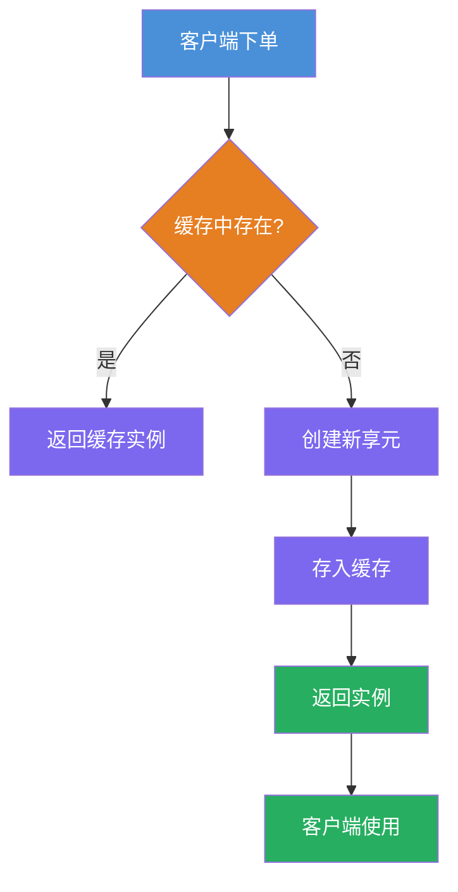
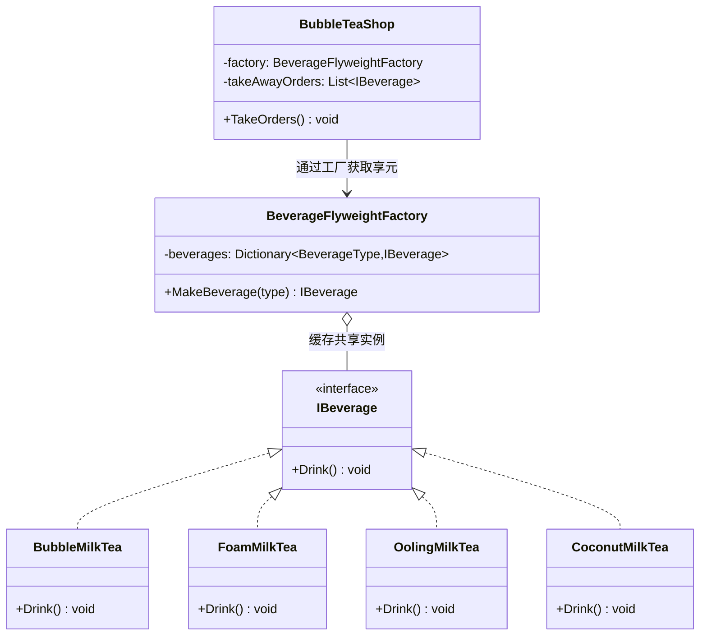

# 享元模式（Flyweight Pattern）教程

[TOC]

## 一、📖 概述

享元模式是**结构型设计模式**，运用**共享技术**有效支持大量细粒度对象的复用。将对象的**内部状态**（可共享、不变）与**外部状态**（随场景变化）分离，通过工厂缓存共享实例，减少内存消耗与对象创建开销。

核心思想：同一种对象只创建一次，所有使用者复用同一实例。以奶茶店为例，每种奶茶类型作为共享的内部状态，订单中的糖度、冰量等作为外部状态，同一奶茶只实例化一次。

### 核心特性

- **内部状态共享**：不变的部分（如奶茶类型）只创建一次，所有实例共享

- **外部状态分离**：随场景变化的部分（如订单编号）由客户端传入

- **工厂缓存**：通过字典缓存已创建的享元对象，命中则直接复用

- **减少内存开销**：大量相似对象合并为少量共享实例

<br/>

## 二、📐 结构图解

### 2.1 整体流程



### 2.2 类关系



### 2.3 关键角色

| 角色                           | 说明                               |
| ------------------------------ | ---------------------------------- |
| 享元接口（Flyweight）          | 定义共享对象的公共操作接口         |
| 具体享元（Concrete Flyweight） | 存储内部状态，实现共享行为         |
| 享元工厂（FlyweightFactory）   | 管理缓存池，负责创建和复用享元实例 |
| 客户端（Client）               | 通过工厂获取享元，传入外部状态使用 |

<br/>

## 三、💻 代码实现

以奶茶店为例：多种奶茶类型通过享元工厂缓存复用，下单6杯实际只创建4个实例。

### 3.1 享元接口与类型枚举

```csharp
// 享元接口：定义共享对象的公共行为
public interface IBeverage
{
    void Drink();
}

// 饮品类型枚举：作为缓存的键
public enum BeverageType
{
    BubbleMilk,
    FoamMilk,
    OolingMilk,
    CoconutMilk
}
```

### 3.2 具体享元

```csharp
// 具体享元：构造时打印信息便于观察创建次数
public class BubbleMilkTea : IBeverage
{
    public BubbleMilkTea()
    {
        Console.WriteLine("Initializing BubbleMilkTea...");
    }

    public void Drink() => Console.WriteLine("喝一杯珍珠奶茶");
}
```

### 3.3 享元工厂

```csharp
// 享元工厂：字典缓存，命中复用，未命中才创建
public class BeverageFlyweightFactory
{
    private readonly Dictionary<BeverageType, IBeverage> _beverages = new();

    public IBeverage MakeBeverage(BeverageType type)
    {
        if (!_beverages.ContainsKey(type))
        {
            _beverages[type] = type switch
            {
                BeverageType.BubbleMilk => new BubbleMilkTea(),
                BeverageType.FoamMilk => new FoamMilkTea(),
                BeverageType.OolingMilk => new OolingMilkTea(),
                BeverageType.CoconutMilk => new CoconutMilkTea(),
                _ => throw new ArgumentOutOfRangeException()
            };
        }
        return _beverages[type];
    }
}
```

### 3.4 客户端使用

```csharp
// 客户端：通过工厂获取享元，重复类型自动复用
public class BubbleTeaShop
{
    private readonly BeverageFlyweightFactory _factory = new();
    private readonly List<IBeverage> _takeAwayOrders = new();

    public void TakeOrders()
    {
        _takeAwayOrders.Add(_factory.MakeBeverage(BeverageType.BubbleMilk)); // 创建
        _takeAwayOrders.Add(_factory.MakeBeverage(BeverageType.BubbleMilk)); // 复用!
        _takeAwayOrders.Add(_factory.MakeBeverage(BeverageType.FoamMilk));
        _takeAwayOrders.Add(_factory.MakeBeverage(BeverageType.OolingMilk));
        _takeAwayOrders.Add(_factory.MakeBeverage(BeverageType.OolingMilk)); // 复用!
        _takeAwayOrders.Add(_factory.MakeBeverage(BeverageType.CoconutMilk));
    }
}

// 6杯订单，实际仅创建4个享元实例
```

<br/>

## 四、🔍 核心解析

### 4.1 享元工厂

`BeverageFlyweightFactory` 用 `Dictionary` 做缓存，`MakeBeverage` 先查字典：命中直接返回缓存实例，未命中才创建新实例并加入缓存。这是享元模式的核心机制。

### 4.2 内部状态 vs 外部状态

| 维度     | 内部状态（Intrinsic State）            | 外部状态（Extrinsic State）    |
| -------- | -------------------------------------- | ------------------------------ |
| 定义     | 存在于享元对象内部，不随环境改变       | 由客户端传入，每次调用可能不同 |
| 可共享   | 是，所有使用者共享同一份               | 否，每个使用场景独立           |
| 存储位置 | 享元对象的字段                         | 客户端局部变量或方法参数       |
| 生命周期 | 与享元工厂缓存同寿                     | 每次方法调用时传入，用完即弃   |
| 本示例   | 奶茶类型（`BubbleMilk`、`FoamMilk`等） | 订单编号、取餐时间、糖度冰量   |
| 设计原则 | 提取变化频率最低的状态作为内部状态     | 其余一切状态都应外部化         |

> **分离判断**：如果一个属性对所有同类型对象都相同 → 内部状态；如果每个对象实例需要不同的值 → 外部状态。

### 4.3 实例复用验证

构造函数中的 `Initializing...` 输出用于观察实际创建次数。下单6杯但只有4种类型时，只会打印4次初始化信息，证明重复类型被复用。

<br/>

## 五、🎯 应用场景

### 5.1 适用场景

- 系统中存在大量相似对象，且大部分状态可外部化

- 对象的多数状态可以变为外部状态

- 去除外部状态后，对象组可以用少量共享实例替代

- 需要降低内存使用量

### 5.2 实际案例

- **字符串常量池**：相同字符串只存储一份，引用复用

- **线程池**：线程创建开销大，复用已有线程处理任务

- **数据库连接池**：连接对象复用，避免频繁创建销毁

- **棋子/子弹对象**：游戏中大量同类型对象通过享元复用

<br/>

## 六、⚖️ 优缺点分析

### 6.1 优点

- **大幅减少内存占用**：大量相似对象合并为少量共享实例

- **减少对象创建开销**：工厂缓存避免重复创建

- **外部状态独立**：不同场景可传入不同外部状态，不影响共享

### 6.2 缺点

- **增加复杂度**：需要分离内部状态与外部状态，增加了设计复杂度

- **运行时间可能增加**：查找缓存和外部状态计算有一定开销

- **适用范围受限**：对象必须可以划分为内部状态和外部状态

<br/>

## 七、📝 总结

- **核心思想**：将内部状态与外部状态分离，通过工厂缓存实现大量相似对象的共享复用

- **关键角色**：享元接口、具体享元、享元工厂、客户端

- **实现要点**：工厂用字典缓存，命中复用，未命中才创建

- **适用场景**：大量相似对象且大部分状态可外部化的场景
