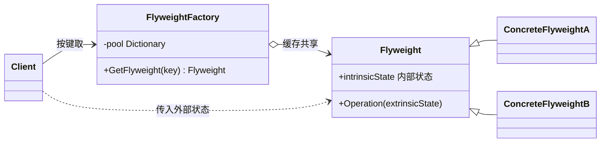
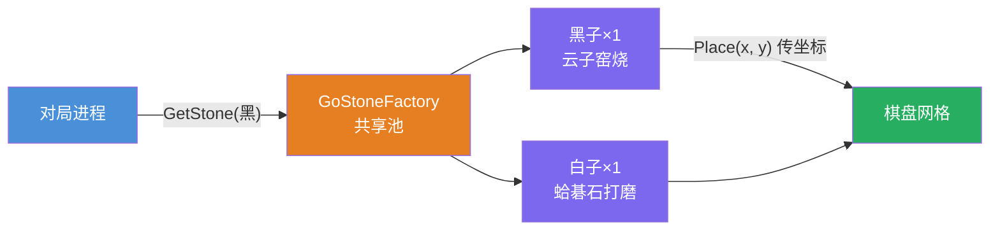
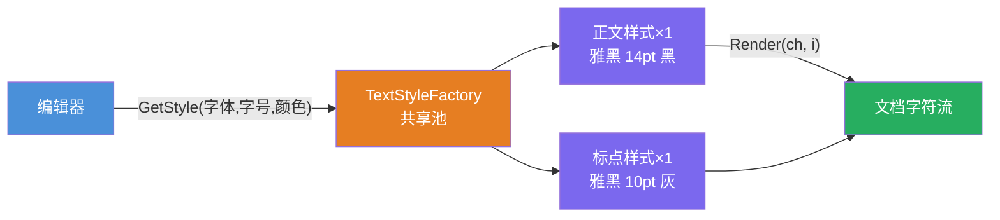

# 享元模式（Flyweight Pattern）

[TOC]

## 一、📖 概述

享元是**结构型设计模式**，运用共享技术有效支持大量**细粒度**对象，避免对象爆炸带来的内存开销。

核心思想：把对象状态一分为二——**内部状态**（不变、可共享）提取到享元对象中，**外部状态**（随场景变化）由调用方每次传入。全盘 300 个棋子不再各造一个对象，黑白**各共享一个**；工厂 + 缓存池保证同键取到同一实例。

<br/>

## 二、🧩 模式解析

### 2.1 类关系图



| 关键角色 | 说明 | 围棋示例 |
| --- | --- | --- |
| **享元（Flyweight）** | 只装内部状态，操作时接收外部状态 | `GoStone`（颜色/材质） |
| **享元工厂（Factory）** | 按键缓存，同键返回同一实例 | `GoStoneFactory` |
| **内部状态（Intrinsic）** | 不随环境变化、可共享 | 颜色、材质 |
| **外部状态（Extrinsic）** | 随场景变化、不可共享 | 落子坐标 (x, y) |

### 2.2 核心代码

```csharp
// 享元：只装可共享的内部状态
class Flyweight(string intrinsic)
{
    public void Operation(object extrinsic) { }     // 外部状态由调用方传入
}

// 享元工厂：同键复用
class FlyweightFactory
{
    private readonly Dictionary<string, Flyweight> _pool = [];

    public Flyweight Get(string key) =>
        _pool.TryGetValue(key, out var fly)
            ? fly                                  // 已有：直接复用
            : _pool[key] = new Flyweight(key);     // 没有：创建并入池
}
```

> 协作方式：客户端向工厂按"内部状态键"取享元对象，拿到的是缓存的共享实例；调用 `Operation()` 时把外部状态作为参数传进去——对象是共享的，效果是个性化的。

### 2.3 关键解析

**判断哪些状态能共享**是使用本模式的第一步：

| 状态类型 | 特征 | 存放位置 | 围棋示例 |
| --- | --- | --- | --- |
| 内部状态 Intrinsic | 不变、重复率高 | 享元对象内 | 黑/白颜色、材质 |
| 外部状态 Extrinsic | 随处变化、不可共享 | 调用方传入 | 坐标、时间 |

- **BCL 中的身影**：`string.Intern()`（字符串驻留池）、`Convert.ChangeType` 缓存、ASP.NET Core 的 `MemoryCache`——共享池思想无处不在
- **享元 vs 单例**：单例是"全局只有一个"，享元是"同键只有一个"（键空间内共享），一个应用可有任意多个享元实例
- **享元 vs 对象池**：池化关心"借还生命周期"（用完归还），享元关心"状态共享"（不分你我、一直用）
- **注意事项**：外部状态穿参会增加调用复杂度；只有对象量级大（万级以上）且内部状态重复率高才值得用

<br/>

## 三、💻 代码示例

### 3.1 经典场景：围棋棋子

> 场景：一盘棋 300 手落子，若每手 new 一个棋子对象就要 300 个；黑白棋子的颜色材质（内部状态）不变，共享两个实例，坐标（外部状态）落子时传入。



| 角色 | 文件 |
| --- | --- |
| 享元 | [`Chess/GoStone.cs`](Chess/GoStone.cs) |
| 享元工厂 | [`Chess/GoStoneFactory.cs`](Chess/GoStoneFactory.cs) |
| 客户端 | [`Program.cs`](Program.cs) |

### 3.2 软件项目：富文本编辑器字符样式

> 场景：文档里每个字符都带样式（字体/字号/颜色）——相同样式的字符共享同一个 `TextStyle` 实例，渲染 12 个字符只创建 2 个样式对象（正文 1 + 标点 1）。



| 角色 | 文件 |
| --- | --- |
| 享元 | [`TextEditor/TextStyle.cs`](TextEditor/TextStyle.cs) |
| 享元工厂 | [`TextEditor/TextStyleFactory.cs`](TextEditor/TextStyleFactory.cs) |
| 客户端 | [`Program.cs`](Program.cs) |

### 3.3 运行结果

```bash
========== 享元模式 (Flyweight Pattern) ==========
共享内部状态，外部状态调用方传入，节省内存

--- 经典场景: 围棋棋子 ---
>> 一盘棋几百个落子，黑白棋子各只需一个实例：

>> 全盘 300 手棋落子完毕
[统计] 不共享需要 300 个棋子对象；实际只创建了 2 个（黑、白各一）

>> 黑白棋子是同一个实例吗？
[验证] ReferenceEquals(black1, black2) = True —— 同一实例，位置是外部参数

>> 实际落子（位置作为外部状态传入）：
[落子] 黑子放在 (3, 15) — 材质：云子窑烧
[落子] 白子放在 (16, 3) — 材质：蛤碁石打磨

--- 软件项目: 富文本编辑器字符样式 ---
>> 一行文档十几个字符，相同样式共享同一实例：

>> 逐字符渲染（首次遇到样式才创建）：
[创建] 新样式实例：微软雅黑 14pt 黑色（池中第 1 个）
  [0] 'H' ← 微软雅黑 14pt 黑色
  [1] 'e' ← 微软雅黑 14pt 黑色
  [2] 'l' ← 微软雅黑 14pt 黑色
  [3] 'l' ← 微软雅黑 14pt 黑色
  [4] 'o' ← 微软雅黑 14pt 黑色
[创建] 新样式实例：微软雅黑 10pt 灰色（池中第 2 个）
  [5] ',' ← 微软雅黑 10pt 灰色
  [6] ' ' ← 微软雅黑 14pt 黑色
  [7] '享' ← 微软雅黑 14pt 黑色
  [8] '元' ← 微软雅黑 14pt 黑色
  [9] '模' ← 微软雅黑 14pt 黑色
  [10] '式' ← 微软雅黑 14pt 黑色
  [11] '!' ← 微软雅黑 10pt 灰色

>> 渲染 12 个字符完毕
[统计] 样式实例只有 2 个（正文 1 + 标点 1），字符各自只存引用
```

<br/>

## 四、📝 小结

- **核心思想**：内部状态进享元、外部状态做参数，工厂缓存保证同键同实例

- **两个示例**：围棋展示 GoF 经典的"300 手落子 2 个对象"，富文本编辑器展示软件项目中的"样式驻留"

- **注意事项**：先用真实内存数据确认对象量级，再决定是否引入；享元与缓存池思想相通，但关注点是**状态共享**而非生命周期管理
