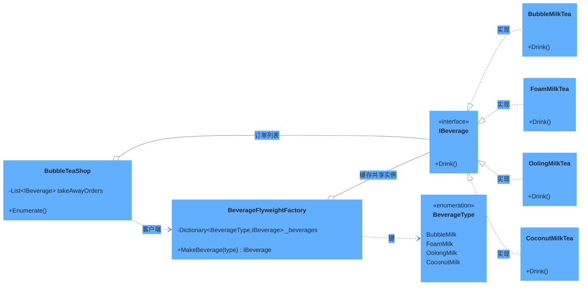

# 享元模式（Flyweight Pattern）

> **核心思想**：运用**共享技术**有效支持大量细粒度对象的复用。将对象的**内部状态**（可共享、不变）与**外部状态**（随场景变化）分离，通过工厂缓存共享实例，减少内存消耗与对象创建开销。

## 解决什么问题

奶茶店一天要卖成百上千杯珍珠奶茶，若每杯都 `new` 一个奶茶对象，会创建海量近乎相同的实例，浪费内存。享元模式把"奶茶类型"作为共享的内部状态：同一种奶茶只创建一次，之后所有订单复用同一实例。本示例中 `BubbleTeaShop` 下单 6 杯，实际只创建 4 个实例（两种乌龙重复下单均复用）。

## 主要参与者

| 角色 | 本示例类 | 职责 |
| --- | --- | --- |
| 享元接口 Flyweight | `IBeverage` | 定义共享对象的公共行为 `Drink()` |
| 具体享元 ConcreteFlyweight | `BubbleMilkTea` / `FoamMilkTea` / `OolingMilkTea` / `CoconutMilkTea` | 可共享的具体奶茶 |
| 享元工厂 FlyweightFactory | `BeverageFlyweightFactory` | 用 `Dictionary<BeverageType, IBeverage>` 缓存并复用实例 |
| 客户端 Client | `BubbleTeaShop` | 通过工厂获取享元，管理订单列表 |
| 类型枚举 | `BeverageType` | 区分饮品类型的键 |

## 类图



## 源码结构

目录下源码文件与职责对应：

- **IBeverage.cs**：享元接口，仅含 `Drink()`。
- **BubbleMilkTea.cs / FoamMilkTea.cs / OolingMilkTea.cs / CoconutMilkTea.cs**：具体享元类，构造函数打印 "Initializing..." 便于观察实例创建次数。
- **BeverageType.cs**：枚举，作为缓存的键。
- **BeverageFlyweightFactory.cs**：享元工厂核心。`MakeBeverage` 先查 `Dictionary`，命中直接返回缓存实例，未命中才 `new` 并加入缓存。
- **BubbleTeaShop.cs**：客户端，下单 6 杯（含重复的珍珠奶茶、乌龙奶茶），`Enumerate()` 统一输出。
- **Program.cs**：创建店铺并枚举订单。

```csharp
// BubbleTeaShop.TakeOrders() 核心代码
takeAwayOrders.Add(factory.MakeBeverage(BeverageType.BubbleMilk)); // 第1次创建
takeAwayOrders.Add(factory.MakeBeverage(BeverageType.BubbleMilk)); // 复用同一实例！
// ... 6 杯订单，实际仅创建 4 个实例
```
