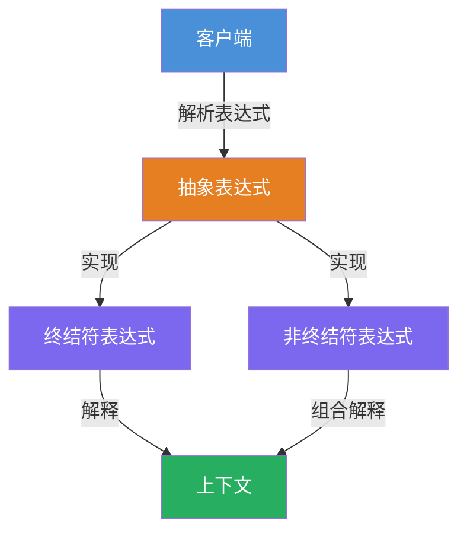
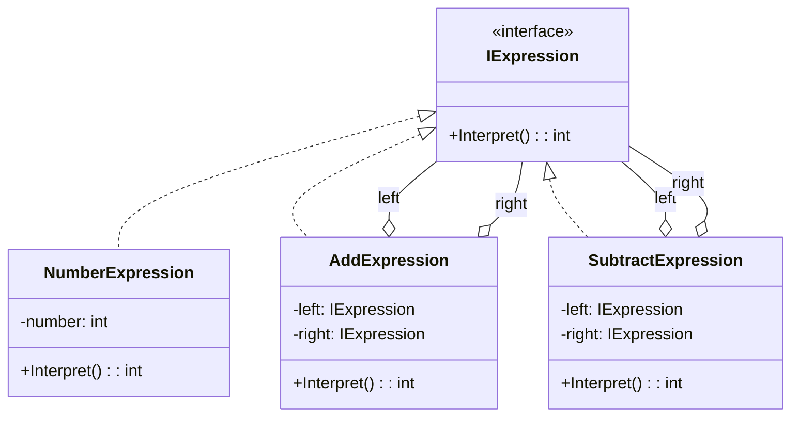

# 解释器模式 (Interpreter) 教程

[TOC]


## 一、📖 概述

解释器模式是**行为型设计模式**，给定一个语言，定义它的文法的一种表示，并定义一个**解释器**，这个解释器使用该表示来解释语言中的句子。

核心思想：将文法规则映射为类结构，每个文法规则对应一个类，通过组合这些类来解释整个语言。典型应用如数学表达式求值、SQL 解析、正则表达式。

### 核心特性

- **语法映射**：每个文法规则对应一个解释器类

- **组合性**：通过组合简单表达式构建复杂表达式

- **易于扩展**：新增文法规则只需新增类

- **符合开闭原则**：对扩展开放，对修改关闭

<br/>

## 二、📐 结构图解

### 2.1 整体流程



### 2.2 类关系



### 2.3 关键角色

| 角色 | 说明 |
|------|------|
| 抽象表达式 (IExpression) | 声明解释操作的接口 |
| 终结符表达式 (NumberExpression) | 实现与终结符相关的解释操作 |
| 非终结符表达式 (Add/SubtractExpression) | 实现与非终结符相关的解释操作，组合子表达式 |

<br/>

## 三、💻 代码实现

以数学表达式求值为例：支持加法、减法和数字的表达式求值。

### 3.1 抽象表达式

```csharp
// 抽象表达式：所有表达式的接口
public interface IExpression
{
    int Interpret();
}
```

### 3.2 终结符表达式

```csharp
// 终结符表达式：数字
public class NumberExpression : IExpression
{
    private readonly int _number;

    public NumberExpression(int number)
    {
        _number = number;
    }

    public int Interpret() => _number;
}
```

### 3.3 非终结符表达式

```csharp
// 非终结符表达式：加法
public class AddExpression : IExpression
{
    private readonly IExpression _left;
    private readonly IExpression _right;

    public AddExpression(IExpression left, IExpression right)
    {
        _left = left;
        _right = right;
    }

    public int Interpret() => _left.Interpret() + _right.Interpret();
}

// 非终结符表达式：减法
public class SubtractExpression : IExpression
{
    private readonly IExpression _left;
    private readonly IExpression _right;

    public SubtractExpression(IExpression left, IExpression right)
    {
        _left = left;
        _right = right;
    }

    public int Interpret() => _left.Interpret() - _right.Interpret();
}
```

### 3.4 客户端使用

```csharp
// 构建表达式: (5 + 3) - 2
var expression = new SubtractExpression(
    new AddExpression(
        new NumberExpression(5),
        new NumberExpression(3)
    ),
    new NumberExpression(2)
);

int result = expression.Interpret();
Console.WriteLine($"(5 + 3) - 2 = {result}");
```

**运行结果**：
```
(5 + 3) - 2 = 6
```

<br/>

## 四、🔍 核心解析

### 4.1 文法规则映射

每条文法规则（如"加法表达式"、"数字"）对应一个类。客户端通过组合这些类来构建表达式树，解释器遍历树来解释整个表达式。

### 4.2 终结符与非终结符

- **终结符**：不可再分的基本元素（如数字），直接返回结果
- **非终结符**：可继续分解的组合元素（如加法），递归解释子表达式

### 4.3 适用性

解释器模式适用于文法规则简单的场景。如果文法复杂（如完整编程语言），应使用 parser generator（如 ANTLR）而非手动实现。

<br/>

## 五、🎯 应用场景

### 5.1 适用场景

- 语言文法简单，规则数量有限

- 需要解释执行语言中的句子

- 文法变化频繁，需要灵活扩展

### 5.2 实际案例

- **SQL 解析器**：将 SQL 语句解析为执行计划

- **正则表达式**：匹配字符串模式

- **数学表达式**：计算器、公式引擎

- **模板引擎**：解析模板语法生成输出

<br/>

## 六、⚖️ 优缺点分析

### 6.1 优点

- **易于扩展**：新增文法规则只需新增类

- **实现简单**：每条规则对应一个类，结构清晰

- **符合开闭原则**：修改文法无需修改现有类

### 6.2 缺点

- **类数量膨胀**：复杂文法会导致大量类

- **维护困难**：文法变更可能影响多个类

- **性能问题**：递归解释可能有性能损耗

<br/>

## 七、📝 总结

- **核心思想**：为文法定义类结构，通过组合类来解释语言

- **关键角色**：抽象表达式、终结符表达式、非终结符表达式

- **适用场景**：文法规则简单且稳定的场景

- **注意事项**：复杂文法应使用专业 parser，避免类数量爆炸
