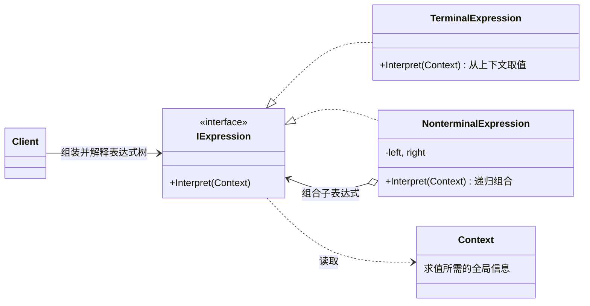
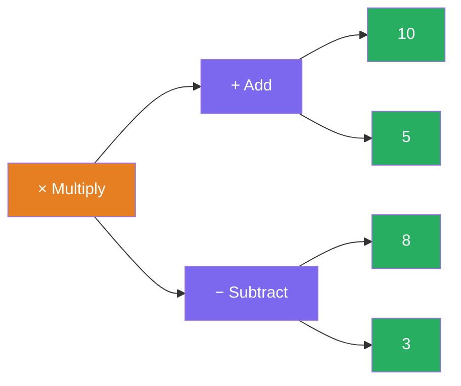
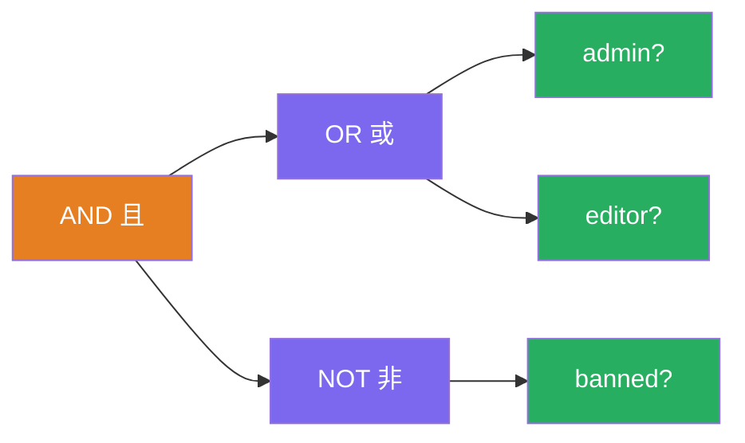

# 解释器模式（Interpreter Pattern）

[TOC]

## 一、📖 概述

解释器是**行为型设计模式**，给定一门语言，定义其文法的一种表示，并定义一个**解释器**，该解释器使用该表示来解释语言中的句子。

核心思想：**每条文法规则映射为一个类**——终结符是叶子节点，非终结符持有子表达式并递归解释；客户端把规则类组装成一棵**表达式树**，对根节点调用一次即完成解释。典型应用：数学表达式求值、规则引擎、正则、SQL、配置 DSL。

<br/>

## 二、🧩 模式解析

### 2.1 类关系图



| 关键角色 | 说明 |
| --- | --- |
| **抽象表达式（Expression）** | 统一的解释入口 `Interpret(Context)` |
| **终结符表达式（Terminal）** | 叶子节点，解释在此触底（数字字面量、角色查询） |
| **非终结符表达式（Nonterminal）** | 内部节点，每条文法规则一个类，递归解释子式（加减乘除、与或非） |
| **上下文（Context）** | 求值所需的全局信息（变量表、用户角色集合） |

### 2.2 核心代码

```csharp
// 抽象表达式：统一解释入口
interface IExpression
{
    int Interpret(Context ctx);
}

// 终结符表达式：叶子，直接持有值或从上下文取值
class NumberExpression(int value) : IExpression
{
    public int Interpret() => value;
}

// 非终结符表达式：一条文法规则一个类，递归组合
class AddExpression(IExpression left, IExpression right) : IExpression
{
    public int Interpret() => left.Interpret() + right.Interpret();
}
```

> 协作方式：客户端把终结符/非终结符组装成一棵表达式树，对根节点调用一次 `Interpret()`；每个非终结符递归解释自己的子式，终结符触底返回——"一文法规则一类，组合成树，递归解释"。

### 2.3 关键解析

**解释 ≠ 解析**：本模式只负责"解释"**已构建好的**表达式树；从字符串构建树需要词法/语法分析器（Parser），不属于本模式职责。

| 表达式类型 | 树中位置 | 求值方式 | 本模式示例 |
| --- | --- | --- | --- |
| 终结符 Terminal | 叶子 | 直接返回 / 查上下文 | `NumberExpression`、`RoleExpression` |
| 非终结符 Nonterminal | 内部节点 | 递归组合子式 | `Add/Multiply`、`And/Or/Not` |

- **表达式树本质是组合模式**的应用（见 [../CompositePattern](../CompositePattern/README.md)）——树形递归结构完全一致
- **适用边界**：文法简单、性能要求不高时用解释器；复杂语言应使用解析器生成器（ANTLR）或编译方案
- **BCL 中的身影**：`System.Linq.Expressions` 表达式树 + `Compile()`，LINQ 就是"解释器 → 编译器"的进化版

<br/>

## 三、💻 代码示例

### 3.1 经典场景：算术表达式求值

> 场景：把 `(10 + 5) × (8 - 3)` 组装成表达式树——非终结符递归求值、终结符触底返回；整棵树还能作为子表达式复用。



| 角色 | 文件 |
| --- | --- |
| 抽象表达式 | [`Arithmetic/IExpression.cs`](Arithmetic/IExpression.cs) |
| 终结符表达式 | [`Arithmetic/NumberExpression.cs`](Arithmetic/NumberExpression.cs) |
| 非终结符表达式 | [`Arithmetic/AddExpression.cs`](Arithmetic/AddExpression.cs)、[`SubtractExpression.cs`](Arithmetic/SubtractExpression.cs)、[`MultiplyExpression.cs`](Arithmetic/MultiplyExpression.cs) |
| 客户端 | [`Program.cs`](Program.cs) |

### 3.2 软件项目：权限规则引擎

> 场景：发布权限规则 `(admin 或 editor) 且 未被封禁` 组装成布尔表达式树，规则只组装一次，可对任意用户上下文反复求值——GoF 原著的布尔表达式领域，也是规则引擎的核心机制。



| 角色 | 文件 |
| --- | --- |
| 抽象表达式 | [`AccessControl/IBooleanExpression.cs`](AccessControl/IBooleanExpression.cs) |
| 终结符表达式 | [`AccessControl/RoleExpression.cs`](AccessControl/RoleExpression.cs) |
| 非终结符表达式 | [`AccessControl/AndExpression.cs`](AccessControl/AndExpression.cs)、[`OrExpression.cs`](AccessControl/OrExpression.cs)、[`NotExpression.cs`](AccessControl/NotExpression.cs) |
| 上下文 | [`AccessControl/RoleContext.cs`](AccessControl/RoleContext.cs) |
| 客户端 | [`Program.cs`](Program.cs) |

### 3.3 运行结果

```bash
========== 解释器模式 (Interpreter Pattern) ==========
给定一门语言，定义其文法表示与解释器

--- 经典场景: 算术表达式求值 ---
>> 构建表达式树：(10 + 5) × (8 - 3)
[求值] (10 + 5) × (8 - 3) = 75

>> 整棵树当作子表达式复用，再 +1：
[求值] (10 + 5) × (8 - 3) + 1 = 76

--- 软件项目: 权限规则引擎 ---
>> 规则：(admin 或 editor) 且 未被封禁

>> Alice（角色：admin）
[通过] 允许发布文章
>> Bob（角色：editor）
[通过] 允许发布文章
>> Eve（角色：editor、banned）
[拒绝] 已被封禁，禁止发布
```

<br/>

## 四、📝 小结

- **核心思想**：文法规则类化，终结符/非终结符组装成表达式树，一次调用递归解释

- **两个示例**：算术求值展示树形递归与子树复用，权限规则引擎展示上下文求值与"规则只组装一次、反复求值"的工程价值

- **注意事项**：文法复杂时类数量爆炸、递归性能受限，应改用解析器生成器；日常开发中遇到"规则 DSL"需求时，本模式是第一步
