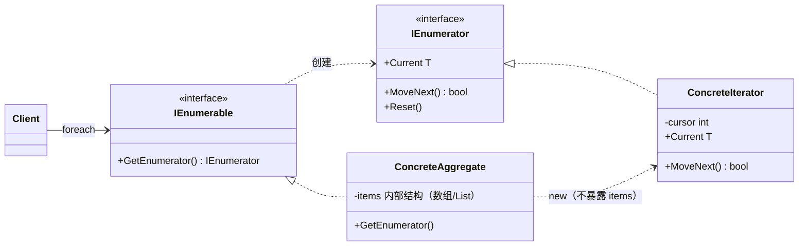
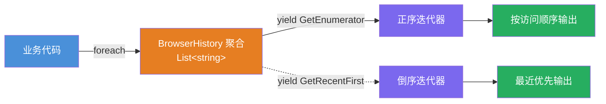

# 迭代器模式（Iterator Pattern）

[TOC]

## 一、📖 概述

迭代器是**行为型设计模式**，提供一种方法**顺序访问**一个聚合对象中的各个元素，而**不暴露其内部表示**。

核心思想：把遍历职责从集合中剥离到独立的迭代器对象，客户端通过统一接口（`MoveNext`/`Current`）遍历，不关心底层是数组、链表还是其他结构。C# 中 `foreach` + `IEnumerable<T>`/`IEnumerator<T>` 就是该模式的内建实现——**天天在用而不知**。

<br/>

## 二、🧩 模式解析

### 2.1 类关系图



| 关键角色 | 说明 | C# 对应 |
| --- | --- | --- |
| **聚合（Aggregate）** | 声明"给我一个迭代器" | `IEnumerable<T>` |
| **具体聚合** | 持有元素与内部结构，只交出迭代器 | 实现 `IEnumerable<T>` 的集合 |
| **迭代器（Iterator）** | 遍历契约：当前元素 + 前进 + 重置 | `IEnumerator<T>` |
| **具体迭代器** | 游标控制遍历位置 | 手写类 / `yield` 状态机 |

### 2.2 核心代码

```csharp
// 迭代器接口（C# 中即 IEnumerator<T>）
interface IIterator<T>
{
    T Current { get; }
    bool MoveNext();          // 前进，false = 遍历结束
    void Reset();             // 回到起点
}

// 聚合接口（C# 中即 IEnumerable<T>）
interface IAggregate<T>
{
    IIterator<T> CreateIterator();    // 只交出迭代器，不暴露内部结构
}

// 具体迭代器：游标控制前进
class ConcreteIterator<T>(T[] items) : IIterator<T>
{
    private int _cursor = -1;
    public T Current => items[_cursor];
    public bool MoveNext() => ++_cursor < items.Length;
    public void Reset() => _cursor = -1;
}
```

> 协作方式：客户端只向聚合要迭代器，迭代器持游标逐步前进；集合内部是数组还是 List，客户端全程无感知——"把遍历从集合中剥离出去"。

### 2.3 关键解析

**foreach 糖衣拆解**——foreach 不是魔法，编译器生成的就是迭代器调用：

```csharp
foreach (var song in playlist)
    Play(song);

// 编译器生成的等价代码
using var e = ((IEnumerable<Song>)playlist).GetEnumerator();
while (e.MoveNext())
    Play(e.Current);
```

- **.NET 生态即模式本体**：`IEnumerable<T>`/`IEnumerator<T>` 是 BCL 内建的迭代器模式；`yield return` 让编译器自动生成状态机，手写迭代器在生产中几近绝迹（但理解机制很值）
- **一个集合多种遍历**：正序、倒序、分页、过滤——每种遍历一个迭代器方法即可
- **注意事项**：遍历中修改集合会抛 `InvalidOperationException`（集合版本号机制）；LINQ 整个体系构建在 `IEnumerable` 之上

<br/>

## 三、💻 代码示例

### 3.1 经典场景：音乐节歌单（手写迭代器）

> 场景：歌单内部用数组存储，客户端只拿到迭代器——手写 `MoveNext`/`Current`/`Reset`，看穿 foreach 的真身。


| 角色 | 文件 |
| --- | --- |
| 集合元素 | [`Playlist/Song.cs`](Playlist/Song.cs) |
| 聚合 | [`Playlist/Playlist.cs`](Playlist/Playlist.cs) |
| 手写迭代器 | [`Playlist/PlaylistEnumerator.cs`](Playlist/PlaylistEnumerator.cs) |
| 客户端 | [`Program.cs`](Program.cs) |

### 3.2 软件项目：浏览器历史（yield 现代写法）

> 场景：浏览器历史用 `yield return` 提供正序、倒序、最近 N 条三种遍历——同一个集合，多个迭代器，每个只要几行。



| 角色 | 文件 |
| --- | --- |
| 聚合 + yield 迭代器 | [`BrowserHistory/BrowserHistory.cs`](BrowserHistory/BrowserHistory.cs) |
| 客户端 | [`Program.cs`](Program.cs) |

### 3.3 运行结果

```bash
========== 迭代器模式 (Iterator Pattern) ==========
顺序访问集合元素，而不暴露内部表示

--- 经典场景: 音乐节歌单（手写迭代器） ---
>> foreach 遍历歌单：
[1/4] 晴天 — 周杰伦（4:29）
[2/4] 海阔天空 — Beyond（5:24）
[3/4] 平凡之路 — 朴树（5:01）
[4/4] 夜空中最亮的星 — 逃跑计划（4:12）

>> 手写等价写法（foreach 的真身 = MoveNext + Current）：
  · 晴天 — 周杰伦
  · 海阔天空 — Beyond
  · 平凡之路 — 朴树
  · 夜空中最亮的星 — 逃跑计划

--- 软件项目: 浏览器历史（yield 现代写法） ---
>> 正序遍历（yield GetEnumerator）：
  github.com
  stackoverflow.com
  nuget.org
  learn.microsoft.com

>> 倒序遍历（GetRecentFirst，最近优先）：
  learn.microsoft.com
  nuget.org
  stackoverflow.com
  github.com

>> 只看最近 2 条（GetRecent）：
  nuget.org
  learn.microsoft.com
```

<br/>

## 四、📝 小结

- **核心思想**：遍历职责剥离到迭代器，统一 `MoveNext`/`Current` 契约，集合内部结构不外泄

- **两个示例**：歌单手写迭代器看穿 foreach 机制，浏览器历史用 yield 优雅提供多种遍历

- **注意事项**：日常开发直接实现 `IEnumerable<T>` + `yield` 即可，手写迭代器仅用于理解原理；这是 C# 程序员用得最多却最少意识到自己在用的模式
