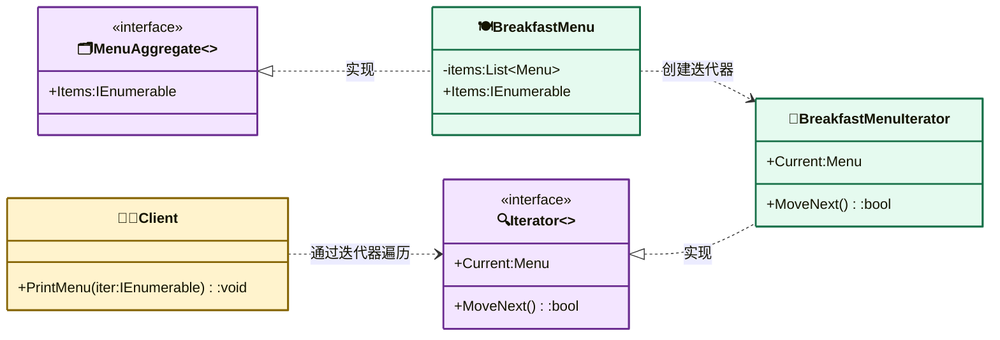

---
AIGC:
    Label: "1"
    ContentProducer: 001191440300708461136T1XGW3
    ProduceID: 6731a671e9c59b3546535911c94fc1c6_66f3a3909bf011f19467525400287e28
    ReservedCode1: riqKE1md9gdAPATDSYjzg5fgnG0wixbgPi09xJGmGYN3UPm9JAptvbYfJbtOyHQULmsHHGO1xZRpHBOXa5B/MiZCL6DO3qk+FWV2b27lTza0aqJlwfLA/mdwSPzD/0OvrVSsW4HBYQ8eXj7UTVkNM+YowcsFWAz5Wt75WLzxUCG/FaZ09eYub+IL5cQ=
    ContentPropagator: 001191440300708461136T1XGW3
    PropagateID: 6731a671e9c59b3546535911c94fc1c6_66f3a3909bf011f19467525400287e28
    ReservedCode2: riqKE1md9gdAPATDSYjzg5fgnG0wixbgPi09xJGmGYN3UPm9JAptvbYfJbtOyHQULmsHHGO1xZRpHBOXa5B/MiZCL6DO3qk+FWV2b27lTza0aqJlwfLA/mdwSPzD/0OvrVSsW4HBYQ8eXj7UTVkNM+YowcsFWAz5Wt75WLzxUCG/FaZ09eYub+IL5cQ=
---

# 迭代器模式（Iterator Pattern）

> **核心思想**：提供一种方法**顺序访问**一个聚合对象中的各个元素，而**不暴露其内部表示**。客户端通过统一的迭代器接口遍历集合，不关心底层是数组、链表还是其他结构。

## 解决什么问题

早餐菜单用 `List` 存储，晚餐菜单用固定数组存储，若客户端分别用 `for` 遍历 List、`for` 遍历数组，则必须知道两种集合的差异，且一旦内部存储结构变化，所有遍历代码都要改。迭代器模式为两类菜单提供一致的 `IEnumerable` 接口，客户端只需 `foreach` 即可统一消费，将"遍历算法"与"集合内部结构"解耦。

## 主要参与者

| 角色 | 本示例类 | 职责 |
| --- | --- | --- |
| 聚合 Aggregate | `BreakfastMenu` / `DinnerMenu` | 提供 `Items` 属性返回迭代器 |
| 迭代器 Iterator | `BreakfastMenuIterator` / `DinnerMenuIterator` | 实现 `IEnumerable`，封装遍历逻辑 |
| 具体枚举器 Enumerator | `BreakfastMenuEnum` / `DinnerMenuEnum` | 实现 `IEnumerator`，负责指针移动与取当前项 |
| 客户端 Client | `Client` / `Program` | 通过迭代器统一遍历所有菜单 |

## 类图



## 源码结构

目录下源码文件与职责对应：

- **Menu.cs**：菜单项实体，含名称、描述、价格、是否素食。
- **BreakfastMenu.cs / DinnerMenu.cs**：两个异构聚合。早餐用 `List<Menu>`，晚餐用固定数组 `Menu[]`，但都暴露统一的 `Items` 属性（返回 `IEnumerable`）。
- **BreakfastMenuIterator.cs / DinnerMenuIterator.cs**：迭代器，实现 `IEnumerable`，返回对应枚举器。
- **BreakfastMenuEnum.cs / DinnerMenuEnum.cs**：枚举器，实现 `IEnumerator`，`MoveNext()` 移动游标、`Current` 取当前项——这是遍历算法与数据结构解耦的关键。
- **Client.cs**：客户端持 `IEnumerable` 引用，`foreach` 统一遍历两类菜单，完全感知不到底层存储差异。
- **Program.cs**：创建菜单并交给 `Client` 打印。

```csharp
// Client.PrintMenu() 核心代码
private void PrintMenu(IEnumerable iter) {
    foreach (var item in iter) {   // 统一遍历 List 与数组
        var i = (Menu)item;
        Console.WriteLine($"{i.Name}  Rs. {i.Price}");
    }
}
```
*（内容由AI生成，仅供参考）*
