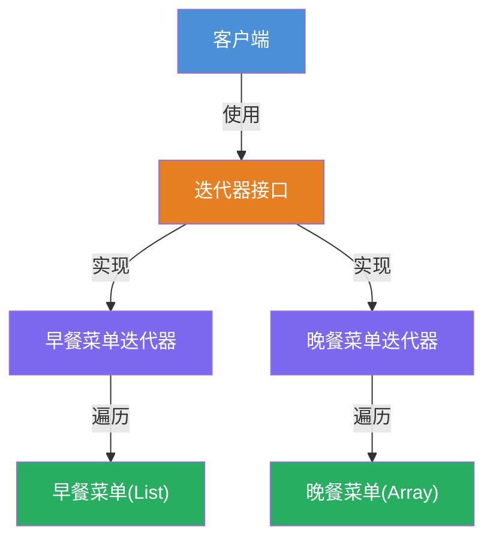
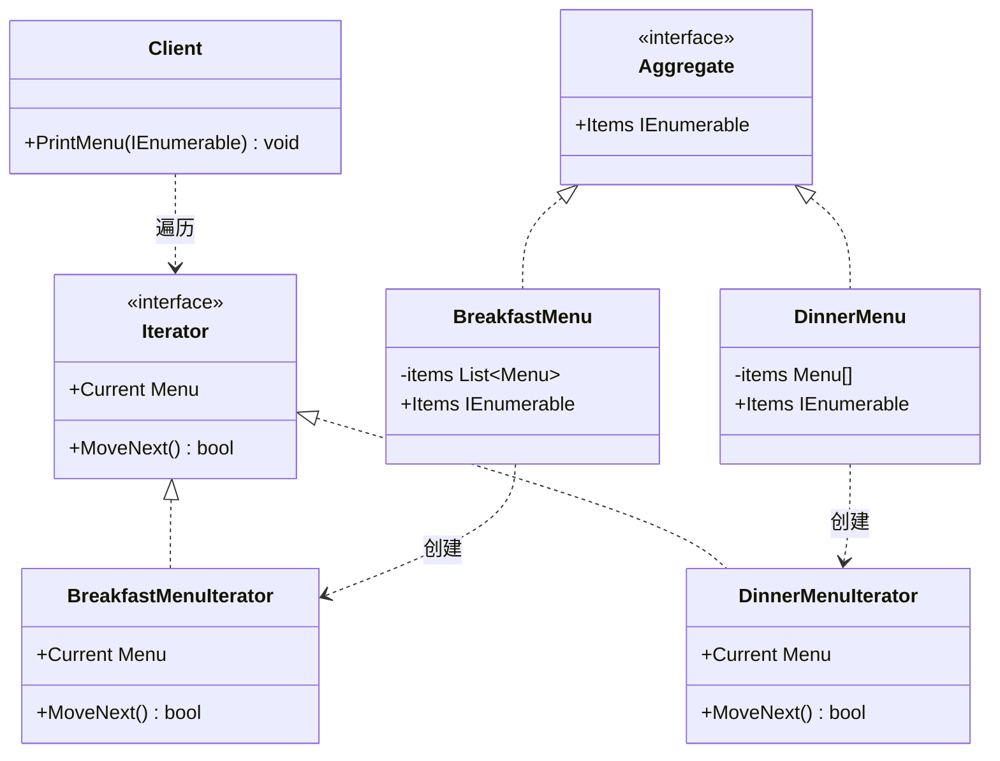

# 迭代器模式（Iterator Pattern）教程

[TOC]

## 一、📖 概述

迭代器模式是**行为型设计模式**，提供一种方法**顺序访问**一个聚合对象中的各个元素，而**不暴露其内部表示**。

核心思想：将遍历行为从集合中分离，客户端通过统一的迭代器接口遍历集合，不关心底层是数组、链表还是其他数据结构。

### 核心特性

- **统一接口**：不同存储结构的集合提供一致的遍历方式

- **封装内部结构**：客户端无需知道集合是数组、链表还是其他结构

- **单一职责**：遍历逻辑由迭代器负责，集合只负责存储

- **支持多种遍历**：同一集合可提供多种迭代器，实现不同遍历方式

<br/>

## 二、📐 结构图解

### 2.1 整体结构



### 2.2 类关系



### 2.3 关键角色

| 角色                   | 说明                                    |
| ---------------------- | --------------------------------------- |
| **迭代器（Iterator）** | 定义遍历协议：`MoveNext()` 和 `Current` |
| **聚合（Aggregate）**  | 提供创建迭代器的工厂方法                |
| **具体迭代器**         | 实现特定集合的遍历逻辑                  |
| **具体聚合**           | 持有数据并返回对应迭代器                |

<br/>

## 三、💻 代码实现

以菜单遍历为例：早餐菜单使用 `List<Menu>` 存储，晚餐菜单使用 `Menu[]` 数组存储，通过迭代器统一遍历。

### 3.1 迭代器接口

```csharp
// 迭代器接口：定义统一的遍历协议
public interface IIterator
{
    bool MoveNext();        // 移动到下一个元素
    Menu Current { get; }   // 获取当前元素
}

// 聚合接口：提供获取迭代器的方法
public interface IAggregate
{
    IIterator CreateIterator();
}
```

### 3.2 聚合与迭代器实现

```csharp
// 早餐菜单：使用List存储
public class BreakfastMenu : IAggregate
{
    private List<Menu> _items = new();

    public IIterator CreateIterator()
        => new BreakfastMenuIterator(this);

    public List<Menu> GetItems() => _items;
}

// 早餐菜单迭代器
public class BreakfastMenuIterator : IIterator
{
    private readonly BreakfastMenu _menu;
    private int _position = 0;

    public BreakfastMenuIterator(BreakfastMenu menu)
        => _menu = menu;

    public bool MoveNext()
    {
        if (_position < _menu.GetItems().Count)
        {
            _position++;
            return true;
        }
        return false;
    }

    public Menu Current => _menu.GetItems()[_position - 1];
}

// 晚餐菜单：使用数组存储
public class DinnerMenu : IAggregate
{
    private Menu[] _items = new Menu[10];
    private int _count = 0;

    public IIterator CreateIterator()
        => new DinnerMenuIterator(this);

    public Menu[] GetItems() => _items;
    public int GetCount() => _count;
}
```

### 3.3 客户端使用

```csharp
// 客户端：通过迭代器统一遍历，不关心底层存储
public class Waitress
{
    public void PrintMenu(IAggregate breakfast, IAggregate dinner)
    {
        IIterator bIter = breakfast.CreateIterator();
        IIterator dIter = dinner.CreateIterator();

        Console.WriteLine("=== 早餐菜单 ===");
        while (bIter.MoveNext())
            Console.WriteLine($"{bIter.Current.Name}  Rs. {bIter.Current.Price}");

        Console.WriteLine("=== 晚餐菜单 ===");
        while (dIter.MoveNext())
            Console.WriteLine($"{dIter.Current.Name}  Rs. {dIter.Current.Price}");
    }
}
```

**关键结论**：`Waitress` 完全不知道底层是 `List` 还是数组，只通过 `IIterator` 接口遍历。

<br/>

## 四、🔍 核心解析

### 4.1 迭代器接口

`IIterator` 定义了 `MoveNext()` 和 `Current` 两个核心成员，封装了遍历逻辑。所有具体迭代器实现此接口，客户端统一消费。

### 4.2 聚合接口

`IAggregate` 通过 `CreateIterator()` 返回迭代器，将"创建迭代器"的职责交给集合本身，客户端无需关心迭代器的构造细节。

### 4.3 遍历与结构解耦

`BreakfastMenu` 用 `List`，`DinnerMenu` 用数组，但 `Waitress` 的遍历代码完全相同。集合内部存储结构的变化不会影响客户端代码。

<br/>

## 五、🎯 应用场景

### 5.1 适用场景

- 需要遍历聚合对象，但不暴露其内部结构

- 需要支持多种遍历方式（正序、倒序、过滤等）

- 为不同类型的集合提供统一的遍历接口

### 5.2 实际案例

- **.NET集合**：`IEnumerable<T>` / `IEnumerator<T>` 是迭代器模式的标准实现

- **数据库结果集**：`DataReader` 提供逐行遍历数据库查询结果

- **文件系统**：`DirectoryInfo.GetFiles()` 返回可遍历的文件集合

<br/>

## 六、⚖️ 优缺点分析

### 6.1 优点

- **简化聚合接口**：集合只需提供迭代器创建方法，无需暴露遍历操作

- **支持多种遍历**：同一集合可提供多个迭代器实现不同遍历方式

- **符合单一职责**：遍历逻辑从集合中分离，各司其职

### 6.2 缺点

- **类数量增多**：每个聚合类可能需要对应的迭代器类

- **简单集合过度设计**：小型集合直接使用 `foreach` 即可，无需额外迭代器

<br/>

## 七、📝 总结

- **核心思想**：提供统一接口遍历聚合对象，不暴露内部表示

- **关键角色**：迭代器（Iterator）、聚合（Aggregate）、具体迭代器、具体聚合

- **适用场景**：需要遍历异构集合或支持多种遍历方式

- **注意事项**：C# 已内置 `IEnumerable<T>`，通常直接使用而非自定义迭代器

---

## 八、🔬 C# 内置迭代器

C# 语言本身已深度集成了迭代器模式，日常开发中**无需手动实现自定义迭代器**：

### 8.1 `IEnumerable<T>` / `IEnumerator<T>`

.NET 标准库的迭代器接口，是迭代器模式的标准实现：

| 接口             | 方法              | 说明                                             |
| ---------------- | ----------------- | ------------------------------------------------ |
| `IEnumerable<T>` | `GetEnumerator()` | 返回迭代器，相当于 `IAggregate.CreateIterator()` |
| `IEnumerator<T>` | `MoveNext()`      | 移动到下一个元素                                 |
| `IEnumerator<T>` | `Current`         | 获取当前元素                                     |
| `IEnumerator<T>` | `Reset()`         | 重置到初始位置                                   |

### 8.2 `yield return` 语法糖

C# 提供 `yield return` 自动生成迭代器，无需手动编写迭代器类：

```csharp
// 无需自定义迭代器类，编译器自动生成状态机
public class BreakfastMenu : IEnumerable<Menu>
{
    private readonly List<Menu> _items = new();

    public IEnumerator<Menu> GetEnumerator()
    {
        for (int i = 0; i < _items.Count; i++)
            yield return _items[i];  // 编译器生成迭代器状态机
    }

    IEnumerator IEnumerable.GetEnumerator() => GetEnumerator();
}
```

`yield return` 的优势：编译器自动生成实现了 `IEnumerator<T>` 的状态机类，代码量从一个独立迭代器类缩减为一个 `yield` 语句，且支持惰性求值（按需逐个产出元素，不一次性加载全部数据）。

### 8.3 `foreach` 与迭代器

`foreach` 语法在编译时被转换为对 `GetEnumerator()` + `MoveNext()` + `Current` 的调用，本质上就是迭代器模式的消费者。自定义集合只需实现 `IEnumerable<T>`，即可无缝支持 `foreach` 遍历。
