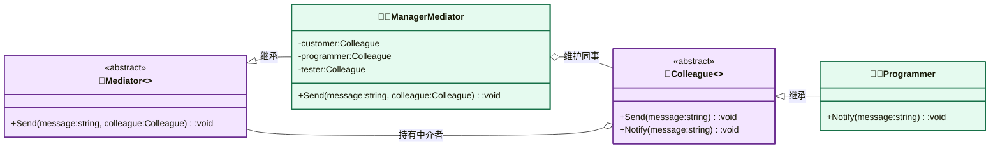

---
AIGC:
    Label: "1"
    ContentProducer: 001191440300708461136T1XGW3
    ProduceID: 6731a671e9c59b3546535911c94fc1c6_679f40d99bf011f18cca525400e6dd8f
    ReservedCode1: iSJrrh2lEgy6cYplouv5KIJwFXiETGUNRqETfTm5S5XRm7MuCjklnhWC8hY/x0ZYQEqeiT5qleustmYnh+Jsm26p8yo/ohCKUJBr5ZCId7P0m/rfVXuH8KljbXGkW8e91YYHKBDPWsGNHLyKBy/1pldlGpy4x78NGFljcgGDKLwM6VcH6WUPAKGxW30=
    ContentPropagator: 001191440300708461136T1XGW3
    PropagateID: 6731a671e9c59b3546535911c94fc1c6_679f40d99bf011f18cca525400e6dd8f
    ReservedCode2: iSJrrh2lEgy6cYplouv5KIJwFXiETGUNRqETfTm5S5XRm7MuCjklnhWC8hY/x0ZYQEqeiT5qleustmYnh+Jsm26p8yo/ohCKUJBr5ZCId7P0m/rfVXuH8KljbXGkW8e91YYHKBDPWsGNHLyKBy/1pldlGpy4x78NGFljcgGDKLwM6VcH6WUPAKGxW30=
---

# 中介者模式（Mediator Pattern）

> **核心思想**：定义一个**中介对象**来封装一组对象之间的交互。各同事对象不再直接互相引用，而是通过中介者转发消息，从而**降低对象间的耦合**，使系统易于维护和扩展。

## 解决什么问题

客户、程序员、测试员之间要互相传递需求/进度，若两两直接引用，会形成复杂的网状依赖，新增一个角色就要改所有连接。中介者模式把交互集中到一个"经理"上，同事只需与中介者通信，网状结构退化为星形结构，交互规则也集中在中介者一处，便于统一管理与变更。

## 主要参与者

| 角色 | 本示例类 | 职责 |
| --- | --- | --- |
| 中介者 Mediator | `Mediator`（抽象） | 定义 `Send(message, colleague)` 接口 |
| 具体中介者 ConcreteMediator | `ManagerMediator` | 维护所有同事引用，实现消息转发规则 |
| 同事 Colleague | `Colleague`（抽象） | 持有中介者引用，提供 `Send` / `Notify` |
| 具体同事 | `Customer` / `Programmer` / `Tester` | 通过中介者收发消息 |

## 类图



## 源码结构

目录下源码文件与职责对应：

- **Mediator.cs**：中介者抽象基类，`Send(string message, Colleague colleague)` 为抽象方法。
- **ManagerMediator.cs**：具体中介者，持有三个同事引用；`Send` 按来源同事决定转发给谁（客户→程序员→测试员→客户），交互规则集中于此。
- **Colleague.cs**：同事抽象基类，构造时注入 `Mediator`，`Send()` 统一委托给 `mediator.Send(message, this)`。
- **Customer.cs / Programmer.cs / Tester.cs**：具体同事，`Notify()` 打印收到的消息。
- **Program.cs**：组装中介者与同事，依次发送需求、开发完成、测试完成三条消息，消息经经理按序转发。

```csharp
// ManagerMediator.Send() 核心代码
if (colleague == Customer)
    Programmer.Notify(message);      // 客户 → 程序员
else if (colleague == Programmer)
    Tester.Notify(message);          // 程序员 → 测试员
else
    Customer.Notify(message);        // 测试员 → 客户
```
*（内容由AI生成，仅供参考）*
