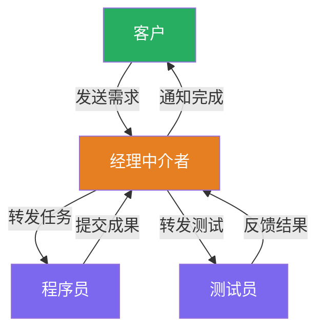
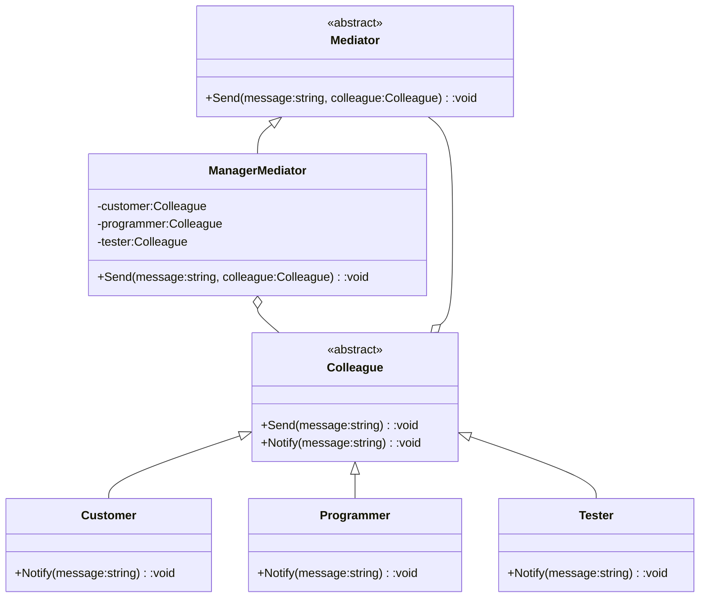

# 中介者模式（Mediator Pattern）教程

[TOC]


## 一、📖 概述

中介者模式是**行为型设计模式**，定义一个**中介对象**来封装一组对象之间的交互，降低对象间的耦合度。

核心思想：多个对象之间不再直接通信，而是通过中介者统一协调。网状的多对多依赖退化为星形的一对多依赖，交互规则集中在中介者一处，便于管理和变更。

### 核心特性

- **降低耦合**：同事对象之间无直接引用，通过中介者转发消息

- **集中控制**：交互逻辑集中在中介者，修改一处即可调整全局行为

- **易于扩展**：新增同事只需注册到中介者，不影响已有同事

- **符合迪米特法则**：同事只与中介者通信，不了解其他同事的内部细节

<br/>

## 二、📐 结构图解

### 2.1 整体结构



### 2.2 类关系



### 2.3 关键角色

| 角色 | 说明 |
|------|------|
| **中介者（Mediator）** | 定义交互接口，负责协调各同事之间的通信 |
| **具体中介者（Concrete Mediator）** | 实现交互规则，持有所有同事的引用，根据发送者决定转发目标 |
| **同事（Colleague）** | 仅持有中介者引用，通过 `Send` 发送消息，通过 `Notify` 接收消息 |

<br/>

## 三、💻 代码实现

以项目经理协调客户、程序员、测试员为例：三者不直接通信，由经理中介者统一转发消息。

### 3.1 中介者与同事抽象

```csharp
// 中介者抽象
public abstract class Mediator
{
    public abstract void Send(string message, Colleague colleague);
}

// 同事抽象
public abstract class Colleague
{
    protected Mediator mediator;

    public Colleague(Mediator mediator)
    {
        this.mediator = mediator;
    }

    public void Send(string message)
    {
        mediator.Send(message, this);
    }

    public abstract void Notify(string message);
}
```

### 3.2 具体中介者

```csharp
// 经理中介者：集中管理转发规则
public class ManagerMediator : Mediator
{
    public Colleague Customer { get; set; }
    public Colleague Programmer { get; set; }
    public Colleague Tester { get; set; }

    public override void Send(string message, Colleague colleague)
    {
        if (colleague == Customer)
            Programmer.Notify(message);      // 客户 → 程序员
        else if (colleague == Programmer)
            Tester.Notify(message);          // 程序员 → 测试员
        else
            Customer.Notify(message);        // 测试员 → 客户
    }
}
```

### 3.3 具体同事

```csharp
public class Customer : Colleague
{
    public Customer(Mediator mediator) : base(mediator) { }
    public override void Notify(string message)
        => Console.WriteLine($"[客户] 收到: {message}");
}

public class Programmer : Colleague
{
    public Programmer(Mediator mediator) : base(mediator) { }
    public override void Notify(string message)
        => Console.WriteLine($"[程序员] 收到: {message}");
}

public class Tester : Colleague
{
    public Tester(Mediator mediator) : base(mediator) { }
    public override void Notify(string message)
        => Console.WriteLine($"[测试员] 收到: {message}");
}
```

### 3.4 客户端使用

```csharp
var mediator = new ManagerMediator();

var customer = new Customer(mediator);
var programmer = new Programmer(mediator);
var tester = new Tester(mediator);

mediator.Customer = customer;
mediator.Programmer = programmer;
mediator.Tester = tester;

customer.Send("请开发新功能");       // 客户 → 经理 → 程序员
programmer.Send("开发完成");         // 程序员 → 经理 → 测试员
tester.Send("测试通过");             // 测试员 → 经理 → 客户
```

**运行结果**：
```
[程序员] 收到: 请开发新功能
[测试员] 收到: 开发完成
[客户] 收到: 测试通过
```

<br/>

## 四、🔍 核心解析

### 4.1 中介者角色

`ManagerMediator` 是整个交互的核心枢纽。它持有所有同事的引用，在 `Send` 方法中根据发送者身份决定转发目标，所有交互规则集中在此。

### 4.2 同事角色

每个 `Colleague` 子类只持有中介者引用，通过 `Send` 发送消息，通过 `Notify` 接收消息。同事之间完全解耦，互不知晓。

### 4.3 通信流程

消息始终经过中介者中转：同事A调用 `Send` → 中介者接收并判断来源 → 中介者调用目标同事的 `Notify`。星形拓扑取代了网状拓扑。

<br/>

## 五、🎯 应用场景

### 5.1 适用场景

- 多个对象之间存在复杂的交互关系

- 不希望对象之间互相引用，降低耦合

- 交互逻辑需要集中管理或频繁变更

### 5.2 实际案例

- **聊天室**：`ChatRoom` 作为中介者，用户发送消息由聊天室转发给所有人

- **MVC框架**：控制器作为视图和模型之间的中介者，协调二者交互

- **航空管制**：塔台作为飞机之间的中介者，统一调度航班起降

<br/>

## 六、⚖️ 优缺点分析

### 6.1 优点

- **降低耦合**：同事之间无直接依赖，修改一个不影响另一个

- **集中管理**：交互逻辑在一处维护，便于调整和排查

- **易于扩展**：新增同事只需注册到中介者，现有同事无需改动

### 6.2 缺点

- **中介者职责过重**：所有交互集中在中介者，可能成为复杂臃肿的"上帝类"

- **单点故障**：中介者出问题，整个系统交互瘫痪

- **过度使用**：简单场景引入中介者反而增加不必要的间接层

<br/>

## 七、📝 总结

- **核心思想**：用中介者封装对象间交互，将网状依赖退化为星形结构

- **关键角色**：中介者（协调中心）、同事（通信参与者）

- **适用场景**：多对象交互复杂且需要集中管理

- **注意事项**：中介者不宜承担过多职责，避免变成臃肿的上帝类
