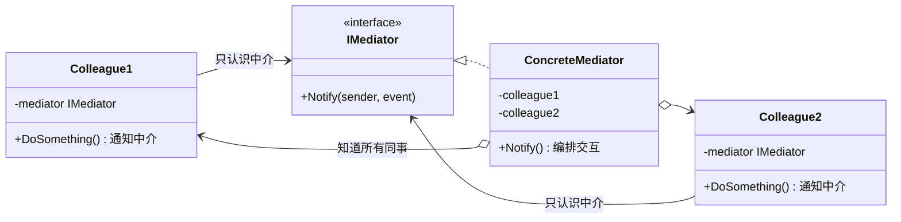

# 中介者模式（Mediator Pattern）

[TOC]

## 一、📖 概述

中介者是**行为型设计模式**，用一个中介对象封装**一系列对象的交互**，使各对象不需要显式互相引用，从而松散耦合。

核心思想：网状交互改为**星型**——飞机之间不直接通话，一切听塔台调度；用户发消息只发给聊天室，由它转发。任意两个同事类之间零依赖，交互规则全部集中在中介者一处。典型应用：机场塔台、聊天室、MVC 框架、事件总线、UI 组件联动。

<br/>

## 二、🧩 模式解析

### 2.1 类关系图



| 关键角色 | 说明 | 塔台示例 |
| --- | --- | --- |
| **中介者接口（Mediator）** | 同事间通信的契约 | `ITowerMediator` |
| **具体中介者** | 知道所有同事，封装全部交互规则 | `ControlTower`（跑道状态 + 协调逻辑） |
| **同事类（Colleague）** | 只持中介者引用，彼此互不相识 | `Aircraft`（只跟塔台对话） |

### 2.2 核心代码

```csharp
// 中介者接口：同事之间唯一的通信渠道
interface IMediator
{
    void Notify(Colleague sender, string Event);     // "谁、发生了什么"
}

// 同事基类：只认识中介，不认识其他同事
abstract class Colleague(IMediator mediator)
{
    protected IMediator Mediator { get; } = mediator;

    public void DoSomething()
    {
        // ... 自身业务
        Mediator.Notify(this, "SomethingHappened");  // 告诉中介，不直接找别人
    }
}

// 具体中介者：持有双方，编排交互规则
class ConcreteMediator : IMediator
{
    public Colleague? A { get; set; }
    public Colleague? B { get; set; }

    public void Notify(Colleague sender, string Event)
    {
        if (sender == A) B?.React();                 // 规则：A 的消息给 B
        else A?.React();                             // 规则：B 的消息给 A
    }
}
```

> 协作方式：同事把"发生了什么"报告给中介者，中介者查规则决定通知谁、做什么——同事之间永远不直接对话，新增同事只需让中介者认识它。

### 2.3 关键解析

**为什么不让对象直接互调？** 6 个对象两两交互需要 15 条引用路径（n(n-1)/2），任何一方变动波及所有关联方：

| 对比维度 | 直接交互（网状） | 中介者（星型） |
| --- | --- | --- |
| 引用路径数 | n(n-1)/2，平方增长 | n，线性增长 |
| 新增同事 | 与所有老同事建立引用 | 中介者登记一次 |
| 交互规则 | 散落各处 | 集中在中介者 |
| 代价 | — | 中介者可能膨胀成"上帝类" |

- **BCL/框架中的身影**：WinForms/WPF 的窗体控件事件互调推荐走 mediator；`Microsoft.Extensions.DependencyInjection` + 事件总线；前端 Redux/MobX 也是状态中介
- **中介者 vs 观察者**：观察者是**一对多广播**（subject 不认识 observer，单向通知），中介者是**多对多协调**（mediator 认识所有同事，双向编排）；聊天室两种都可以做——广播用观察者更轻，在线状态协调用中介者更直接
- **中介者 vs 外观**：外观是单向简化入口（子系统不知道外观存在），中介者是双向交互枢纽（同事知道并主动找中介）

<br/>

## 三、💻 代码示例

### 3.1 经典场景：机场控制塔协调起降

> 场景：多架飞机请求降落，塔台掌握跑道状态——空闲放行、被占让后来者盘旋等待；飞机之间互不通话，起降规则全部在塔台。

```mermaid
flowchart LR
    subgraph 同事（飞机，互不相识）
        A1["国航 CA1874"]
        A2["东航 MU5108"]
    end
    T["ControlTower 塔台<br/>跑道状态 + 协调规则"]
    A1 -->|"CoordinateLanding()"| T
    A2 -->|"CoordinateLanding()"| T
    T -->|"允许降落"| A1
    T -->|"盘旋等待"| A2

    style A1 fill:#4A90D9,color:#fff
    style A2 fill:#4A90D9,color:#fff
    style T fill:#E67E22,color:#fff
```

| 角色 | 文件 |
| --- | --- |
| 同事基类 | [`Airport/Aircraft.cs`](Airport/Aircraft.cs) |
| 具体同事 | [`Airport/Airliner.cs`](Airport/Airliner.cs) |
| 中介者接口 | [`Airport/ITowerMediator.cs`](Airport/ITowerMediator.cs) |
| 具体中介者 | [`Airport/ControlTower.cs`](Airport/ControlTower.cs) |
| 客户端 | [`Program.cs`](Program.cs) |

### 3.2 软件项目：群聊聊天室

> 场景：用户发言只发给聊天室，由它广播给其他在线成员；成员上下线由聊天室维护名单，离线后发言不再送达。

```mermaid
flowchart LR
    subgraph 同事（用户，互不相识）
        U1["Alice"]
        U2["Bob"]
        U3["Carol"]
    end
    R["ChatRoom 聊天室<br/>在线名单 + 广播规则"]
    U1 -->|"Send(msg)"| R
    R -->|"Receive()"| U2
    R -->|"Receive()"| U3

    style U1 fill:#4A90D9,color:#fff
    style U2 fill:#4A90D9,color:#fff
    style U3 fill:#4A90D9,color:#fff
    style R fill:#E67E22,color:#fff
```

| 角色 | 文件 |
| --- | --- |
| 具体同事 | [`ChatRoom/ChatUser.cs`](ChatRoom/ChatUser.cs) |
| 具体中介者 | [`ChatRoom/ChatRoom.cs`](ChatRoom/ChatRoom.cs) |
| 客户端 | [`Program.cs`](Program.cs) |

### 3.3 运行结果

```bash
========== 中介者模式 (Mediator Pattern) ==========
用一个中介对象封装一组对象的交互

--- 经典场景: 机场控制塔协调起降 ---
>> 飞机之间互不通话，一切听塔台调度：

[塔台] 国航 CA1874 进入管辖空域
[塔台] 东航 MU5108 进入管辖空域
[塔台] 南航 CZ3456 进入管辖空域

>> 国航 CA1874：请求降落
[客机] 国航 CA1874 收到塔台指令：允许降落，跑道已清空

>> 东航 MU5108：请求降落
[客机] 东航 MU5108 收到塔台指令：跑道正被 国航 CA1874 占用，请盘旋等待

[塔台] 国航 CA1874 已脱离跑道
>> 东航 MU5108：请求降落
[客机] 东航 MU5108 收到塔台指令：允许降落，跑道已清空

--- 软件项目: 群聊聊天室 ---
>> 用户只把消息发给聊天室，由它广播给其他人：

[系统] Alice 加入了聊天室（当前 1 人在线）
[系统] Bob 加入了聊天室（当前 2 人在线）
[系统] Carol 加入了聊天室（当前 3 人在线）

>> Alice 说：今晚一起吃饭吗？
[收到] Bob ← Alice：今晚一起吃饭吗？
[收到] Carol ← Alice：今晚一起吃饭吗？

>> Bob 说：好啊，老地方见
[收到] Alice ← Bob：好啊，老地方见
[收到] Carol ← Bob：好啊，老地方见

[系统] Carol 离开了聊天室

>> Carol 说：我有事，你们去吧
[系统] Carol 已下线，此消息没有送达任何成员
```

<br/>

## 四、📝 小结

- **核心思想**：网状交互改星型，同事只认中介，交互规则集中一处

- **两个示例**：机场塔台展示"资源协调"型中介（跑道状态裁决），聊天室展示"消息路由"型中介（名单 + 广播）

- **注意事项**：交互规则全压进中介者容易膨胀成上帝类，可按业务域拆分多个中介者；同事数量少、交互简单时直接互调更直观
