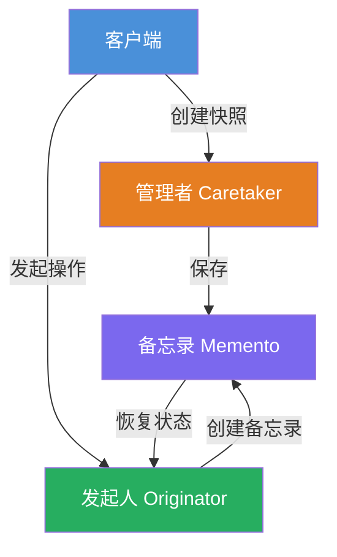
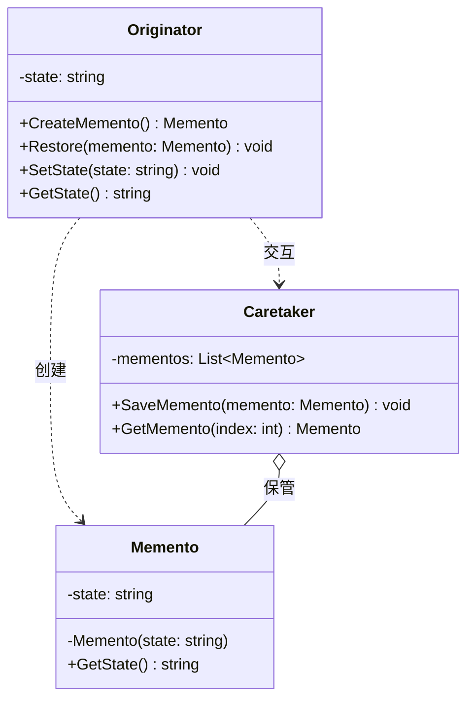

# 备忘录模式 (Memento) 教程

[TOC]

## 一、📖 概述

备忘录模式是**行为型设计模式**，在不暴露对象内部结构的前提下，**捕获并保存对象的内部状态**，以便之后可以将对象恢复到原先保存的状态。

核心思想：将对象状态的保存与恢复职责分离，发起人只负责产生状态，备忘录负责存储状态，管理者负责保管备忘录。典型应用如撤销（Undo）功能。

### 核心特性

- **状态封装**：备忘录存储发起人的内部状态，但不暴露其实现细节

- **单一职责**：发起人、备忘录、管理者各司其职

- **可恢复**：支持多次撤销与重做操作

- **符合开闭原则**：新增状态类型无需修改现有类

<br/>

## 二、📐 结构图解

### 2.1 整体流程



### 2.2 类关系



### 2.3 关键角色

| 角色                | 说明                                         |
| ------------------- | -------------------------------------------- |
| 发起人 (Originator) | 创建备忘录以保存自身状态，可从备忘录恢复状态 |
| 备忘录 (Memento)    | 存储发起人的内部状态，不暴露实现细节         |
| 管理者 (Caretaker)  | 负责保管备忘录，不操作备忘录内容             |

<br/>

## 三、💻 代码实现

以文本编辑器为例：支持多次撤销和重做操作，每次编辑后创建快照，撤销时恢复到之前的快照。

### 3.1 备忘录类

```csharp
// 备忘录：存储编辑器状态
public class EditorMemento
{
    public string Content { get; }

    public EditorMemento(string content)
    {
        Content = content;
    }
}
```

### 3.2 发起人类

```csharp
// 发起人：文本编辑器
public class Editor
{
    private string _content = "";

    public void Type(string words)
    {
        _content += words;
        Console.WriteLine($"输入: {words}");
    }

    public string GetContent() => _content;

    // 创建备忘录：保存当前状态
    public EditorMemento CreateMemento()
    {
        return new EditorMemento(_content);
    }

    // 从备忘录恢复状态
    public void Restore(EditorMemento memento)
    {
        _content = memento.Content;
        Console.WriteLine($"恢复到: {_content}");
    }
}
```

### 3.3 管理者类

```csharp
// 管理者：负责保存和提供备忘录
public class History
{
    private readonly List<EditorMemento> _mementos = new();

    public void Push(EditorMemento memento)
    {
        _mementos.Add(memento);
    }

    public EditorMemento Pop()
    {
        if (_mementos.Count > 0)
        {
            var memento = _mementos[^1];
            _mementos.RemoveAt(_mementos.Count - 1);
            return memento;
        }
        return null;
    }
}
```

### 3.4 客户端使用

```csharp
var editor = new Editor();
var history = new History();

editor.Type("Hello ");
history.Push(editor.CreateMemento());  // 保存快照 1

editor.Type("World ");
history.Push(editor.CreateMemento());  // 保存快照 2

editor.Type("!");
Console.WriteLine($"当前内容: {editor.GetContent()}");

// 撤销
editor.Restore(history.Pop());  // 恢复到快照 2
editor.Restore(history.Pop());  // 恢复到快照 1
```

**运行结果**：

```
输入: Hello
输入: World
输入: !
当前内容: Hello World !
恢复到: Hello World
恢复到: Hello
```

<br/>

## 四、🔍 核心解析

### 4.1 状态封装

备忘录 `EditorMemento` 只暴露 `GetState()` 方法，外部无法修改已保存的状态。管理者只知道保管备忘录，不知道备忘录内部是什么。

### 4.2 撤销机制

每次编辑后，客户端调用 `CreateMemento()` 创建快照并交给 `History` 保管。撤销时从 `History` 弹出最近的快照，调用 `Restore()` 恢复状态。

### 4.3 内存考量

备忘录会占用内存存储状态快照。如果状态很大或撤销操作频繁，需要考虑快照数量上限或使用增量快照策略。

<br/>

## 五、🎯 应用场景

### 5.1 适用场景

- 需要提供撤销/重做功能的系统

- 需要保存对象状态以便后续恢复

- 不希望外部直接访问对象内部状态

### 5.2 实际案例

- **文本编辑器**：撤销/重做编辑操作

- **游戏存档**：保存/加载游戏进度

- **数据库事务**：事务回滚机制

- **版本控制**：Git 的 commit 与 checkout

<br/>

## 六、⚖️ 优缺点分析

### 6.1 优点

- **职责分离**：发起人、备忘录、管理者各司其职

- **状态封装**：备忘录不暴露发起人内部实现

- **简化发起人**：发起人无需关心状态保存细节

### 6.2 缺点

- **内存消耗**：频繁保存大状态会占用大量内存

- **序列化开销**：如果状态需要持久化，序列化/反序列化有性能损耗

- **管理者职责**：管理者需要管理多个快照，可能变得复杂

<br/>

## 七、📝 总结

- **核心思想**：捕获对象内部状态，以便之后恢复到原先状态

- **关键角色**：发起人（Originator）、备忘录（Memento）、管理者（Caretaker）

- **适用场景**：需要撤销/重做、状态保存与恢复的场景

- **注意事项**：注意内存消耗，可考虑增量快照或快照数量上限
