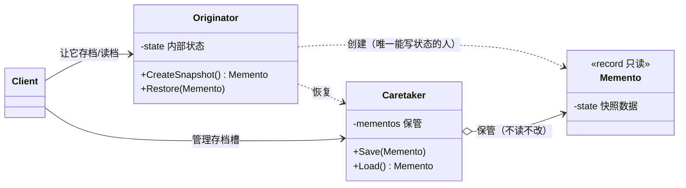
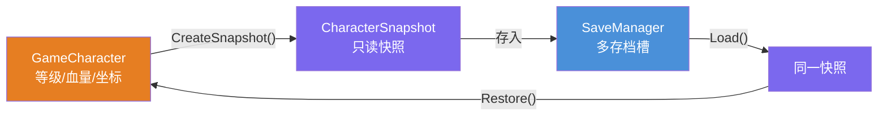
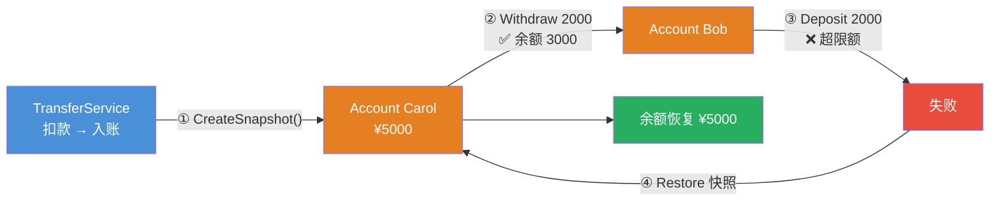

# 备忘录模式（Memento Pattern）

[TOC]

## 一、📖 概述

备忘录是**行为型设计模式**，在**不破坏封装性**的前提下，捕获一个对象的内部状态，并在该对象之外保存这个状态，以便以后将其恢复到原先状态。

核心思想：发起人自己把内部状态打包成**不可变快照**交给管理者保管；管理者**只存不读**，恢复时把快照原样交还。游戏存档、事务回滚、IDE 撤销（快照式）都是它。

<br/>

## 二、🧩 模式解析

### 2.1 类关系图



| 关键角色 | 说明 | 存档示例 |
| --- | --- | --- |
| **发起人（Originator）** | 状态的主人：唯一能创建/解读快照的对象 | `GameCharacter` |
| **备忘录（Memento）** | 只读状态快照，外界拿到也改不了 | `CharacterSnapshot` |
| **管理者（Caretaker）** | 保管快照（多槽位/栈），但从不窥视内容 | `SaveManager` |

### 2.2 核心代码

```csharp
// 备忘录：只读快照（record 天生不可变 + 值语义）
record Memento(int State);

// 发起人：状态的主人，快照的唯二进出口
class Originator
{
    private int _state;

    public Memento CreateSnapshot() => new(_state);       // 打包：不暴露字段
    public void Restore(Memento memento) => _state = memento.State;   // 恢复：只有我懂怎么写回
}

// 管理者：只管存取，从不读快照内容
class Caretaker
{
    private readonly List<Memento> _history = [];
    public void Save(Memento memento) => _history.Add(memento);
    public Memento Load() => _history[^1];
}
```

> 协作方式：发起人把内部状态打包成只读快照交给管理者；管理者像保险柜一样只存不读；恢复时快照原样奉还，由发起人自己写回——封装边界从未被打破。

### 2.3 关键解析

**备忘录 vs 命令模式实现撤销**——两种撤销路线的选型：

| 对比维度 | 备忘录（快照式） | 命令模式（反向操作式） |
| --- | --- | --- |
| 撤销原理 | 整体存档，恢复旧快照 | 记录操作，执行反向命令 |
| 内存开销 | 大（每步存全量状态） | 小（只存操作参数） |
| 实现难度 | 简单直观 | 要为每个操作写逆操作 |
| 适用场景 | 状态小、可整体快照 | 状态大、操作可逆 |
| 本仓库示例 | 本模式（游戏存档/事务回滚） | [../CommandPattern](../CommandPattern/README.md)（文本编辑器双栈） |

- **C# 的 `record` 是备忘录的天然载体**：init-only + 值相等 + with 表达式，几乎零成本造只读快照
- **窄接口 vs 宽接口**：GoF 原版用"窄接口（管理者只见 object）/宽接口（发起人见强类型）"保护封装；C# 常用 `record` 只读性直接达成
- **注意事项**：快照频率高 + 状态大 = 内存爆炸，可配合增量快照或序列化到外部存储

<br/>

## 三、💻 代码示例

### 3.1 经典场景：游戏角色存档

> 场景：打 Boss 前存档——升级、掉血、团灭后读档，等级血量坐标全部还原；存档管理器支持多槽位（打Boss前/回城点）。



| 角色 | 文件 |
| --- | --- |
| 发起人 | [`Game/GameCharacter.cs`](Game/GameCharacter.cs) |
| 备忘录 | [`Game/CharacterSnapshot.cs`](Game/CharacterSnapshot.cs) |
| 管理者 | [`Game/SaveManager.cs`](Game/SaveManager.cs) |
| 客户端 | [`Program.cs`](Program.cs) |

### 3.2 软件项目：银行转账事务回滚

> 场景：转账 = 扣款 + 入账两步——扣款成功、入账触风控失败时，恢复扣款前快照，余额分文不差（事务语义）。



| 角色 | 文件 |
| --- | --- |
| 发起人 | [`Bank/Account.cs`](Bank/Account.cs) |
| 备忘录 | [`Bank/BalanceSnapshot.cs`](Bank/BalanceSnapshot.cs) |
| 管理者（事务编排） | [`Bank/TransferService.cs`](Bank/TransferService.cs) |
| 客户端 | [`Program.cs`](Program.cs) |

### 3.3 运行结果

```bash
========== 备忘录模式 (Memento Pattern) ==========
捕获对象内部状态，以便以后恢复

--- 经典场景: 游戏角色存档 ---
>> 打 Boss 前存档，打输了读档重来：

[状态] Lv.8 血量 100 坐标 (20, 35)

>> 战前存档：
[存档] 已保存当前进度
[管理] 快照已存入槽位「打Boss前」

>> 开始战斗：
[战斗] 受到 45 点伤害，剩余血量 55
[升级] 恭喜升到 Lv.9
[移动] 前进到 (30, 35)
[状态] Lv.9 血量 55 坐标 (30, 35)

>> 买张回城票再存一档：
[存档] 已保存当前进度
[管理] 快照已存入槽位「回城点」

>> 不小心被团灭：
[战斗] 受到 999 点伤害，剩余血量 0
[状态] Lv.9 血量 0 坐标 (30, 35)

>> 读取「打Boss前」存档：
[状态] Lv.8 血量 100 坐标 (20, 35)

--- 软件项目: 银行转账事务回滚 ---
>> 转账两步操作，第二步失败则回滚第一步：

[账户] Alice 余额 ¥1000.00
[账户] Bob 余额 ¥500.00

>> 情形一：¥300 未超限额，两步都成功：
>> 发起转账：Alice → Bob ¥300.00
[转出] Alice 扣款 ¥300.00，余额 ¥700.00
[转入] Bob 入账 ¥300.00，余额 ¥800.00
[事务] 转账成功，无需回滚

>> 情形二：Carol 转 Bob ¥2000 —— Carol 扣款成功，Bob 入账超限失败：
[账户] Carol 余额 ¥5000.00

>> 发起转账：Carol → Bob ¥2000.00
[转出] Carol 扣款 ¥2000.00，余额 ¥3000.00
[事务] 失败：Bob 单笔入账限额 ¥1000.00，¥2000.00 超限
[回滚] Carol 余额已恢复
[账户] Carol 余额 ¥5000.00
```

<br/>

## 四、📝 小结

- **核心思想**：发起人打包只读快照，管理者只存不读，恢复原样奉还——封装不破，状态可回

- **两个示例**：游戏存档展示多槽位快照的生活直觉，转账事务展示"先快照、失败即回滚"的软件工程用法

- **注意事项**：全量快照在大对象 + 高频场景下内存开销大；需要细粒度撤销/重做时优先考虑命令模式（见对比表）
