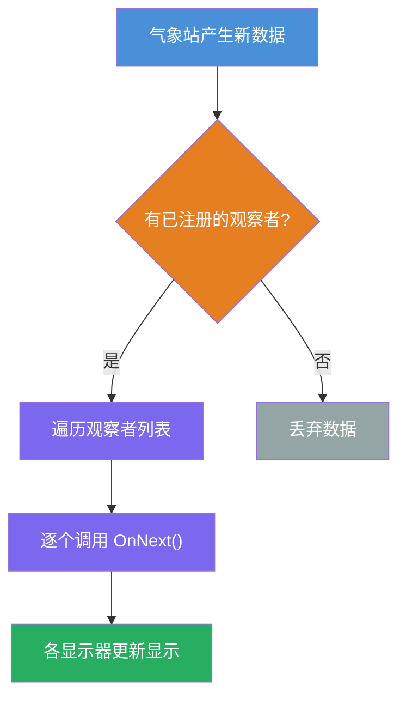
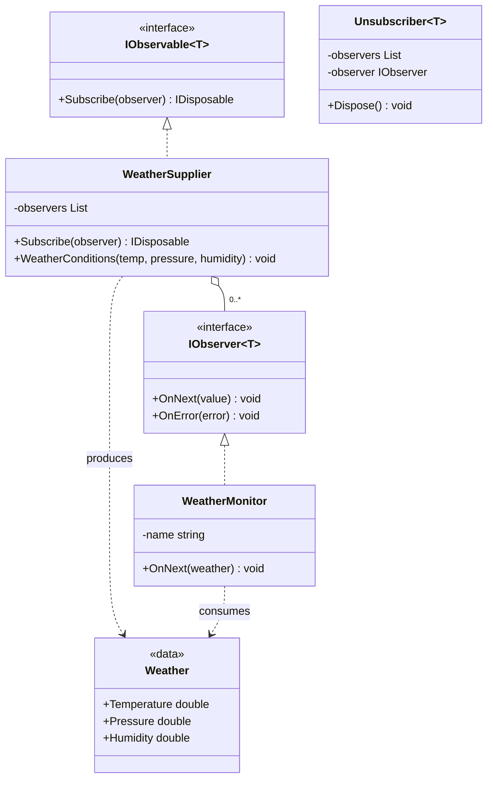

# 观察者模式（Observer Pattern）教程

[TOC]

## 一、📖 概述

观察者模式是**行为型设计模式**，定义对象间**一对多**的依赖关系，当被观察者状态改变时，**所有已注册的观察者自动收到通知**并作出更新。

核心思想：将状态发布与状态消费分离，被观察者只维护观察者列表，不关心观察者具体逻辑。观察者自由订阅/退订，互不依赖，符合**开闭原则**。

### 核心特性

- **解耦发布与订阅**：被观察者不持有观察者的具体类型，只依赖观察者接口

- **动态管理**：观察者可随时订阅或退订，不影响其他观察者

- **一对多通知**：状态变化时自动通知所有已注册的观察者

- **符合开闭原则**：新增观察者无需修改被观察者代码

<br/>

## 二、📐 结构图解

### 2.1 整体流程



### 2.2 类关系



### 2.3 关键角色

| 角色                               | 说明                                              |
| ---------------------------------- | ------------------------------------------------- |
| **被观察者（Subject/Observable）** | 维护观察者列表，状态变化时通知所有已注册的观察者  |
| **观察者（Observer）**             | 定义更新接口，接收被观察者的状态变化通知          |
| **退订句柄（Unsubscriber）**       | 封装退订逻辑，通过 `IDisposable` 管理订阅生命周期 |

<br/>

## 三、💻 代码实现

以气象站天气更新为例：`WeatherSupplier` 产生天气数据，`WeatherMonitor` 订阅并显示温度、气压或湿度。

### 3.1 数据对象

```csharp
// 天气数据载体
public record Weather(double Temperature, double Pressure, double Humidity);
```

### 3.2 被观察者

```csharp
// 气象站——维护观察者列表，状态变化时推送通知
public class WeatherSupplier : IObservable<Weather>
{
    private readonly List<IObserver<Weather>> _observers = new();

    public IDisposable Subscribe(IObserver<Weather> observer)
    {
        _observers.Add(observer);
        return new Unsubscriber<Weather>(_observers, observer);
    }

    // 产生新天气数据，通知所有观察者
    public void WeatherConditions(double temp, double pressure, double humidity)
    {
        var weather = new Weather(temp, pressure, humidity);
        foreach (var observer in _observers)
            observer.OnNext(weather);
    }
}
```

### 3.3 观察者

```csharp
// 天气显示器——根据名称中的标识显示对应数据
public class WeatherMonitor : IObserver<Weather>
{
    private readonly string _name;

    public WeatherMonitor(string name) => _name = name;

    public void OnNext(Weather value) =>
        Console.WriteLine($"{_name}: 温度={value.Temperature}°C");

    public void OnError(Exception error) =>
        Console.WriteLine($"{_name} 发生错误: {error.Message}");
}
```

### 3.4 退订机制

```csharp
// 退订——从观察者列表中移除自身
public class Unsubscriber<T> : IDisposable
{
    private readonly List<IObserver<T>> _observers;
    private readonly IObserver<T> _observer;

    public void Dispose() => _observers.Remove(_observer);
}
```

### 3.5 客户端使用

```csharp
var supplier = new WeatherSupplier();

var monitor1 = new WeatherMonitor("温度显示器");
var monitor2 = new WeatherMonitor("气压显示器");

monitor1.Subscribe(supplier);               // 观察者1 订阅
supplier.WeatherConditions(32.0, 0.05, 1.5); // 观察者1 收到

monitor2.Subscribe(supplier);               // 观察者2 订阅
supplier.WeatherConditions(33.5, 0.04, 1.7); // 两个观察者都收到
```

<br/>

## 四、🔍 核心解析

### 4.1 订阅与退订

`Subscribe()` 将观察者加入列表并返回 `IDisposable`，调用方持有此句柄即可在适当时机退订，无需被观察者暴露额外方法。

### 4.2 推送机制

`WeatherConditions()` 产生数据后遍历观察者列表，逐个调用 `OnNext()`。观察者列表为空时不会执行任何操作，不存在空引用风险。

### 4.3 数据流向

数据从被观察者流向观察者，方向单向。观察者不直接修改被观察者状态，避免循环依赖。

<br/>

## 五、🎯 应用场景

### 5.1 适用场景

- 气象站、股票行情等实时数据推送系统

- 事件监听器、消息通知系统

- MVC 中 Model 变化通知 View 更新

### 5.2 实际案例

- **.NET Reactive Extensions**：`IObservable<T>` / `IObserver<T>` 本模式的原生实现

- **WPF 数据绑定**：`INotifyPropertyChanged` 实现属性变化通知

- **消息队列**：发布/订阅模型是观察者模式的分布式扩展

<br/>

## 六、⚖️ 优缺点分析

### 6.1 优点

- **松耦合**：被观察者不依赖观察者的具体类型

- **动态订阅**：观察者可随时加入或退出

- **广播通知**：一次状态变化自动通知所有订阅者

### 6.2 缺点

- **通知顺序不确定**：遍历顺序可能随实现变化

- **可能引发连锁更新**：观察者中修改被观察者状态可触发无限循环

- **内存泄漏风险**：退订不彻底时观察者不会被垃圾回收

<br/>

## 七、📝 总结

- **核心思想**：一对多依赖，状态变化时自动通知所有已注册的观察者

- **关键角色**：被观察者（WeatherSupplier）、观察者（WeatherMonitor）、退订句柄（Unsubscriber）

- **适用场景**：需要实时数据推送、事件驱动、解耦发布与消费

- **注意事项**：避免观察者中触发被观察者状态变更导致循环通知

---

## 八、🔬 推模型与拉模型对比

观察者模式在通知时有两种数据传递策略：

| 对比项       | 推模型（Push Model）                         | 拉模型（Pull Model）                              |
| ------------ | -------------------------------------------- | ------------------------------------------------- |
| **数据来源** | 被观察者主动将详细数据推送给观察者           | 观察者仅收到通知，自行到被观察者拉取数据          |
| **耦合程度** | 观察者依赖被观察者的完整数据结构             | 观察者按需获取，只依赖自己关心的字段              |
| **灵活性**   | 数据结构固定，新增字段需修改所有观察者       | 观察者可选择性获取，更灵活                        |
| **典型实现** | `OnNext(Weather value)` 直接传入完整数据对象 | `OnNext()` 无参数，观察者回调 `subject.GetData()` |

**本例使用推模型**：`WeatherSupplier.WeatherConditions()` 直接将 `Weather` 对象推送给所有观察者。如果改为拉模型，`OnNext` 只传递通知信号，观察者自行调用 `supplier.LatestWeather` 获取最新数据。

```csharp
// 推模型（本例）：被观察者推送完整数据
observer.OnNext(weather);

// 拉模型：仅通知，观察者自行拉取
observer.OnNext();  // 无参数
// 观察者内部：
var data = _subject.LatestWeather;  // 主动获取
```

**选择建议**：数据量小且观察者普遍需要完整数据时用推模型（简单直接）；数据量大或观察者只关心部分字段时用拉模型（减少不必要传输）。
