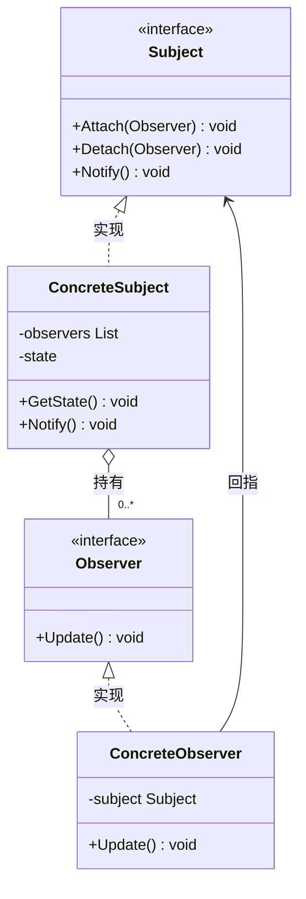
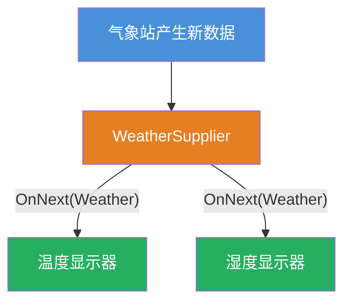
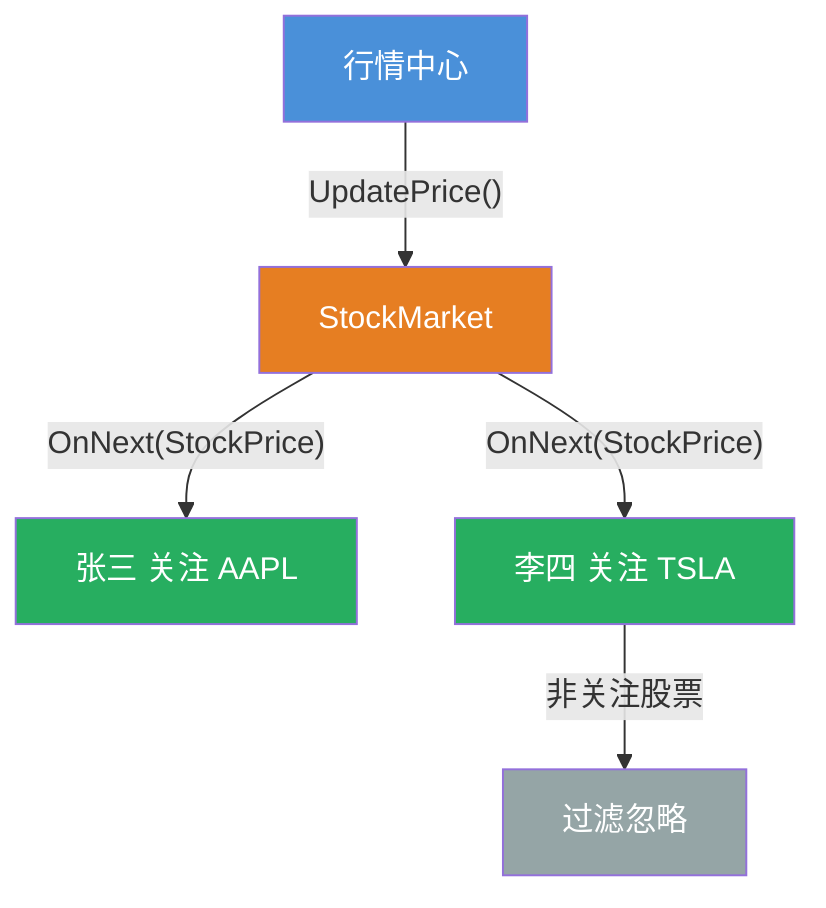
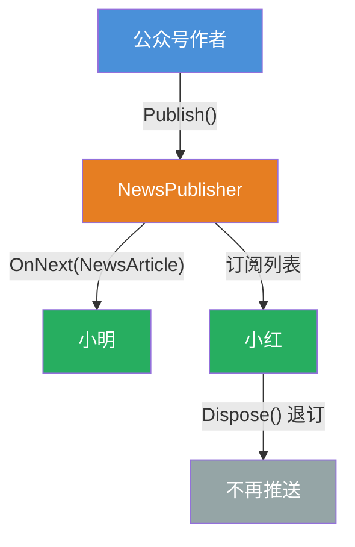

# 观察者模式（Observer Pattern）

[TOC]

## 一、📖 概述

观察者模式是**行为型设计模式**，定义对象间**一对多**的依赖关系，当被观察者状态改变时，**所有已注册的观察者自动收到通知**并作出更新。

核心思想：将状态发布与状态消费分离，被观察者只维护观察者列表，不关心观察者具体逻辑。观察者自由订阅/退订，互不依赖，符合**开闭原则**。

<br/>

## 二、🧩 模式解析

### 2.1 类关系图



### 2.2 三大角色

| 角色                      | 职责                               | 设计要点                            |
| ------------------------- | ---------------------------------- | ----------------------------------- |
| **被观察者 Subject**      | 维护观察者列表，状态变化时广播通知 | 不依赖观察者具体类型，只面向接口    |
| **观察者 Observer**       | 订阅并接收状态变化通知             | 实现更新接口，可自由订阅/退订       |
| **退订句柄 Unsubscriber** | 封装退订逻辑                       | 通过 `IDisposable` 管理订阅生命周期 |

### 2.3 核心代码

```csharp
// 被观察者 Subject
class Subject
{
    List<Observer> _observers;

    void Attach(Observer o)  => _observers.Add(o);    // 订阅
    void Detach(Observer o)  => _observers.Remove(o); // 退订

    // 状态变化时通知所有观察者
    void Notify() => foreach (var o in _observers) o.Update(_state);
}

// 观察者 Observer
interface Observer
{
    void Update(State state);
}

// 具体观察者
class ConcreteObserver : Observer
{
    void Update(State state) => // 收到通知后刷新自身展示
}
```

> 协作方式：客户端通过 `Attach()` / `Detach()` 增删观察者；被观察者只面向 `Observer` 接口调用 `Update()`，不感知具体类型，二者由此解耦。

### 2.4 关键解析

**订阅与退订**：`Subscribe()` 返回 `IDisposable`，调用方持有句柄即可在适当时机退订，无需被观察者暴露额外方法，避免内存泄漏。

**推模型与拉模型**：本示例采用推模型，被观察者将完整数据对象（如 `Weather` / `StockPrice`）推送给观察者；拉模型则只发通知，观察者自行拉取所需数据。

<br/>

## 三、💻 代码示例

> 三个示例都直接使用 .NET 内置的 `IObservable<T>` / `IObserver<T>` 接口，`Subscribe()` 返回退订句柄，无需自行定义抽象契约。

### 3.1 气象站：天气推送

> 场景：`WeatherSupplier` 产生天气数据并推送，多个 `WeatherMonitor` 订阅接收；可随时退订。



| 角色     | 文件                                                       |
| -------- | ---------------------------------------------------------- |
| 数据载体 | [`Weather/Weather.cs`](Weather/Weather.cs)                 |
| 被观察者 | [`Weather/WeatherSupplier.cs`](Weather/WeatherSupplier.cs) |
| 观察者   | [`Weather/WeatherMonitor.cs`](Weather/WeatherMonitor.cs)   |
| 退订句柄 | [`Weather/Unsubscriber.cs`](Weather/Unsubscriber.cs)       |

### 3.2 股票行情：价格推送

> 场景：`StockMarket` 价格变动时推送所有订阅者；`Investor` 只关注自己持仓的股票。



| 角色     | 文件                                             |
| -------- | ------------------------------------------------ |
| 数据载体 | [`Stock/StockPrice.cs`](Stock/StockPrice.cs)     |
| 被观察者 | [`Stock/StockMarket.cs`](Stock/StockMarket.cs)   |
| 观察者   | [`Stock/Investor.cs`](Stock/Investor.cs)         |
| 退订句柄 | [`Stock/Unsubscriber.cs`](Stock/Unsubscriber.cs) |

### 3.3 公众号：文章推送

> 场景：`NewsPublisher` 发布文章时推送所有订阅者；退订后不再接收。



| 角色     | 文件                                             |
| -------- | ------------------------------------------------ |
| 数据载体 | [`News/NewsArticle.cs`](News/NewsArticle.cs)     |
| 被观察者 | [`News/NewsPublisher.cs`](News/NewsPublisher.cs) |
| 观察者   | [`News/Subscriber.cs`](News/Subscriber.cs)       |
| 退订句柄 | [`News/Unsubscriber.cs`](News/Unsubscriber.cs)   |

### 3.4 运行结果

```bash
========== 观察者模式 (Observer Pattern) ==========
定义对象间的一对多依赖，状态变化时通知所有依赖者

--- 气象站 ---
温度显示器: 温度 32°C, 气压 0.05 大气压, 湿度 150%
温度显示器: 温度 33.5°C, 气压 0.04 大气压, 湿度 170%
湿度显示器: 温度 33.5°C, 气压 0.04 大气压, 湿度 170%
湿度显示器: 温度 37.5°C, 气压 0.07 大气压, 湿度 120%

--- 股票行情 ---
张三 关注 AAPL: ¥182.50
李四 关注 TSLA: ¥245.00

--- 公众号订阅 ---
小明 收到推送：《观察者模式详解》作者 CodeGuide
小红 收到推送：《观察者模式详解》作者 CodeGuide
小明 收到推送：《策略模式实战》作者 CodeGuide
```

> 要点：气象站中第二次更新后两个显示器都收到，`温度显示器.Unsubscribe()` 退订后仅湿度显示器收到；股票示例中 GOOG 无人关注被过滤；公众号示例中小红退订后不再收到新文章。

<br/>

## 四、📝 小结

- **核心思想**：一对多依赖，状态变化时自动广播通知所有已注册的观察者

- **关键角色**：被观察者（Subject）、观察者（Observer）、退订句柄（Unsubscriber）

- **.NET 生态**：`IObservable<T>` / `IObserver<T>`、WPF 的 `INotifyPropertyChanged`、事件的委托发布订阅都是该模式的应用

- **注意事项**：避免观察者中触发被观察者状态变更导致循环通知；完成退订避免内存泄漏
