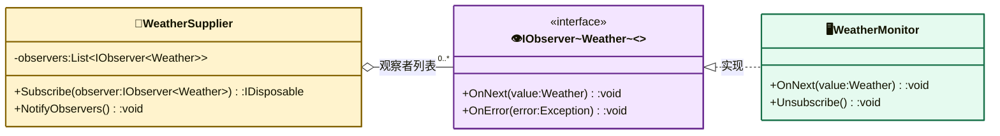

# 观察者模式（Observer Pattern）

> **核心思想**：定义对象间**一对多**的依赖关系，当被观察者（主题）状态改变时，**所有已注册的观察者自动收到通知**并作出更新。本示例基于 .NET 内置的 `IObservable<T>` / `IObserver<T>` 实现。

## 解决什么问题

气象站需要根据天气数据实时更新多个显示器（温度、气压、湿度屏）。若供应方直接持有并逐个调用显示器，新增一种显示器就要改供应方代码。观察者模式让供应方只维护"观察者列表"，状态变化时统一推送，观察者自由订阅/退订，互不依赖，符合**开闭原则**。

## 主要参与者

| 角色 | 本示例类 | 职责 |
| --- | --- | --- |
| 被观察者 Subject | `WeatherSupplier`（`IObservable<Weather>`） | 维护观察者列表，`WeatherConditions()` 时推送通知 |
| 观察者 Observer | `WeatherMonitor`（`IObserver<Weather>`） | 订阅供应者，`OnNext()` 响应数据更新 |
| 订阅解绑 | `Unsubscriber<TWeather>`（`IDisposable`） | 退订时从观察者列表移除自身 |
| 数据对象 | `Weather` | 温度/气压/湿度数据载体 |
| 客户端 Client | `Program` | 创建供应者与观察者并建立订阅关系 |

## 类图



## 源码结构

目录下源码文件与职责对应：

- **Weather.cs**：数据对象，只读温度/气压/湿度。
- **WeatherSupplier.cs**：被观察者，持有 `List<IObserver<Weather>>`；`WeatherConditions()` 遍历观察者逐个 `OnNext()` 推送；`Subscribe()` 添加观察者并返回 `Unsubscriber` 句柄（订阅时若已有历史数据会先补推）。
- **WeatherMonitor.cs**：观察者，`OnNext()` 根据名称中的 `T/P/H` 分别显示温度、气压、湿度，名称不含三者则触发 `OnError`。
- **Unsubscriber.cs**：`IDisposable`，`Dispose()` 时把自己从观察者列表移除。
- **Program.cs**：演示动态订阅——观察者1 先订阅，观察者2 中途加入，后续天气变化二者都能收到推送。

```csharp
// Program.cs 核心代码
provider.WeatherConditions(32.0, 0.05, 1.5);   // 无订阅者，无人收到
observer1.Subscribe(provider);                 // 观察者1 订阅
provider.WeatherConditions(33.5, 0.04, 1.7);   // 观察者1 收到
observer2.Subscribe(provider);                 // 观察者2 订阅
provider.WeatherConditions(37.5, 0.07, 1.2);   // 两个观察者都收到
```
