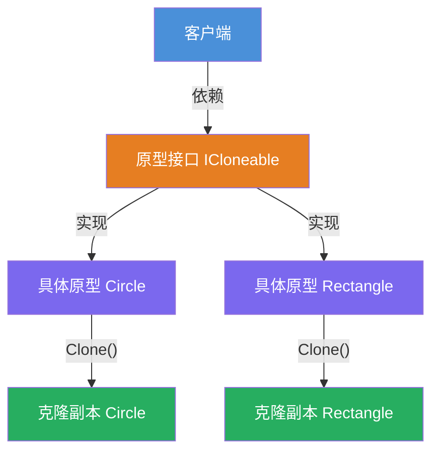
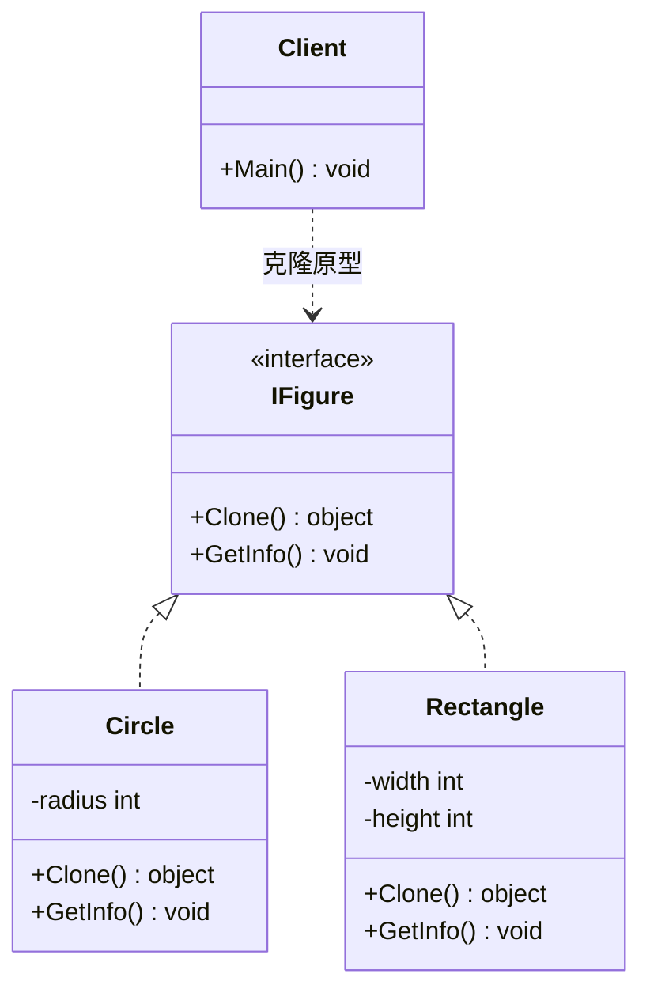

# 原型模式（Prototype Pattern）教程

[TOC]

## 一、📖 概述

原型模式是**创建型设计模式**，用**原型实例**指定创建对象的种类，并通过**拷贝**这些原型来创建新对象，从而避免重复执行昂贵的初始化过程。

核心思想：以已有对象为模板，通过 `Clone()` 复制出新实例，客户端无需关心具体类型。

### 核心特性

- **高效创建**：避免重复执行复杂的构造和初始化过程

- **类型统一**：客户端通过接口克隆，无需关心具体实现类

- **状态复制**：克隆副本与原型保持一致的内部状态

- **符合开闭原则**：新增原型类型无需修改客户端代码

<br/>

## 二、📐 结构图解

### 2.1 整体结构



### 2.2 类关系



### 2.3 关键角色

| 角色                       | 说明                              |
| -------------------------- | --------------------------------- |
| 原型接口 Prototype         | 声明 Clone 方法的抽象接口         |
| 具体原型 ConcretePrototype | 实现 Clone 方法，复制自身状态     |
| 客户端 Client              | 通过原型接口调用 Clone 创建新对象 |

<br/>

## 三、💻 代码实现

以图形克隆为例：`Circle` 和 `Rectangle` 实现 `IFigure` 接口，通过 `Clone()` 复制自身状态。

### 3.1 原型接口

```csharp
// 原型接口，继承 ICloneable
public interface IFigure : ICloneable
{
    void GetInfo();
}
```

### 3.2 具体原型

```csharp
public class Circle : IFigure
{
    private int _radius;

    public Circle(int radius) => _radius = radius;

    public object Clone()
    {
        return new Circle(_radius); // 复制自身状态
    }

    public void GetInfo()
    {
        Console.WriteLine($"Circle radius {_radius}");
    }
}

public class Rectangle : IFigure
{
    private int _width;
    private int _height;

    public Rectangle(int width, int height)
    {
        _width = width;
        _height = height;
    }

    public object Clone()
    {
        return new Rectangle(_width, _height); // 复制自身状态
    }

    public void GetInfo()
    {
        Console.WriteLine($"Rectangle height {_height} and width {_width}");
    }
}
```

### 3.3 客户端使用

```csharp
public class Program
{
    public static void Main()
    {
        IFigure figure = new Rectangle(30, 40);
        IFigure clonedFigure = (IFigure)figure.Clone(); // 克隆

        figure.GetInfo();       // Rectangle height 40 and width 30
        clonedFigure.GetInfo(); // 副本状态一致

        IFigure circle = new Circle(30);
        IFigure clonedCircle = (IFigure)circle.Clone(); // 克隆

        circle.GetInfo();       // Circle radius 30
        clonedCircle.GetInfo(); // 副本状态一致
    }
}
```

**运行结果**：

```
Rectangle height 40 and width 30
Rectangle height 40 and width 30
Circle radius 30
Circle radius 30
```

<br/>

## 四、🔍 核心解析

### 4.1 原型接口

`IFigure` 继承 `ICloneable`，声明 `Clone()` 和 `GetInfo()` 方法。客户端仅依赖此接口进行克隆操作。

### 4.2 浅拷贝 vs 深拷贝

原型模式的克隆语义直接影响对象的独立性，浅拷贝和深拷贝的选择至关重要：

| 维度         | 浅拷贝 (Shallow Copy)                             | 深拷贝 (Deep Copy)                        |
| ------------ | ------------------------------------------------- | ----------------------------------------- |
| 值类型字段   | 复制值                                            | 复制值                                    |
| 引用类型字段 | 复制引用（共享同一对象）                          | 递归复制整个对象图                        |
| 实现方式     | `MemberwiseClone()`                               | 手动递归克隆 / `BinaryFormatter` / 序列化 |
| 本例适用性   | 适用（`_radius`、`_width`、`_height` 均为值类型） | 如含引用字段则必须用深拷贝                |
| 风险         | 修改引用字段会影响原型和其他副本                  | 无共享风险，但性能开销更大                |

**选择原则**：

- 产品字段全为值类型 → 浅拷贝足够，简单高效
- 产品包含引用类型字段 → 必须深拷贝，否则修改副本会意外影响原型
- 循环引用场景 → 推荐序列化方式实现深拷贝，避免手动递归栈溢出

### 4.3 客户端调用

客户端通过原型实例的 `Clone()` 创建新对象，无需 `new` 和复杂初始化，统一通过接口操作。

<br/>

## 五、🎯 应用场景

### 5.1 适用场景

- 创建对象成本较高，构造参数复杂

- 需要大量相似对象，且状态差异在运行时确定

- 对象创建过程涉及资源密集操作（数据库、网络等）

### 5.2 实际案例

- **.NET `ICloneable`**：框架内置原型克隆接口

- **缓存对象池**：通过克隆已有实例快速创建新对象

- **文档编辑器**：克隆已有图形元素生成新元素

<br/>

## 六、⚖️ 优缺点分析

### 6.1 优点

- **高效**：避免重复执行复杂的构造和初始化

- **解耦**：客户端不依赖具体类，只依赖原型接口

- **灵活**：运行时动态决定克隆哪种对象

### 6.2 缺点

- **浅拷贝风险**：引用类型字段可能共享同一实例，需注意深拷贝

- **类数量增多**：每新增一种原型需实现对应的 `Clone()` 方法

- **实现复杂**：包含循环引用的对象克隆逻辑较复杂

<br/>

## 七、📝 总结

- **核心思想**：通过拷贝已有原型实例创建新对象，避免昂贵的初始化

- **关键角色**：原型接口、具体原型、客户端

- **适用场景**：创建成本高、需要大量相似对象、运行时动态决定类型

- **注意事项**：关注浅拷贝与深拷贝的区别，引用类型字段需谨慎处理
