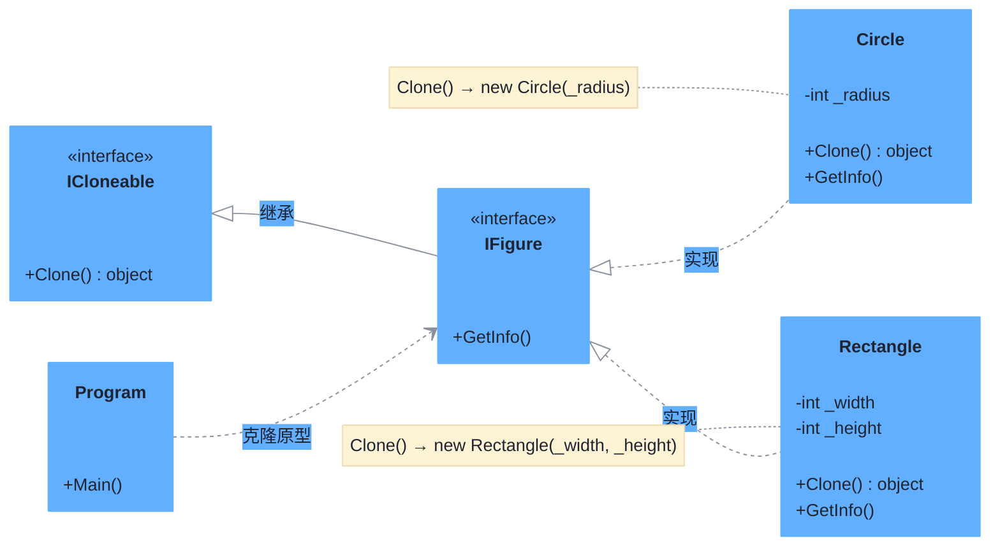

# 原型模式（Prototype Pattern）

> **核心思想**：用**原型实例**指定创建对象的种类，并通过**拷贝**这些原型来创建新对象，从而避免重复执行昂贵的初始化过程。本示例基于 .NET 的 `ICloneable` 接口实现。

## 解决什么问题

当创建对象的成本较高（或构造参数复杂）时，每次都 `new` 并重新初始化不划算。原型模式以"已有实例"为模板，通过 `Clone()` 复制出新实例。本示例中 `Circle` / `Rectangle` 只需实现 `Clone()` 返回同类型新对象，客户端统一通过 `IFigure` 接口克隆，无需关心具体类型。

## 主要参与者

| 角色 | 本示例类 | 职责 |
| --- | --- | --- |
| 原型 Prototype | `IFigure` | 继承 `ICloneable`，定义 `GetInfo()` 与 `Clone()` |
| 具体原型 ConcretePrototype | `Circle` / `Rectangle` | 实现克隆逻辑，复制自身状态 |
| 客户端 Client | `Program` | 通过原型实例的 `Clone()` 创建新对象 |

## 类图



## 源码结构

目录下源码文件与职责对应：

- **IFigure.cs**：原型接口，继承 `ICloneable` 并声明 `GetInfo()`。
- **Circle.cs / Rectangle.cs**：具体原型，`Clone()` 读取自身字段构造并返回同类型新对象，实现浅拷贝（本示例字段均为值类型）。
- **Program.cs**：先创建 `Rectangle(30, 40)` 并克隆，再创建 `Circle(30)` 并克隆，通过 `GetInfo()` 验证克隆副本状态一致。

```csharp
// Program.cs 核心代码
IFigure figure = new Rectangle(30, 40);
IFigure clonedFigure = (IFigure)figure.Clone();   // 克隆新对象
figure.GetInfo();      // Rectangle height 40 and width 30
clonedFigure.GetInfo();// 副本状态一致
```
