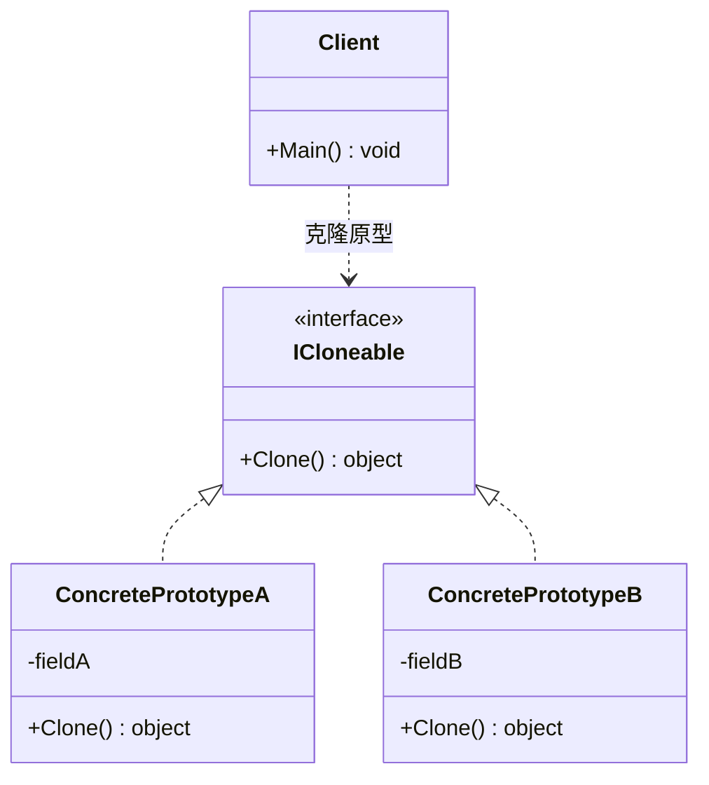
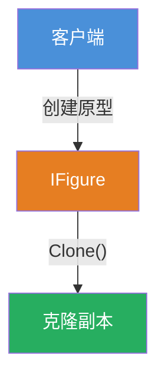

# 原型模式（Prototype Pattern）

[TOC]

## 一、📖 概述

原型模式是**创建型设计模式**，用**原型实例**指定创建对象的种类，并通过**拷贝**这些原型来创建新对象，从而避免重复执行昂贵的初始化过程。

核心思想：以已有对象为模板，通过 `Clone()` 复制出新实例，客户端无需关心具体类型。

<br/>

## 二、🧩 模式解析

### 2.1 类关系图



### 2.2 三大角色

| 角色 | 职责 | 设计要点 |
| --- | --- | --- |
| **原型接口 Prototype** | 声明 Clone 方法的抽象接口 | 通常继承 `ICloneable`，统一克隆契约 |
| **具体原型 ConcretePrototype** | 实现 Clone 方法，复制自身状态 | 内部维护状态，克隆时传递自身数据 |
| **客户端 Client** | 通过原型接口调用 Clone 创建新对象 | 仅依赖接口，无需 `new` 和复杂初始化 |

### 2.3 关键解析

**浅拷贝 vs 深拷贝**：

| 维度 | 浅拷贝 (Shallow Copy) | 深拷贝 (Deep Copy) |
| --- | --- | --- |
| 值类型字段 | 复制值 | 复制值 |
| 引用类型字段 | 复制引用（共享同一对象） | 递归复制整个对象图 |
| 实现方式 | `MemberwiseClone()` | 手动递归克隆 / 序列化 |
| 风险 | 修改引用字段会影响原型和其他副本 | 无共享风险，但性能开销更大 |

> **选择原则**：字段全为值类型 → 浅拷贝足够；包含引用类型 → 必须深拷贝；循环引用 → 推荐序列化方式。

**接口的意义**：原型接口是克隆的统一契约，客户端仅依赖接口，新增原型类型无需修改客户端代码（开闭原则）。

**克隆的本质**：Clone() 不走构造函数，直接复制内存状态，因此创建成本极低。

**与继承的区别**：继承（基类→子类）描述的是「类和类之间的静态继承关系」，原型模式关注的是「对象实例的克隆复制」，二者完全不同。继承是编译时确定的类型层级，克隆是运行时基于已有实例创建新对象。

**与深拷贝/浅拷贝的区别**：原型模式是设计模式层面的概念，定义了「通过克隆创建对象」的结构；深拷贝和浅拷贝是实现层面的拷贝策略，是 Clone() 方法内部的具体实现方式。原型模式可以用浅拷贝，也可以用深拷贝，二者是不同层级的东西。

<br/>

## 三、💻 代码示例

### 3.1 模式示例

> Circle 和 Rectangle 实现 IFigure 接口，通过 Clone() 复制自身状态。



| 角色 | 文件 |
| --- | --- |
| 原型接口 | [`IFigure.cs`](IFigure.cs) |
| 具体原型A | [`Circle.cs`](Circle.cs) |
| 具体原型B | [`Rectangle.cs`](Rectangle.cs) |
| 客户端 | [`Program.cs`](Program.cs) |

**运行结果**：

```
半径为 30 的圆形
半径为 30 的圆形
矩形高度 40 宽度 30
矩形高度 40 宽度 30
```

### 3.2 经典应用

> 原型模式在 .NET 框架中广泛使用，以下为典型案例。

**ADO.NET DataTable 克隆**：

```csharp
// 克隆表结构（不含数据）
DataTable schemaClone = originalTable.Clone();

// 克隆表结构 + 数据
DataTable fullClone = originalTable.Copy();

// 克隆单行数据
DataRow newRow = originalRow.ItemArray;
newRow.ItemArray = (object[])originalRow.ItemArray.Clone();
```

**GDI+ Bitmap 克隆**：

```csharp
// 从原图克隆指定区域
Bitmap cloned = originalBitmap.Clone(new Rectangle(0, 0, 100, 100), originalBitmap.PixelFormat);
```

**WPF Freezable 克隆**：

```csharp
// 冻结的对象可安全跨线程克隆
Freezable cloned = originalFreezable.Clone();
```

> **实际价值**：原型模式的核心价值在于「避免昂贵初始化」。数据库连接池复用配置、图形编辑器复制元素、Undo 系统保存状态快照——都是原型思想的落地。.NET 的 `ICloneable` 虽标记过时（返回 `object`），但模式本身通过 `record` 的 `with` 表达式等现代方式延续。

<br/>

## 四、📝 小结

- **核心思想**：通过拷贝已有原型实例创建新对象，避免昂贵的初始化

- **适用场景**：创建成本高、需要大量相似对象、运行时动态决定类型

- **注意事项**：字段全为值类型用浅拷贝，包含引用类型必须深拷贝
